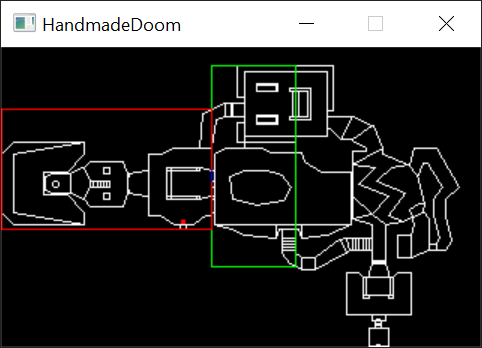
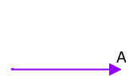
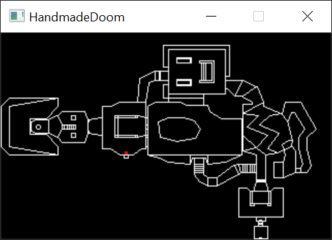

Reviewers:
*  Marl [@DOOMReboot](https://twitter.com/DOOMReboot)  

# Notes 008 - Finding Walls and BSP Traversal  

**Recommended reading:** [Graphics Programming Black Book By Michael Abrash](https://www.drdobbs.com/parallel/graphics-programming-black-book/184404919) (Chapters 59, 60, 61, 62).  

Things will start getting serious, our main goal is to render a 3D view of what the player is viewing. To accomplish this, we need to know few things  
*  Where is the player on the map? We know this (Notes005)  
*  Which walls are around the player? We will be implementing this  
*  Which of these walls are in the player's field of view? Later notes  
*  Render what the player is seeing. Later notes  

If you have been an ID Software fan you mostly know by now how Wolfenstein 3D rendering works, and the big shift between Wolf3D and DOOM was the utilization of a BSP Tree (BSP was used in Wolf3D SNES version). 
How things worked in Wolf 3D was using [ray casting](https://en.wikipedia.org/wiki/Ray_casting) technology. But using such a technology has a lot of limitations. This is where BSP trees comes in. BSP trees are used to help us know which walls are closest to the player. So, let us get started. 

It is time to have a better understanding of BSP and how they are they the secret behind the success of DOOM.  
All we know now is that BSP is just a tree that split the map to smaller pieces. Those small pieces (sub-sector), are organized in a tree that makes searching and traversing easy and fast. Sub-sectors are convex, which means walls in the sub-sector will not overlap. But how can this be usefully? The BSP tree is used in visible-surface determination (VSP), in simple words, which wall is visible to the player.

Using the BSP tree you can traverse all the walls in a map ether from furthest to the player to closest (Back to front) or closest to the player to the furthest (front to back).  

DOOM could have used a simple furthest to closest approach (Back to front) which will be an implementation of [Painter's algorithm](https://en.wikipedia.org/wiki/Painter%27s_algorithm). This would have rendered the seen correctly, but the side effect of this is that we will be forced to traverse the complete tree, and redraw part of the screen that have already been drawn by the furthest walls (which translates to performance cost). This approach is simple, no need to maintain what is drawn on the screen just draw every single wall you see in the tree.  

What DOOM does is draw the closest to the player to the furthest (front to back), but with this approach, extra work has to be done to maintain what is already drawn on the screen so it wont be overdrawn later. Also there is a big advantage for font to back, we can skip traversing big chunk of the BSP since we are maintaining what is drawn on the screen.  

What we will implement is a font to back as DOOM does but wont be implementing the function that would make us skip chunks of the BSP tree. 

With all the info we have from the binary tree traversal it should be easy to understand BSPs. The BSP traversal is based on the modified algorithm we discussed in Notes007, with the only difference being that the map space is being split instead of numbers.  

Here is how the root node can be visualized.  

 

Notice the small blue line that splits the map to right and left (relative to the splitter)?  
The right and left of a line are based on the direction of drawing the line. So that specific line is drawn from top to bottom, this makes the green box the left side, and the red box the right. Recursively those boxes are split into smaller boxes, for example here is the right box in the above picture being split into smaller ones.  

  

The map breaking down all the way to what is known as "sub-sector", for now, let's just think about a sub-sector as a small piece of map walls (we will look into details about sector and sub-sectors later).  

Here is an image to visualize how sub-sectors would look. All the pieces with the same color are part of the same sub-sector.

  

I see BSP traversal as two stage actions
1. Find which sub-sector the player is in
2. What are the sub-sectors close to the sub-sector the playing is in?

But before we start there is one missing key part that we have not discussed yet! How in the world will I know if a player to the right or left a splitter line? The answer is "cross product".   

First, let us quickly go over a what a vector is.
A vector is an object that has both a magnitude and a direction. We can visualize a vector as a line in a specific direction, where we know its length and magnitude. 
  
  
  
In other words, a line that has a starting point and an end point. Given two points a and b, moving from a to b (where we know both magnitude and direction). If you remember, the splitter walls in the BSP nodes are vectors, they have a starting point and direction.  
  
Cross product is a mathematical operation on two vectors and the output is another vector. The output vector will also have magnitude and a direction. We can tell its direction if it is up or down based on the sign value of the cross product (we do not care much about the magnitude).    


Notice in the above example that if vector b is on the left of an output vector points up, and when b the right of an output vector points down. We can use this to our advantage.  

So, lets create our two vectors
1. Splitter V1 to the position of the player.  
2. Splitter V1 to its V2.  
  
Finding cross products is easy once you have the two vectors.    
For two 2D vector A=(Ax, Ay), B=(Bx, By) the cross product is  
__A x B = Ax * By - Ay * Bx__  
  
  

Keep in mind A X B = -(B X A)  

## Goals
1. Traverse the BSP tree!  
   
## Coding
In previous notes we loaded all the nodes, which are stored in an array form with the root being the last node in the list. Now we need to find the player in this BSP tree. So, we start at the root and figure out whether to go left or right based on player location.  
To figure out which node of those is a leaf node (a sub-sector node) the original DOOM code had a nice optimization, they used the last bit of the node ID as a flag.   
  
``` cpp
// 0x8000 in binary 1000000000000000
#define SUBSECTORIDENTIFIER 0x8000
```  

We will use bit masking to figure out if we are holding a sub-sector node, or just "guide" node,  
and at each node we can simply use the cross product to decide whether to go left or right.  
We just care about the direction (positive or negative to decide where to go).  

``` cpp
bool Map::IsPointOnLeftSide(int XPosition, int YPosition, int iNodeID)
{
    int dx = XPosition - m_Nodes[iNodeID].XPartition; // Find X the point relative to the player 
    int dy = YPosition - m_Nodes[iNodeID].YPartition; // Find y the point relative to the player 

    return (((dx * m_Nodes[iNodeID].ChangeYPartition) - (dy * m_Nodes[iNodeID].ChangeXPartition)) <= 0);
}
```

Now let apply the tree search code we discussed in previous notes, and call it passing in the root node!  

``` cpp
void Map::RenderBSPNodes(int iNodeID)
{
    // Masking all the bits except the last one
    // to check if this is a subsector
    if (iNodeID & SUBSECTORIDENTIFIER)
    {
        RenderSubsector(iNodeID & (~SUBSECTORIDENTIFIER));
        return;
    }

    bool isOnLeft = IsPointOnLeftSide(m_pPlayer->GetXPosition(), m_pPlayer->GetYPosition(), iNodeID);

    if (isOnLeft)
    {
        RenderBSPNodes(m_Nodes[iNodeID].LeftChildID);
    }
    else
    {
        RenderBSPNodes(m_Nodes[iNodeID].RightChildID);
    }
}

void Map::RenderBSPNodes()
{
    RenderBSPNodes(m_Nodes.size() - 1);
}

void Map::RenderSubsector(int iSubsectorID)
{
    // for now, just let us keep this empty
}
```

Animating the searching for the player  
  
  

Sweeeet!  
Now let us finish this off, by going through the rest of the tree to give us the custom sort we want (Notes 006)!

```cpp
void Map::RenderBSPNodes(int iNodeID)
{
    // Masking all the bits except the last one
    // to check if this is a subsector
    if (iNodeID & SUBSECTORIDENTIFIER)
    {
        RenderSubsector(iNodeID & (~SUBSECTORIDENTIFIER));
        return;
    }

    bool isOnLeft = IsPointOnLeftSide(m_pPlayer->GetXPosition(), m_pPlayer->GetYPosition(), iNodeID);

    if (isOnLeft)
    {
        RenderBSPNodes(m_Nodes[iNodeID].LeftChildID);
        RenderBSPNodes(m_Nodes[iNodeID].RightChildID);
    }
    else
    {
        RenderBSPNodes(m_Nodes[iNodeID].RightChildID);
        RenderBSPNodes(m_Nodes[iNodeID].LeftChildID);
    }
}
```

Now, ```RenderSubsector``` will be called processing sub-sectors from near to far!  

## Other Notes
Let us look at the original/Chocolate doom code that did the BSP traversal. You will find the implementation in ``` r_bsp.c ```, function ``` R_RenderBSPNode ```.  
Let us peek at the struct that held the node data. 
``` cpp
//
// BSP node.
//
typedef struct
{
    // Partition line.
    fixed_t	x;
    fixed_t	y;
    fixed_t	dx;
    fixed_t	dy;

    // Bounding box for each child.
    fixed_t	bbox[2][4];

    // If NF_SUBSECTOR its a subsector.
    unsigned short children[2];
    
} node_t;
```
  
We could have defined our box boundaries as bbox was defined, but I found it was easier to be explicit about the naming and not to hide them under array indexes.    
  
``` cpp
//
// RenderBSPNode
// Renders all subsectors below a given node,
// traversing subtree recursively.
// Just call with BSP root.
void R_RenderBSPNode (int bspnum)
{
    node_t*	bsp;
    int		side;

    // Found a subsector?
    if (bspnum & NF_SUBSECTOR)
    {
        // This condition was never hit, maybe it was 
        // there to handle unexpected cases in custom maps
        if (bspnum == -1)			
            R_Subsector (0);
        else
            R_Subsector (bspnum&(~NF_SUBSECTOR));
        return;
    }
        
    bsp = &nodes[bspnum];
    
    // Decide which side the viewpoint is on.
    // Cross product happens here, but there is some
    // optimization that makes it even avoid the multiplication
    side = R_PointOnSide (viewx, viewy, bsp);  

    // Recursively divide right space. (This comment is misleading and not true)
    R_RenderBSPNode (bsp->children[side]); 

    // Possibly divide left space. (This comment is misleading and not true)
    if (R_CheckBBox (bsp->bbox[side^1]))	
        R_RenderBSPNode (bsp->children[side^1]);
}
```

What is happening here? Where is the condition to check which side, the player is on and traverse based on that? hmmm...  
Nice trick! I got it! So the function ```R_PointOnSide (viewx, viewy, bsp);``` returns 0 or 1 (true or false) which is used to select either the child at index 0 or index 1 ```R_RenderBSPNode (bsp->children[side]);```. Now to go to the other branch we just call ```R_RenderBSPNode (bsp->children[side^1]);```.
What happened here is a good utilization of X-OR operation.  

| A | B | A XOR B |  
|---|---|---------|  
| 0 | 0 | 0       |  
| 0 | 1 | 1       |  
| 1 | 0 | 1       |  
| 1 | 1 | 0       |  

So, you always get to invert the case when calling ```R_RenderBSPNode (bsp->children[side^1]);```.   
The function ```R_CheckBBox (bsp->bbox[side^1])``` is an optimization that saves going though nodes that are not in the player FOV (maybe something we could look at and implement later).  

## Source code
[Source code](../src)  

## Reference
[3D Math Primer for Graphics and Game Development](https://www.amazon.com/Math-Primer-Graphics-Game-Development-ebook/dp/B008KZU548/ref=sr_1_1?keywords=3d+Math+primer&qid=1564421411&s=gateway&sr=8-1)  
[Cross product Wikipedia](https://en.wikipedia.org/wiki/Cross_product)  
[Cross product Math is fun](https://www.mathsisfun.com/algebra/vectors-cross-product.html)  

