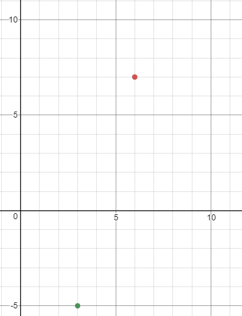
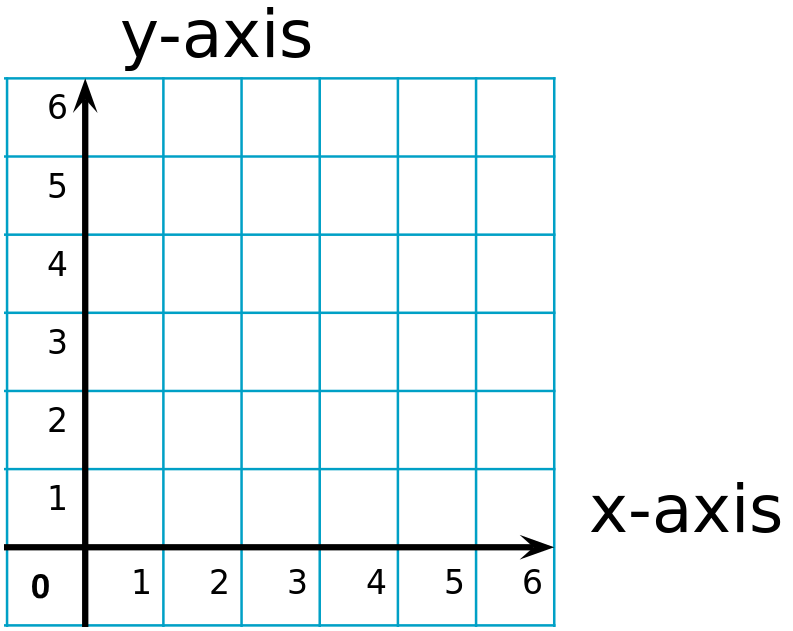

# Week 004 - Automap
Finally, it is time to draw something! Let's try and see if we can implement a simple automap.  
Before we start, this is not the same way original DOOM draws its automap, the one released with original game would draw the map as you visit the area (to be more exact, it will draw a wall in the automap only if it was rendered in the 3D view). Our automap drawn all the walls, so we can get an idea what is going on and validate our knowledge about the map.  
A quick recap, the maps have two core components, vertex, and a Linedef. Vertexes are just corners, and linedefs are walls. All we need is just convert the 2D data to a 2D image.  
Let's draw that data and see if we get a top view of the map. If you need more information about reading the map data head back to Week002.  

## Goals
1. Draw the loaded map.  

## Design
Simply update the map class to render the vertex and linedef! 
Note: You will notice that I drew directly to the renderer, usually you have a buffer you draw to then just copy it to the renderer. That would be much faster, but I love starting simple and when needed just change it.

## Coding
So, we have previously seen the list of vertexes. If you look to that list, you know that there is a lot of negative numbers. We need to shift those number to be positive, after all our screen resolution we chose 320 x 200. We need to shift number to be in that range.  
So, to achieve this I will use simple math, I will find the min point value while adding vertexes, then just invert the singe of that value and add it to each point X value, and same for Y. Let's look at a simple example.  
  
```
Point A (3, -5)
Point B (6, 7)
```
  
If we plot them, we will see something like this  
  
  
Now we want to shift those point to be in the positive domain  
So, the min value in X is 3, and min Value in Y is -5  
so, from each X from point A and B we subtract -3  
and from each Y in point A and B we add 5  
so, updating those points will look like this 
  
``` 
Point A (0, 0)  
Point B (3, 12)  
```
  
  
  
With that simple logic, let's try to keep track of our min, max values and put them to use.
Oh, one more thing! We will for sure need to scale this map by a factor, so let's add a variable for that too.  
So, let's add those variables in Map.h  
  
``` cpp
int m_XMin;
int m_XMax;
int m_YMin;
int m_YMax;
int m_iAutoMapScaleFactor;
```
  
and initialize them in the constructor  

``` cpp
// For the Scaling factor, let's set it for 15 
Map::Map(std::string sName) : m_sName(sName), m_XMin(INT_MAX), m_XMax(INT_MIN), m_YMin(INT_MAX), m_YMax(INT_MIN), m_iAutoMapScaleFactor(15) 
{
}
```
  
Now, all we need is to update those values as we get in each vertex, so let's update AddVertex.  
  
``` cpp
void Map::AddVertex(Vertex &v)
{
    m_Vertexes.push_back(v);

    if (m_XMin > v.XPosition)
    {
        m_XMin = v.XPosition;
    }
    else if (m_XMax < v.XPosition)
    {
        m_XMax = v.XPosition;
    }

    if (m_YMin > v.YPosition)
    {
        m_YMin = v.YPosition;
    }
    else if (m_YMax < v.YPosition)
    {
        m_YMax = v.YPosition;
    }
}
```
  
Cool! now we have all the number we need! let's try to just draw the map and see what we get, let's update the map header to with a new automap render function.  
  
``` cpp
void RenderAutoMap(SDL_Renderer *pRenderer);
```
  
Before we implement this, we need to find out how to draw a line on the screen! It turns out the SDL has a RenderDrawLine function that takes two points and draw a line between them.  
  
``` cpp
void Map::RenderAutoMap(SDL_Renderer *pRenderer)
{
    int iXShift = -m_XMin; // Invert the min X value
    int iYShift = -m_YMin; // Invert the min Y value

    SDL_SetRenderDrawColor(pRenderer, 255, 255, 255, SDL_ALPHA_OPAQUE);

    for (Linedef &l : m_Linedef)
    {
        Vertex vStart = m_Vertexes[l.StartVertex]; // Read the first point
        Vertex vEnd = m_Vertexes[l.EndVertex]; // Read the second point

        //Draw a line between those 2 points and scale it down by a factor
        SDL_RenderDrawLine(pRenderer,
            (vStart.XPosition + iXShift) / m_iAutoMapScaleFactor,
            (vStart.YPosition + iYShift) / m_iAutoMapScaleFactor,
            (vEnd.XPosition + iXShift) / m_iAutoMapScaleFactor,
            (vEnd.YPosition + iYShift) / m_iAutoMapScaleFactor);
    }
}
```

Let's give this a try! and see what we get.  
WOW! WOW! WOW!  
  
  
  
That is E1M1, but.... it is flipped!  
It is flipped because the map was drawn in Cartesian coordinate, and we are drawing it on screen coordinates.  
Cartesian coordinates  



Screen coordinates start from the top left corner, X increase as you go left, and Y increase as you go down.
Screen coordinates  


In simple words the Y-axis is flipped!  
A quick fix is to invert the Y access as shown in the code below. Remember that the screen is 200 in height and that it ranges from 0 to 199.  
We can use the function ```SDL_RenderGetLogicalSize``` to get the current render view size.  

``` cpp
void Map::RenderAutoMap(SDL_Renderer *pRenderer)
{
    int iXShift = -m_XMin;
    int iYShift = -m_YMin;

    int iRenderXSize;
    int iRenderYSize;

    // Read what is the resolution we are using
    SDL_RenderGetLogicalSize(pRenderer, &iRenderXSize, &iRenderYSize);
    
    --iRenderXSize; // remember it is 0 to 319 and not to 320
    --iRenderYSize; // remember it is 0 to 199 and not to 200

    SDL_SetRenderDrawColor(pRenderer, 255, 255, 255, SDL_ALPHA_OPAQUE);

    for (Linedef &l : m_Linedef)
    {
        Vertex vStart = m_Vertexes[l.StartVertex];
        Vertex vEnd = m_Vertexes[l.EndVertex];

        SDL_RenderDrawLine(pRenderer,
            (vStart.XPosition + iXShift) / m_iAutoMapScaleFactor,
            iRenderYSize - (vStart.YPosition + iYShift) / m_iAutoMapScaleFactor,
            (vEnd.XPosition + iXShift) / m_iAutoMapScaleFactor,
            iRenderYSize - (vEnd.YPosition + iYShift) / m_iAutoMapScaleFactor);
    }
}
```
  
  
  
Looks good now!  
  
## Other Notes  
This might be a little advanced, but I would like to leave a note here :)
We can't render the automap using the ML_MAPPED flag yet! It is not set by default; it gets set only if the wall is seen by the player. It would give the feeling that the automap is being built as the player is exploring the level.  
Looking at Chocolate Doom code, it gets set when the function R_StoreWallRange gets called (we will dig deep into that don't worry), and when the automap gets drawn when the function AM_drawWalls the following check is done "if (cheating || (lines[i].flags & ML_MAPPED))"
so, the automap wall will be drawn only if it was seen by player or if you are cheating :).

One Sad thing I never knew about the automap as a kid :(, it would have made my life easy, I never owned the full game as a kid, all I had was the shareware!
  
## Source code
[Source code](../src)  

## Reference
[SDL DrawLine](https://wiki.libsdl.org/SDL_RenderDrawLine) 
