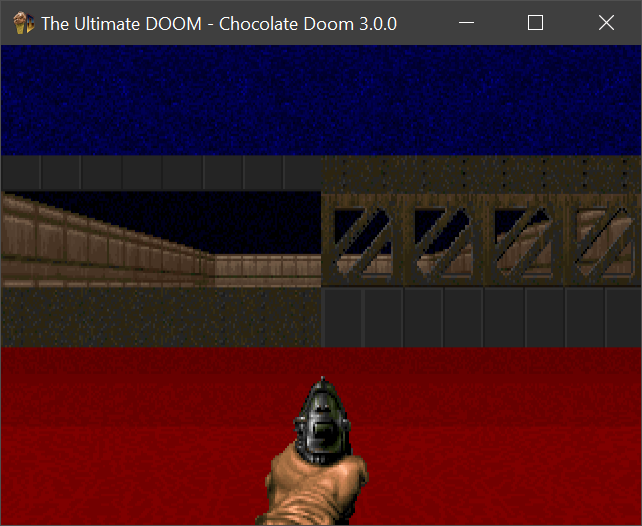

# Week 016 - Portals
Now it is time to talk about the second type of walls, portals, or as I like to call them "Windows".  

Before explaining what portals are, let's recap a few things about solid walls.  
* Solid walls are one-sided Linedefs (you are not supposed to go behind them).
* Once a solid wall is drawn at an X location on the screen, nothing else can be drawn on top of that.  
  
So, what are portals? portals are walls with an opening where you can see through them. They can look like a passageway, a see-through barrier (like grating if a texture is provided), and a step and/or decrease in ceiling height.

  
  
There are two types of portals, ones that you can see through, and ones you can partially see through.   
Portals are parts of a Sector (a sector consists of all connected, surrounding Segs). A Sector defines the ceilings and floors.(A sector defines both heights and textures of both ceilings and floors).

  

Notice the top and bottom section of the Portal are not see-through.  

Top view   

  

The main difference between see-through portals and partial see-through portals, is the see-through part has a middle texture.  
If you don't know me by now, simplicity is the key to understanding, so forget about the partial see-through walls and let’s assume that all portals are just see-through (we will just ignore the middle texture).  

So, with that simplification it should be easy to draw a portal. It's similar to drawing solid walls, but instead of drawing one single solid wall (middle section), let's draw two solid sections: the top and bottom sections. We will not draw anything for the middle, but there is a catch!  

Portals can be identified by having both a right Sector and a left Sector (since we see through the wall, we need to know some information about the floor and ceiling on the other side of the Portal).  
In a single-sided Linedef (a solid wall), a single Seg is created which only has a right side, but two Segs are created for a two-sided Linedef, one for the right and one for the left. That means when we try to draw a Seg we must know if it is running along the right Sector or the left Sector. This is where the direction flag in the Seg data becomes handy. The direction flag indicates the type (direction) of the Seg.  

Original/Chocolate Doom had a nice trick, it checks the direction flag and switches the right and the left, so let’s "borrow" that trick.
In the function ```void Map::BuildSeg()```  

``` cpp
    Sidedef *pRightSidedef;
    Sidedef *pLeftSidedef;

    if (seg.Direction)
    {
        pRightSidedef = seg.pLinedef->pLeftSidedef;
        pLeftSidedef = seg.pLinedef->pRightSidedef;
    }
    else
    {
        pRightSidedef = seg.pLinedef->pRightSidedef;
        pLeftSidedef = seg.pLinedef->pLeftSidedef;
    }
```
Note: I just noticed I pushed the above code in an earlier week, it should have been pushed this week with the explanation.  

With the first issue out of the way, there is another issue we need to handle: maintaining ceiling and floor height. Imagine drawing a Portal (top section and/or bottom section). As you are drawing Segs you need to draw what is behind them.  
 
From the previous week, did you notice that the four pillars look taller than how they look in the original DOOM?  

  

This is due to the ceiling and floors of the Segs that are in front clipped the Segs behind them (in other words, there is a ceiling or a floor that blocks you from seeing). 
The following animation shows the ceiling and the floor for the Segs where the player spawns (those ceilings and floors are not clipping each other).

  

Looking at the same problem from the portal's point of view, portals are see-through, so you have to draw what is behind it, but we are drawing everything from near to far away. So, we need to keep track of where we can draw on the screen (from the top and the bottom).  
We will have two vectors that will keep track of every Y height for every X on the screen.

``` cpp
    std::vector<int> m_FloorClipHeight;
    std::vector<int> m_CeilingClipHeight;
```

and on initialization 
``` cpp
    // m_iRenderXSize = 320
    m_CeilingClipHeight.resize(m_iRenderXSize);
    m_FloorClipHeight.resize(m_iRenderXSize);
```

on each frame start we will set them all to their minimum values

``` cpp
    std::fill(m_CeilingClipHeight.begin(), m_CeilingClipHeight.end(), -1);
    std::fill(m_FloorClipHeight.begin(), m_FloorClipHeight.end(), m_iRenderYSize);
```

Now, while we are drawing Segs we should update those two vectors.

Let’s jump to the code and explain what's happening as we go.

## Goals
* Refactoring
* Clip ceilings and floors
* Draw Portals

## Code
First things first, clean up! I noticed that I have been passing a lot of parameters around, so I grouped them up in a struct and just pass a pointer to that struct.

``` cpp
struct SegmentRenderData
{
    int V1XScreen;
    int V2XScreen;
    
    Angle V1Angle;
    Angle V2Angle;

    float DistanceToV1;
    float DistanceToNormal;
    float V1ScaleFactor;
    float V2ScaleFactor;
    float Steps;

    float RightSectorCeiling;
    float RightSectorFloor;
    float CeilingStep;
    float CeilingEnd;
    float FloorStep;
    float FloorStart;

    float LeftSectorCeiling;
    float LeftSectorFloor;

    bool bDrawUpperSection;
    bool bDrawLowerSection;

    float UpperHeightStep;
    float iUpperHeight;
    float LowerHeightStep;
    float iLowerHeight;

    bool UpdateFloor;
    bool UpdateCeiling;

    Seg *pSeg;
};
```

Now, we should start processing Portal Segs. But how can we tell if a seg is a portal. Previously to determine if a seg is solid we used the following check ```if (seg.pLeftSector == nullptr)``` (solid seg have one side), so with that being given you would expect everything else to be a Portal Seg. However, that is not the case.  
So, one way to check for seg being a portal is to check if the there is a difference in ceiling or floor height between the right and left Sector.

``` cpp
// function AddWallInFOV
// Windowed walls
if (seg.pRightSector->CeilingHeight != seg.pLeftSector->CeilingHeight ||
    seg.pRightSector->FloorHeight != seg.pLeftSector->FloorHeight)
{
    ClipPassWalls(seg, V1XScreen, V2XScreen, V1Angle, V2Angle);
    return;
}
```

Now, we detect that a Seg is portal, we need to find out if a solid wall already fills that area (remember, once a solid wall is there you can't draw anything over it). We have a function that does this for us ```ClipSolidWalls```, but there is a little problem if we decide to use the same function. The function expects the Seg being passed to be a solid wall and will fill the area that is supposed to be a portal, which is something we don't want to do. One solution to this problem is to duplicate code in ```ClipSolidWalls``` to ```ClipPassWalls``` and simply remove the code that stores the Seg. So, both functions have the same implementation, but removing any insert or delete to the ```m_SolidWallRanges``` vector.

``` cpp
void ViewRenderer::ClipPassWalls(Seg &seg, int V1XScreen, int V2XScreen, Angle V1Angle, Angle V2Angle)
{
    ....
}
```

Now, after we know that the partial Seg could possibly be drawn in that area we will require some flags to help us decide of what to keep track.

This is where the function ```CeilingFloorUpdate(RenderData, seg);``` comes into play.

``` cpp
void ViewRenderer::CeilingFloorUpdate(SegmentRenderData &RenderData)
{
    if (!RenderData.pSeg->pLeftSector)
    {
        RenderData.UpdateFloor = true;
        RenderData.UpdateCeiling = true;
        return;
    }

    if (RenderData.LeftSectorCeiling != RenderData.RightSectorCeiling)
    {
        RenderData.UpdateCeiling = true;
    }
    else
    {
        RenderData.UpdateCeiling = false;
    }

    if (RenderData.LeftSectorFloor != RenderData.RightSectorFloor)
    {
        RenderData.UpdateFloor = true;
    }
    else
    {
        RenderData.UpdateFloor = false;
    }

    if (RenderData.pSeg->pLeftSector->CeilingHeight <= RenderData.pSeg->pRightSector->FloorHeight || RenderData.pSeg->pLeftSector->FloorHeight >= RenderData.pSeg->pRightSector->CeilingHeight)
    {
        // closed door
        RenderData.UpdateCeiling = RenderData.UpdateFloor = true;
    }

    if (RenderData.pSeg->pRightSector->CeilingHeight <= m_pPlayer->GetZPosition())
    {
        // below view plane
        RenderData.UpdateCeiling = false;
    }

    if (RenderData.pSeg->pRightSector->FloorHeight >= m_pPlayer->GetZPosition())
    {
        // above view plane
        RenderData.UpdateFloor = false;
    }
}
```

Now, we need to update our ```CalculateWallHeight``` to handle the left Sector. If you remember, it already handles the right Sector from the previous week.
These are similar calculations as to what we have done on the right Sector.

``` cpp
void ViewRenderer::CalculateWallHeight(Seg &seg, int V1XScreen, int V2XScreen, Angle V1Angle, Angle V2Angle)
{
    ...

    if (seg.pLeftSector)
    {
        RenderData.LeftSectorCeiling = seg.pLeftSector->CeilingHeight - m_pPlayer->GetZPosition();
        RenderData.LeftSectorFloor = seg.pLeftSector->FloorHeight - m_pPlayer->GetZPosition();

        CeilingFloorUpdate(RenderData, seg);

        // Is the Ceiling visible?
        if (RenderData.LeftSectorCeiling < RenderData.RightSectorCeiling)
        {
            RenderData.bDrawUpperSection = true;
            RenderData.UpperHeightStep = -(RenderData.LeftSectorCeiling * RenderData.Steps);
            RenderData.iUpperHeight = round(m_HalfScreenHeight - (RenderData.LeftSectorCeiling * RenderData.V1ScaleFactor));
        }

        // Is the floor visible
        if (RenderData.LeftSectorFloor > RenderData.RightSectorFloor)
        {
            RenderData.bDrawLowerSection = true;
            RenderData.LowerHeightStep = -(RenderData.LeftSectorFloor * RenderData.Steps);
            RenderData.iLowerHeight = round(m_HalfScreenHeight - (RenderData.LeftSectorFloor * RenderData.V1ScaleFactor));
        }
    }

    RenderSegment(seg, V1XScreen, V2XScreen, RenderData);
}
```

Now, with the drawing function cleaned up, the drawing of upper and lower sections is basically the same. The drawing of the middle section is also very similar.
The only problem I faced was within the ```SelectColor``` function, within the while loop (to have different colors for the top and bottom sections). The rendering was extremely slow. The function ```SDL_SetRenderDrawColor``` is very time-consuming. We will investigate fixing this next week but, for now, let’s set both the upper and lower sections of each portal to same color.  

``` cpp
void ViewRenderer::RenderSegment(SegmentRenderData &RenderData)
{
    SDL_Color color;
    int iXCurrent = RenderData.V1XScreen;

    SelectColor(*(RenderData.pSeg), color);

    while (iXCurrent <= RenderData.V2XScreen)
    {
        int CurrentCeilingEnd = RenderData.CeilingEnd;
        int CurrentFloorStart = RenderData.FloorStart;

        if (!ValidateRange(RenderData, iXCurrent, CurrentCeilingEnd, CurrentFloorStart))
        {
            continue;
        }

        if (RenderData.pSeg->pLeftSector)
        {
            DrawUpperSection(RenderData, iXCurrent, CurrentCeilingEnd);
            DrawLowerSection(RenderData, iXCurrent, CurrentFloorStart);
        }
        else
        {
            DrawMiddleSection(RenderData, iXCurrent, CurrentCeilingEnd, CurrentFloorStart);
        }

        RenderData.CeilingEnd += RenderData.CeilingStep;
        RenderData.FloorStart += RenderData.FloorStep;
        ++iXCurrent;
    }
}
```

There is a nice optimization in the code, handle closed doors as a solid wall

``` cpp
    // AddWallInFOV
    // Handle closed door
    if (seg.pLeftSector->CeilingHeight <= seg.pRightSector->FloorHeight
        || seg.pLeftSector->FloorHeight >= seg.pRightSector->CeilingHeight)
    {
        ClipSolidWalls(seg, V1XScreen, V2XScreen, V1Angle, V2Angle);
        return;
    }
```

One final thing, let’s give the player a way to raise and lower their altitude so that we can fly around the map using the Z and X buttons.

``` cpp
void Player::Fly()
{
    m_ZPosition += 1;
}

void Player::Sink()
{
    m_ZPosition -= 1;
}
```

Now run  

  

Comparing the progress

  

Now moving around

  

It unbelievable that simply handling those two types of walls renders the Mission, it is very impressive to see a 2D map transform into a 3D view this way. It makes me wonder how they came up with this back in 1993.  
All those ceilings and floors that are drawn in black are known as Visplanes. But, those are for an upcoming week.
What I would like to do now is to give the DOOM guy proper walking code. You may have noticed that his Z coordinate doesn't change when he goes up or down stairs.

## Other Notes
The above code is implemented in the original Chocolate DOOM in r_segs.c, R_StoreWallRange, and r_main.c. This is just part of what this function does.
Drawing Portals was easier than I had expected. It may sound complex at the beginning, but if you break it down and go slow it should be easy to understand

## Source code
[Source code](../src)  

## Reference
[Segs Doom Fandom](https://doom.fandom.com/wiki/Seg)
