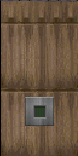
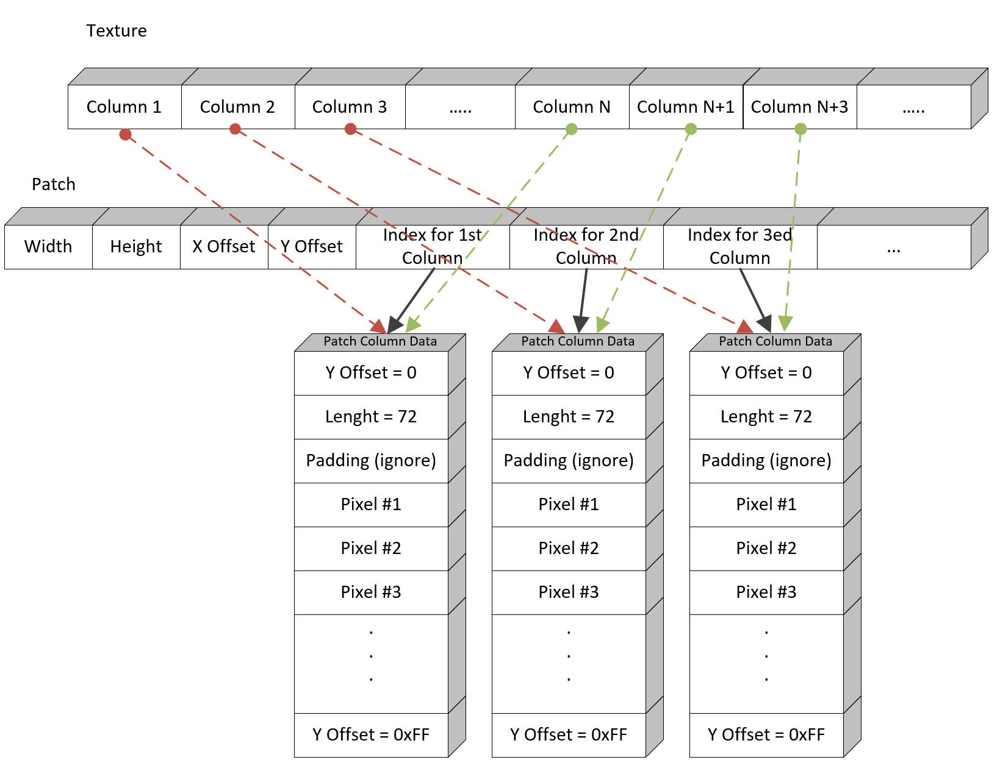
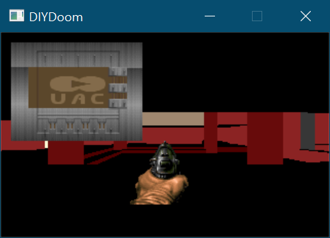
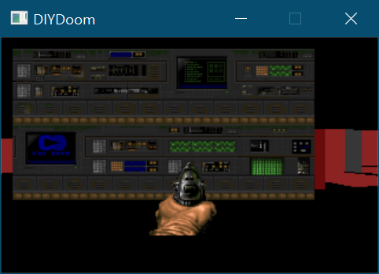
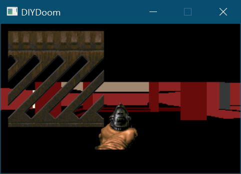

# Week 020 - Texture Format

Now it’s time to start looking into how texture is formatted in DOOM. The texture format and implementation are very interesting to study and learn about. With our knowledge about patch/picture format, it is time to dig deeper and look how textures are composed on run time. So, let’s get started.

A texture is composed of a single or multiple patch, that get formatted and overlapped to form the final texture.  
Let’s have a look at a simple example given the following patches  

     

The two textures below are composed of the above patches

   

  

Did you start having a sense how powerfully this could be?  

Few things to note: 
* Texture has its own size that is not dependent on the patch size.
* The order of drawing patches will affect the final texture.
* Such a LEGO design gives the map designer more flexibility when designing a wall texture.  
* WAD size will be small (since you don't need to prebake those textures).

Before we jump into how to compose the texture lets first have a look at the texture format in the WAD.

In the shareware version only TEXTURE1 lump exist, but for retail it also gets TEXTURE2 lump. So, to get a complete list of textures for retail version we must read both TEXTURE1, TEXTURE2 lumps (both lumps have exact same format).

### Texture Header
| Field Size | Size | Data Type    | Content                                                        |  
|------------|------|--------------|----------------------------------------------------------------|  
| 0x00-0x03  | 4    | unsigned int | Number of textures                                             |  
| 0x04-0x07  | 4\*    | unsigned int | Array of offsets of textures data structure                  |  

### Texture Data
| Field Size | Size | Data Type      | Content                                                                   |  
|------------|------|----------------|---------------------------------------------------------------------------|  
| 0x00-0x07	 |  8   | ASCII          | Name of texture                                                           |  
| 0x08-0x0B  |  4   | unsigned int   | Ignored                                                                   |  
| 0x0C-0x0D  |  2   | unsigned short | Texture width                                                             |  
| 0x0E-0x0F	 |  2   | unsigned short | Texture height                                                            |  
| 0x10-0x13  |  4   | unsigned int   | Ignored                                                                   |  
| 0x14-0x15  |  2   | unsigned short | Number of patches used by the textures                                    |  
| 0x16-0x17  |  10\* | Patch layout  | A structure that formats how the patch is drawn on the texture            |  

### Patch layout
This is how the patch should be drawn on the texture, the order affects final texture.

| Field Size | Size | Data Type    | Content                                                                   |  
|------------|------|--------------|---------------------------------------------------------------------------|  
| 0x00-0x01  |  2   | short int    | Horizontal offset of the patch relative to the upper-left of the texture  |  
| 0x02-0x03  |  2   | short int    | Vertical offset of the patch relative to the upper-left of the texture    |  
| 0x04-0x05  |  2   | short int    | Patch index as listed in patch names (PNAMES, see below)                  |  
| 0x06-0x07  |  2   | short int    | Ignored                                                                   |  
| 0x08-0x09  |  2   | short int    | Ignored                                                                   |  

### Patch Names 
| Field Size | Size | Data Type      | Content                               |  
|------------|------|----------------|---------------------------------------|  
| 0x00-0x03  |  4   | unsigned int   | Number of patches                     |  
| 0x04-0x0A  |  8\* | unsigned short | Patch name, maximum 8 characters      |  

Visualizing all the above

  

Now with all this information the simplest possible way we can generate the final texture is allocate a memory that matches the size of the texture and simple draw (copy) its patches into it, and we are done. Do you think this is what DOOM does? Of course not! The biggest problem with such approach is wasting memory. 

Let me explain, we said a texture could be composed of one or multiple patches. Let’s take the simplest case possible, a texture composed of one single patch. That mean if we allocate memory for the texture matching the texture size, then just copying the patch into it the texture we will have a duplication of exact same thing in memory. Once for the patch and once for the texture.   

Memory allocated for the patch  


Memory allocated for the texture  


Do you see the problem?

Let’s take another example let’s say we have a texture that is composed of two the same patch, next to each other  

Memory allocated for the patch  


Memory allocated for the texture  


Do you see the problem yet? It is just wasting memory with duplicate data!
   
Note: Some constrains for now, no transparency in textures.  

Before we jump into how DOOM solved this problem, lets refresh how patch structure looked like


The patch column is decoupled from the patch and just pointed to by the patch. Texture can use this to its own advantage, but just pointing to those patch column data (but that won’t work in all cases, we will explain more as we go on).

Let’s start by a simple example, a texture that is composed of a single patch. All the texture needs to do is just point to those columns and reuse those data

  

Notice No need to reallocate memory for the texture, just use pointers to the patch data.

Now let’s move to another simple texture, a texture with 2 patches (those patches column don't overlap at all, they are next to each other)


Again, you can use the above the same technic and just use pointers and save memory

  

So, where does the above technic fails? When two or more patches overlap in columns, look at the following example

  

The green area is unmodified (data in texture is same as in patch), but the red highlighted area has overlapping textures.


For such case we need to allocate memory and re-construct the overlap area, and the rest of the texture can simply reuse the original patch data.

  

Some textures need all columns to be recomposed, a good example of this is the following (there is an overlap in every column).


Now, with all of this being said and you have an idea of how textures are represented, but there is an important step we have not talked about yet, which is detecting how to tell if a column has multiple textures. This is done in an initialization stage where we have an array size equal to the width of the texture, and we go through every patch in the texture keeping track which column it occupies, and when we go through all patches, any column that has a number more than 1 patch then it needs to be composed.

On final thing before we move to implementation, transparency, all the above works fine if there is no transparency. Digging though DOOM code it seems the code doesn't expect transparency patches to overlap, nor I found any texture that has overlapping transparent textures. They are always next to each other with no overlap (so it seems that was a constrain). So, the current rendering code in previous week should take care of transparency.  

Note: If I was implementing textures with current hardware, I would simple just allocate memory for each texture and compose it (the memory saved is not worth the trouble). It took quite a while to get this implemented the same way DOOM does.

## Goals
* Refactoring
* Read TEXTURE1/TEXTURE2
* Add texture class
* Compose a texture

## Code
First things first, the structures where we are going to read data from the WAD file. They should match what we stated above.
Reading from the WAD in nothing special at this point, you can still peak at the code in WADReader and WADLoader.

``` cpp
struct WADPNames
{
    uint32_t PNameCount;
    uint32_t PNameOffset;
};

struct WADTextureHeader
{
    uint32_t TexturesCount;
    uint32_t TexturesOffset;
    uint32_t *pTexturesDataOffset;
};

struct WADTexturePatch
{
    int16_t XOffset;
    int16_t YOffset;
    uint16_t PNameIndex;
    uint16_t StepDir;  // Ignored
    uint16_t ColorMap;  // Ignored
};

struct WADTextureData
{
    char TextureName[9];
    uint32_t Flags;           // Ignored
    uint16_t Width;
    uint16_t Height;
    uint32_t ColumnDirectory;  // Ignored
    uint16_t PatchCount;
    WADTexturePatch *pTexturePatch;
};
```
Note: You might notice there are some fields that are ignored (this is how things are in Classic/Chocolate DOOM), it makes me believe that texture format gone under some kind of modification and changes during development, and this was a dead code left over.  

Now the important stuff, I have added a class to wrap all the texture variables and functions.
The texture composition is done in DOOM with a lazy approach, which means it would composed when the texture needs to be drawn, and once it is compose no need to recompose it.

``` cpp
class Texture
{
public:
    Texture(WADTextureData &TextureData);
    ~Texture();

    bool IsComposed(); // Was this texture composed pre
    bool Initialize(); // Does all the calculations needed for a texture
    bool Compose();

    // Draw a texture on Screen X and Y (no scaling)
    void Render(uint8_t *pScreenBuffer, int iBufferPitch, int iXScreenLocation, int iYScreenLocation); 

    // Draw a specific texture column on screen X and Y.
    void RenderColumn(uint8_t *pScreenBuffer, int iBufferPitch, int iXScreenLocation, int iYScreenLocation, int iCurrentColumnIndex);

protected:
    //int m_Flags; // Ignored
    int m_iWidth;
    int m_iHeight;
    int m_iOverLapSize; // Keeps track of the total height of overlapping columns

    bool m_IsComposed;

    std::string m_sName;

    std::vector<int> m_ColumnPatchCount;
    std::vector<int> m_ColumnIndex;
    std::vector<int> m_ColumnPatch;
    std::vector<WADTexturePatch> m_TexturePatches; // Patches that compose the texture
    std::unique_ptr<uint8_t[]> m_pOverLapColumnData;

};
```

Few things to note so you don't get lost, ```m_iOverLapSize```, is the total height of overlapping columns, you will need this value so you know how much memory needs to be allocated where the overlap patches will be composed.

``` cpp
bool Texture::Compose()
{
    // Initialize will figure out how many patches is there per column, 
    // and total amount of memory needed to be allocated
    Initialize();

    // allocate required memory for 
    m_pOverLapColumnData = std::unique_ptr<uint8_t[]>(new uint8_t[m_iOverLapSize]);

    AssetsManager *pAssetsManager = AssetsManager::GetInstance();

    // To compose to though all the patches that compose the texture
    for (int i = 0; i < m_TexturePatches.size(); ++i)
    {
        //Lookup patch
        Patch *pPatch = pAssetsManager->GetPatch(pAssetsManager->GetPName(m_TexturePatches[i].PNameIndex));

        int iXStart = m_TexturePatches[i].XOffset;
        int iMaxWidth = iXStart + pPatch->GetWidth();


        int iXIndex = iXStart;

        if (iXStart < 0)
        {
            iXIndex = 0;
        }

        //Does this patch extend outside the Texture?
        if (iMaxWidth > m_iWidth)
        {
            iMaxWidth = m_iWidth;
        }

        while (iXIndex < iMaxWidth)
        {
            // Does this column have more than one patch?
            // if yes compose it, else skip it,
            // remember any column with more than 2 patches was set to -1
            // -1 means needs to be composed.
            if (m_ColumnPatch[iXIndex] < 0)
            {
                int iPatchColumnIndex = pPatch->GetColumnDataIndex(iXIndex - iXStart);

                // Ask to patch to compose one of its columns on a buffer
                pPatch->ComposeColumn(m_pOverLapColumnData.get(), m_iHeight, iPatchColumnIndex, m_ColumnIndex[iXIndex], m_TexturePatches[i].YOffset);
            }

            ++iXIndex;
        }
    }

    m_IsComposed = true;
    return m_IsComposed;
}
```

Now like patch rendering we have done last week, this time you want to draw on a buffer instead of screen buffer. Remember the you want to compose a texture patches in same order they show in the WAD. How the Texture is composed in a painter’s algorithm manner. 

The patch ComposeColumn is nothing special, is very similar to drawing on screen.

``` cpp
void Patch::ComposeColumn(uint8_t *pOverLapColumnData, int iHeight, int &iPatchColumnIndex, int iColumnOffsetIndex, int iYOrigin)
{
    while (m_PatchData[iPatchColumnIndex].TopDelta != 0xFF)
    {
        int iYPosition = iYOrigin + m_PatchData[iPatchColumnIndex].TopDelta;
        int iMaxRun = m_PatchData[iPatchColumnIndex].Length;

        if (iYPosition < 0)
        {
            iMaxRun += iYPosition;
            iYPosition = 0;
        }

        if (iYPosition + iMaxRun > iHeight)
        {
            iMaxRun = iHeight - iYPosition;
        }

        for (int iYIndex = 0; iYIndex < iMaxRun; ++iYIndex)
        {
            pOverLapColumnData[iColumnOffsetIndex + iYPosition + iYIndex] = m_PatchData[iPatchColumnIndex].pColumnData[iYIndex];
        }
        ++iPatchColumnIndex;
    }
}
```
In last week we rendered a complete patch, this is just a slim version where you can ask only a specific column to be rendered instead of the full patch

``` cpp
void Patch::RenderColumn(uint8_t *pScreenBuffer, int iBufferPitch, int iColumn, int iXScreenLocation, int iYScreenLocation, int iMaxHeight, int iYOffset)
{
    int iTotalHeight = 0;
    int iYIndex = 0;

    if (iYOffset < 0)
    {
        iYIndex = iYOffset * -1;
    }

    while (m_PatchData[iColumn].TopDelta != 0xFF && iTotalHeight < iMaxHeight)
    {
        while (iYIndex < m_PatchData[iColumn].Length && iTotalHeight < iMaxHeight)
        {
            pScreenBuffer[iBufferPitch * (iYScreenLocation + m_PatchData[iColumn].TopDelta + iYIndex + iYOffset) + iXScreenLocation] = m_PatchData[iColumn].pColumnData[iYIndex];
            ++iTotalHeight;
            ++iYIndex;
        }
        ++iColumn;
        iYIndex = 0;
    }
}
```
Just to test all those changes, I thought the best place to draw a texture is in ViewRenderer for now. Here are some of the textures I tested with.

``` cpp
void ViewRenderer::Render(uint8_t *pScreenBuffer, int iBufferPitch)
{
	m_pScreenBuffer = pScreenBuffer;
	m_iBufferPitch = iBufferPitch;

    InitFrame();
    Render3DView();

    //Texture *pTexture = AssetsManager::GetInstance()->GetTexture("AASTINKY");
    //Texture *pTexture = AssetsManager::GetInstance()->GetTexture("BROWN1");
    //Texture *pTexture = AssetsManager::GetInstance()->GetTexture("BROWNPIP");
    //Texture *pTexture = AssetsManager::GetInstance()->GetTexture("BROWN144");
    //Texture *pTexture = AssetsManager::GetInstance()->GetTexture("BIGDOOR1");
    //Texture *pTexture = AssetsManager::GetInstance()->GetTexture("BIGDOOR2");
    //Texture *pTexture = AssetsManager::GetInstance()->GetTexture("BIGDOOR4");
    //Texture *pTexture = AssetsManager::GetInstance()->GetTexture("COMP2");
    //Texture *pTexture = AssetsManager::GetInstance()->GetTexture("BRNSMAL1");
    //Texture *pTexture = AssetsManager::GetInstance()->GetTexture("BRNBIGC");
    //Texture *pTexture = AssetsManager::GetInstance()->GetTexture("BRNPOIS");
    //Texture *pTexture = AssetsManager::GetInstance()->GetTexture("BRNPOIS2");
    //Texture *pTexture = AssetsManager::GetInstance()->GetTexture("EXITDOOR");
    //Texture *pTexture = AssetsManager::GetInstance()->GetTexture("SKY1");
    //Texture *pTexture = AssetsManager::GetInstance()->GetTexture("TEKWALL5");
    Texture *pTexture = AssetsManager::GetInstance()->GetTexture("SW1DIRT");
    pTexture->Render(pScreenBuffer, iBufferPitch, 10, 10);    
}
```
Now if you got everything right you should see the textures getting drawn.









We are very close to give the walls some textures :)

__Join us on [Discord](https://discord.gg/a8n4Y2z)__

## Other Notes
Here are the same functions in Chocolate DOOM, texture initialization is split to 2 functions ```R_InitTextures``` and ```R_GenerateLookup```.  
Texture composition is process start when ```R_GenerateComposite``` is called, and the function that draws overlapping textures columns to new allocated memory is ```R_DrawColumnInCache```.

This design is very focused on minimizing memory consumption, but added some complexity, again if I was implementing this on modern hardware I will simple allocated memory that match the texture size (height x width), then iterate thought every patch to compose the final texture. 

## Source code
[Source code](../src)  

## Reference
[Fandom TEXTURE1 TEXTURE2](https://doom.fandom.com/wiki/TEXTURE1_and_TEXTURE2)  
[Fandom PNames ](https://doom.fandom.com/wiki/PNAMES)  
