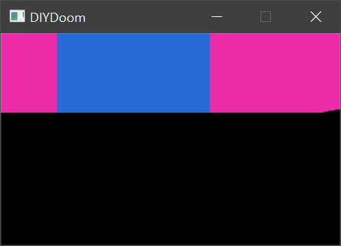

# Week 017 - History
Do you think all the history is true? I don't believe so. Keeping history aside we need to cover a different type of history but before we jump in lets recap.  
So up to last week we were able to render portals and solid segments, what are doing at this point is very close to how DOOM renders a frame. Here is a slow animation to what we currently do.  

  

Due to drawing that way we were forced to draw both top and bottom with exact same color (using upper texture as a random color key), switching color in between was very slow affecting frame rate (SDL_SetRenderDrawColor is performance very expensive, what I tested was draw a single line on top section switch color, draw a single line in bottom section switch color again and so on until we are done with both top and bottom section).  

With the way we render a frame now is fine, but there is a lot of important information that we lost. For example, we have simplified the partial see thought portal as a see though portal, we can’t draw those in a front to back order, it is very hard to draw a nearby see though portal then try and draw what is behind it, it is much easier sometimes to draw object at the back first then draw object in front of them, even if you are going to overdraw each other.   
Notice that now we are looking for a different behavior, we used to draw near to far, but for some cases we need to draw far to near, this is where "history" comes to play, we need somehow to keep track of what was drawn and the order of drawing.  
The classic / Chocolate DOOM engine keeps track of what is drawn in an array called "drawsegs" aka "drawn segments". To read more about drawsegs it is covered in Fabian DOOM engine book v1.1 section 5.12.9.2.  
The idea behind is is very simple, think about it like a history log, when ever you draw something on the screen just add it to an array, and they what is drawn first with show up first in the array.  
We will do a little bit of modification to that, what we will do is keep track of things (and not draw them) and at the end we draw every thing (remember for us this is temporary change of behavior we will revert this at some point, and use the order of segs similar to what it is used in classic / Chocolate DOOM). Our implementation will not be identical to drawsegs, we will modify it as we go and need.  

One other thing I would like to implement this week is giving the player the correct height, we did implement a fly and sink last week, but I would love to see the player just go upstairs and downstairs (with minimal animation). In E1M1 we are lucky that the player spawns on a floor with 0 height, if you switch to E1M3 you will see that when the player spawns the walls are halfway above his head.  



## Goals
* Refactoring / Cleanup  
* Lazy sector drawing  
* Find the correct player eye-level height  

## Code

Let’s start by creating a struct to store the data we need for each segment, just simple store every line we need to draw.  

``` cpp
    struct SingleDrawLine
    {
        int x1;
        int y1;
        int x2;
        int y2;
    };

    struct FrameSegDrawData
    {
        Seg *seg;

        bool bDrawUpperSection;
        bool bDrawLowerSection;
        bool bDrawMiddleSection;

        std::list<SingleDrawLine> UpperSection;
        std::list<SingleDrawLine> LowerSection;
        std::list<SingleDrawLine> MiddleSection;
    };
```

Now we need to store this for every single segment we are going to draw  

``` cpp
std::list<FrameSegDrawData> m_FrameSegsDrawData;
```

Now just add a helper function sore the data we need for a section (top/mid/bottom) of a segment   

``` cpp
void ViewRenderer::AddLineToSection(std::list<SingleDrawLine> &Section, int iXCurrent, int CurrentCeilingEnd, int CurrentFloorStart)
{
    SingleDrawLine line;
    line.x1 = iXCurrent;
    line.y1 = CurrentCeilingEnd;
    line.x2 = iXCurrent;
    line.y2 = CurrentFloorStart;
    Section.push_back(line);
}
```

Now update the function that will do the rendering to call the AddLineToSection we just created.  

``` cpp
void ViewRenderer::RenderUpperSection(ViewRenderer::FrameRenderData &RenderData, int iXCurrent, int CurrentCeilingEnd, FrameSegDrawData &SegDrawData)
{
	...
	AddLineToSection(SegDrawData.UpperSection, iXCurrent, CurrentCeilingEnd, iUpperHeight);
	...
}
```

Finally, add a function to draw off this history we created (you need to update your void ViewRenderer::Render to call the draw function last)  

``` cpp
void ViewRenderer::DrawSoredSegs()
{
    for (std::list<FrameSegDrawData>::iterator SegDrawData = m_FrameSegsDrawData.begin(); SegDrawData != m_FrameSegsDrawData.end(); ++SegDrawData)
    {
        if (SegDrawData->bDrawUpperSection)
        {
            SetSectionColor(SegDrawData->seg->pLinedef->pFrontSidedef->UpperTexture);
            DrawSection(SegDrawData->UpperSection);
        }

        if (SegDrawData->bDrawMiddleSection)
        {
            SetSectionColor(SegDrawData->seg->pLinedef->pFrontSidedef->MiddleTexture);
            DrawSection(SegDrawData->MiddleSection);
        }

        if (SegDrawData->bDrawLowerSection)
        {
            SetSectionColor(SegDrawData->seg->pLinedef->pFrontSidedef->LowerTexture);
            DrawSection(SegDrawData->LowerSection);
        }
    }
}

void ViewRenderer::DrawSection(std::list<ViewRenderer::SingleDrawLine> &Section)
{
    for (std::list<SingleDrawLine>::iterator line = Section.begin(); line != Section.end(); ++line)
    {
        SDL_RenderDrawLine(m_pRenderer, line->x1, line->y1, line->x2, line->y2);
    }
}
```

Now our rendering looks like  

  

Again remember, the what was implemented last week was closer to what classic DOOM does, we will revert some of those changes at some point.  

Now implementing player height calculation, this was much easier that I expected, if you have gone thought Week 006, 007, 008 you will find this a piece of cake.  

Remember the part where you search for the sector the player is in? Once you find the sector, find out its height and add the player eye level to it.  

So simple implement the search of player exactly like what we have done previously  

``` cpp
int Map::GetPlayerSubSectorHieght()
{
    int iSubsectorID = m_Nodes.size() - 1;
    while (!(iSubsectorID & SUBSECTORIDENTIFIER))
    {

        bool isOnBack = IsPointOnBackSide(m_pPlayer->GetXPosition(), m_pPlayer->GetYPosition(), iSubsectorID);

        if (isOnBack)
        {
            iSubsectorID = m_Nodes[iSubsectorID].BackChildID;
        }
        else
        {
            iSubsectorID = m_Nodes[iSubsectorID].FrontChildID;
        }
    }
    Subsector &subsector = m_Subsector[iSubsectorID & (~SUBSECTORIDENTIFIER)];
    Seg &seg = m_Segs[subsector.FirstSegID];
    return seg.pFrontSector->FloorHeight;
    
}
```

Once you found the sector return the floor height, this is where the player is standing! now all you must do is simply add the player eye level to that height (which is 41 in DOOM)  

``` cpp
void Player::Think(int iSubSectorHieght)
{
    m_ZPosition = iSubSectorHieght + m_EyeLevel;
}
```

Now the best place to call those functions is when the DoomEngine is updating!  

``` cpp
void DoomEngine::Update()
{
    m_pPlayer->Think(m_pMap->GetPlayerSubSectorHieght());
}

```

Now play  

  

Even switching to E1M3 now or other maps you will be standing on the floor  
a look at E1M3  

  

Next, I will start exploring how we could read the textures from the WAD files and see if we could possibly give the walls some texture.  
[DOOMReboot](https://twitter.com/DOOMReboot) has been working on a WAD Media Viewer, he has shared the source code with me and he is currently writing an article how to read/view media out of WADs.

## Other Notes
I would recommend reading about "drawsegs" in Fabian book "GAME ENGINE BLACK BOOK DOOM" v1.1 section 5.12.9.2. If you are not clear why we need to keep track of the drawing history I would recommend watching the videos at [fabiensanglard.net](http://fabiensanglard.net/doomIphone/doomClassicRenderer.php), for doom rendering under the "Things and transparent walls". You will notice that "Things" and partial see thought segs gets drawn in a similar behavior to back to front.  
In classic / Chocolate Doom there is a limit to the history array "drawsegs" could have up to 256 entry which could cause some issues in custom maps, later ports removed the limit.  

Now looking at my code, it is very obvious that the design is missed up, there is allot of stuff happening in ViewRenderer class, we should have a separate class to handle a segment and draw it (similar to DOOM code), also having the player as a separate class is not a good idea. I see that we should have a Things class, then the player should be sub-class. All things will need to know its sector height, they will also need to move around.  

## Source code
[Source code](../src)  

## Reference
[Drawsegs overflow](https://doomwiki.org/wiki/Seg)   
[fabiensanglard.net DOOM](http://fabiensanglard.net/doomIphone/doomClassicRenderer.php)  
[GAME ENGINE BLACK BOOK DOOM](http://fabiensanglard.net/gebbdoom/index.html)  