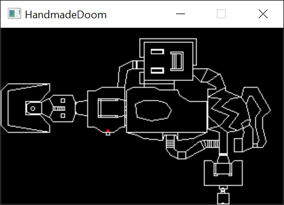
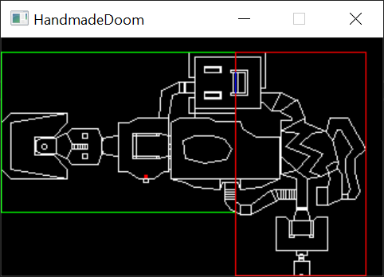
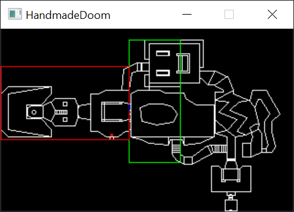
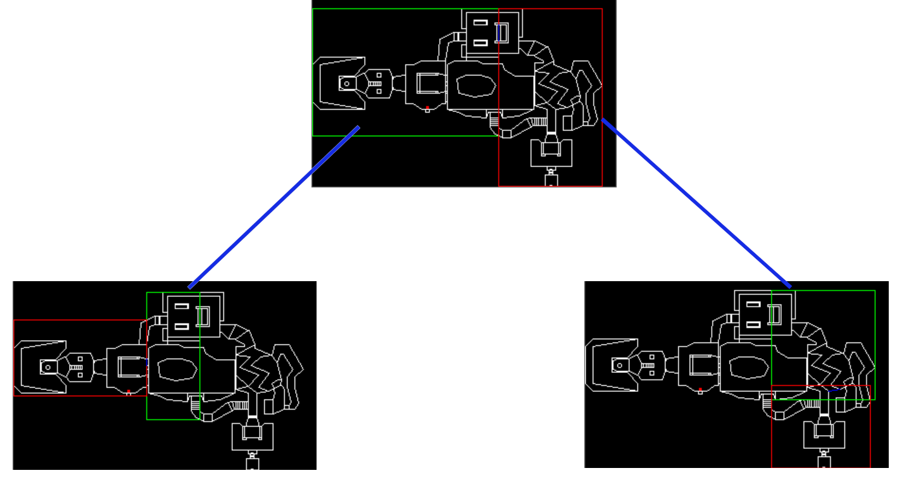

# Week 007 - BSP Node
BSP (binary space partitioning), is just a tree that breaks down a map too small pieces (sub-sectors) and stores them in a form of a tree nodes so it is easy to search for a sub-sector and look at neighboring sub-sectors. When the map is created by the designer it gets processed to generate its BSP tree before the map could be used in game. Lets have a high overview of how this BSP tree could be visualized.  

Let's take E1M1 as an example  

  

A splitter is chosen, and then everything is on the the front or the back of that splitter (sometimes they also call it left and right, I decided not to go with this convention due to the fact that the left is not always the left and right is not always right. Left could be on the right and right could be on the left if you got confused your on the right track. Using left and right will get confusing so front and back is better so no assumptions in direction would be done).  

The front and back are based on the direction of the first vertex moving to the second vertex (mathematically called vector, the direction you go moving to the second point).  

So the first splitter in E1M1 is point (2176, -2304), with change in X = 0 and change in Y = -256 (line is moving down). This makes the front of the line to the left and back to the right.  

  

In this image the splitter is the small blue line, the left green box is the front and the red box is the back.  

Each one of those boxes is split to the smaller front and back boxes (forming the tree).  

  

First BSP tree level for E1M1  

  

This will go all the way until we have a "sub-sector" which is a convex polygon (we will dig deep into that later).  
The node structure in the WAD has a lot of data stored in it. A node is a sub-sector leaf node if the last bit is set to 1 (a leaf node, indicating that this node is a sub-sector and it will not have more children). 

For now, we will not use this information, but it is critical to figure out the type of the node we are looking at.  
Something to note here, you can see how developer back then would utilize every single bit they could, nowadays (and I'm doing that myself) just allocate memory left and right.  

In my professional life, I have seen how much performance was impacted because developers was too lazy and was just copying variables over and over for function calls (An HTML parser that took 10 sec with passing variables by value over and over dropped down to 3 sec when the code was just changed to pass pointer around). Using too much memory will impact your application performance because it will be busy fetching data from memory.  

## Goals
1. Read the Node structure  
   
## Design
So at this point we just need to read the nodes of map BSP tree, the nodes are sorted into an array (and we will store them in an array format), the index is needed to access the children of a node.  
So let's get started

### Node Data Format  
| Field Size | Data Type                            | Content                                          |  
|------------|--------------------------------------|--------------------------------------------------|  
| 0x00-0x01  | Partition line x coordinate          | X coordinate of the splitter                     |  
| 0x02-0x03  | Partition line y coordinate          | Y coordinate of the splitter                     |   
| 0x04-0x05  | Change in x to end of partition line | The amount to move in X to reach end of splitter |  
| 0x06-0x07  | Change in y to end of partition line | The amount to move in Y to reach end of splitter |  
| 0x08-0x09  | Front box top                        | First corner of front box (Y coordinate)         |  
| 0x0A-0x0B  | Front box bottom                     | Second corner of front box (Y coordinate)        |  
| 0x0C-0x0D  | Front box left                       | First corner of front box (X coordinate)         |  
| 0x0E-0x0F  | Front box right                      | Second corner of front box (X coordinate)        |  
| 0x10-0x11  | Back box top                         | First corner of back box (Y coordinate)          |  
| 0x12-0x13  | Back box bottom                      | Second corner of back box (Y coordinate)         |  
| 0x14-0x15  | Back box left                        | First corner of back box (X coordinate)          |  
| 0x16-0x17  | Back box right                       | Second corner of back box (X coordinate)         |  
| 0x18-0x19  | Front child index                    | Index of the front child + sub-sector indicator  |  
| 0x1A-0x1B  | Back child index                     | Index of the back child + sub-sector indicator   |  

A lot of data, but there is few interesting things to be noted here. 
* The splitter is stored as a single point, then the delta in X and Y to the second point. This is an optimization which we will talk about when we start traversing the BSP node.
* Why in the world would he need to store the front box and the Back box of a splitter? After digging a little bit into the code it is another brilliant optimization (sadly we will not use for now but we will cover how it works). On the other had this boxes are used in all those screen shoots to show the front and back of the splitter.

## Coding
So nothing is new here, again just the same old task, reading the node data from the WAD.  

Adding our struct that will hold the data  

``` cpp
struct Node
{
    int16_t XPartition;
    int16_t YPartition;
    int16_t ChangeXPartition;
    int16_t ChangeYPartition;

    int16_t FrontBoxTop;
    int16_t FrontBoxBottom;
    int16_t FrontBoxLeft;
    int16_t FrontBoxRight;

    int16_t BackBoxTop;
    int16_t BackBoxBottom;
    int16_t BackBoxLeft;
    int16_t BackBoxRight;

    uint16_t FrontChildID;
    uint16_t BackChildID;
};
```
Update Map.h to hold the nodes  

``` cpp
 std::vector<Node> m_Nodes;
```

If you haven't noticed yet, the map is becoming a mess! I promise to refactor this but not yet, as soon as I get some 3D drawn on the window I will clean all of this.  

Adding a function that will read the data based on their size.  

``` cpp
void WADReader::ReadNodesData(const uint8_t *pWADData, int offset, Node &node)
{
    node.XPartition = Read2Bytes(pWADData, offset);
    node.YPartition = Read2Bytes(pWADData, offset + 2);
    node.ChangeXPartition = Read2Bytes(pWADData, offset + 4);
    node.ChangeYPartition = Read2Bytes(pWADData, offset + 6);

    node.FrontBoxTop = Read2Bytes(pWADData, offset + 8);
    node.FrontBoxBottom = Read2Bytes(pWADData, offset + 10);
    node.FrontBoxLeft = Read2Bytes(pWADData, offset + 12);
    node.FrontBoxRight = Read2Bytes(pWADData, offset + 14);

    node.BackBoxTop = Read2Bytes(pWADData, offset + 16);
    node.BackBoxBottom = Read2Bytes(pWADData, offset + 18);
    node.BackBoxLeft = Read2Bytes(pWADData, offset + 20);
    node.BackBoxRight = Read2Bytes(pWADData, offset + 22);

    node.FrontChildID = Read2Bytes(pWADData, offset + 24);
    node.BackChildID = Read2Bytes(pWADData, offset + 26);
}
```

Now it is time to read the Node from the WAD.  

``` cpp
bool WADLoader::ReadMapNodes(Map *pMap)
{
    int iMapIndex = FindMapIndex(pMap);

    if (iMapIndex == -1)
    {
        return false;
    }

    iMapIndex += EMAPLUMPSINDEX::eNODES;

    if (strcmp(m_WADDirectories[iMapIndex].LumpName, "NODES") != 0)
    {
        return false;
    }

    int iNodesSizeInBytes = sizeof(Node);
    int iNodesCount = m_WADDirectories[iMapIndex].LumpSize / iNodesSizeInBytes;

    Node node;
    for (int i = 0; i < iNodesCount; ++i)
    {
        m_Reader.ReadNodesData(m_WADData, m_WADDirectories[iMapIndex].LumpOffset + i * iNodesSizeInBytes, node);

        pMap->AddNode(node);
    }

    return true;
}
```

The root node is the last node, let's read that and draw the splitter, front and back box.  

``` cpp
void Map::RenderAutoMapNode()
{
    // Get the last node
    Node node = m_Nodes[m_Nodes.size()-1];

    SDL_Rect FrontRect = {
        RemapXToScreen(node.FrontBoxLeft),
        RemapYToScreen(node.FrontBoxTop),
        RemapXToScreen(node.FrontBoxRight) - RemapXToScreen(node.FrontBoxLeft) + 1,
        RemapYToScreen(node.FrontBoxBottom)- RemapYToScreen(node.FrontBoxTop) + 1
    };

    SDL_Rect BackRect = {
        RemapXToScreen(node.BackBoxLeft),
        RemapYToScreen(node.BackBoxTop),
        RemapXToScreen(node.BackBoxRight) - RemapXToScreen(node.BackBoxLeft) + 1,
        RemapYToScreen(node.BackBoxBottom) - RemapYToScreen(node.BackBoxTop) + 1
    };

    SDL_SetRenderDrawColor(m_pRenderer, 0, 255, 0, SDL_ALPHA_OPAQUE); 
    SDL_RenderDrawRect(m_pRenderer, &FrontRect);
    SDL_SetRenderDrawColor(m_pRenderer, 255, 0, 0, SDL_ALPHA_OPAQUE);
    SDL_RenderDrawRect(m_pRenderer, &BackRect);

    SDL_SetRenderDrawColor(m_pRenderer, 0, 0, 255, SDL_ALPHA_OPAQUE);
    SDL_RenderDrawLine(m_pRenderer,
        RemapXToScreen(node.XPartition),
        RemapYToScreen(node.YPartition),
        RemapXToScreen(node.XPartition + node.ChangeXPartition),
        RemapYToScreen(node.YPartition + node.ChangeYPartition));
}
```

  

## Other Notes  
So looking at the original/Chocolate Doom port, the function P_LoadNodes in p_setup.c is the one that loads the BSP nodes. The function  allocates an array of memory and for loops loading the nodes from the WAD.  

The screen shots I took utilized the front and back box in the node, it is nice to play around and draw boxes by changing the index of the node you read
``` cpp
Node node = m_Nodes[m_Nodes.size()-1]; // try  m_Nodes[131]
```

it will give a better understanding of how things are broken down.

## Source code
[Source code](../src)  

## Reference
[FANDOM](https://doom.fandom.com/wiki/Node) 
[Doom Wiki](https://doomwiki.org/wiki/BSP_(node_builder))
