__Editor:__ DOOMReboot ([twitter](https://twitter.com/DOOMReboot))  

# Week 015 - Solid Walls Height (2/2)
So, the time has come to cover how things work in DOOM. This part has puzzled fans and, after reading this post at [Doomworld](https://www.doomworld.com/forum/topic/69966-prboom-graphical-glitches/), I became even more confused. I kept hunting for the correct answers. I investigated the code and tried to understand the theory behind it, but no luck. I looked into books old and new, but no one used such a way to calculate the wall projection. I even tried to reach out to the internet for answers by posting questions, again no answer. But before writing this note, I gave the code one last look, and OMG it happened, it clicked!  

## Goals
* Calculate Wall height the DOOM way  

## Polar Coordinates 
To understand the code, I had to look at things as black boxing without trying to understand how they internally work.  
Before we move on, we must understand what "polar coordinates" mean.  

The most commonly used coordinate system is Cartesian: define a point using X and Y. In simple English, you define a point by how far left or right and how far up or down it is.  
Cartesian coordinates:   

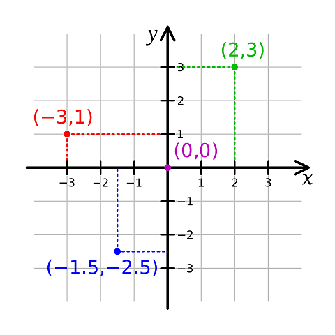   

Now, let's look at what polar coordinates mean. Polar coordinates use a distance and an angle to define a point location, how far away it is, and at which angle.   
Polar coordinates:   

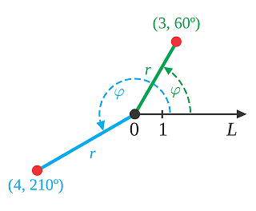   

So, with that being said, expect a point being defined by distance and angle!   

## Projection 
In the previous approach (Week014), the approach was to calculate the distance to a point and evaluate the proportional value on the screen. Original/Chocolate DOOM code does the same, but with a different approach: it finds the scaling factor.   

Let's start by understanding what scaling means. Keep in mind that we are focusing on the horizontal properties of an object.   
The screen is 160 units away from the player. That means anything you see that is exactly at the screen location will not be scaled (it should be drawn on screen with 1 pixel = 1 world unit).   
For example, if an object is 50 units high, then it should be drawn as 50 pixels on screen.  
Now, let's move to another example. Let's say this object has moved to be at 320 units away from the player. How do you expect it to be scaled?   
In a proportional world, the distance has doubled which means the player is further away from the object, which makes it look much smaller on the screen.   
To calculate the scale, divide 160 units (where player sees it at 100% scale) by the distance of the object which is now 320.  This comes out to be scaled at 0.5 or (50%).  
Note: I’m assuming that the following objects show at the center of the screen.   
With this logic in mind, implementing this on walls should be very simple; find the distance to the screen at the same angle to wall edge (V1) and divide it by the distance to wall edge (V1) to get your factor!  

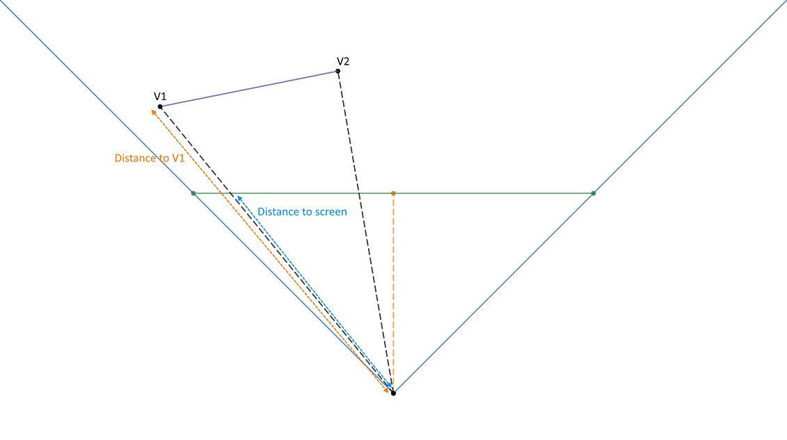  

Do this for V1 and V2 and you will be able to draw the wall. Simple? That is what DOOM does, but with clipping partial Segs in mind.  

## The Normal   
The code doesn't look at the line seg, it looks at the entire line. A line segment has a starting point and an ending point while a line has no starting or end point (it stretches to infinity).   
Let's look at a segment example   

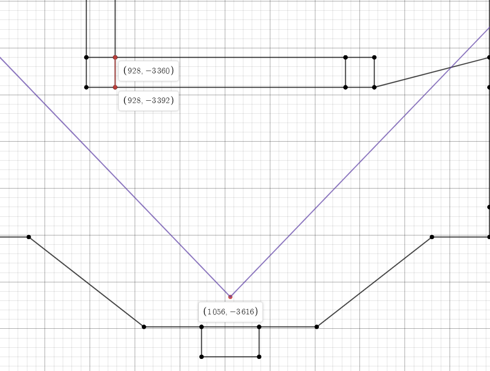  

We are interested in the wall denoted by V1 at (928, -3392) and V2 at (928, -3360)  
Keep in mind we know that V1 exists in the wall (Seg) we care about!   
Now, forget it is a line segment and think about it as a line!   

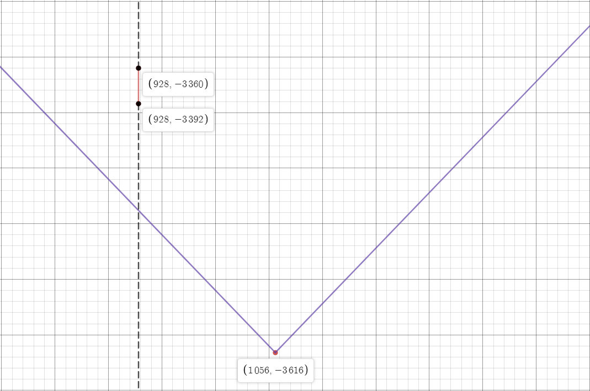   

In the above example V1 and V2 would be viewable by the player. We can simply use the distance formula to calculate the distance to V1 (Same way we did in Week014), but what about if V1 or V2 is outside the screen area?  

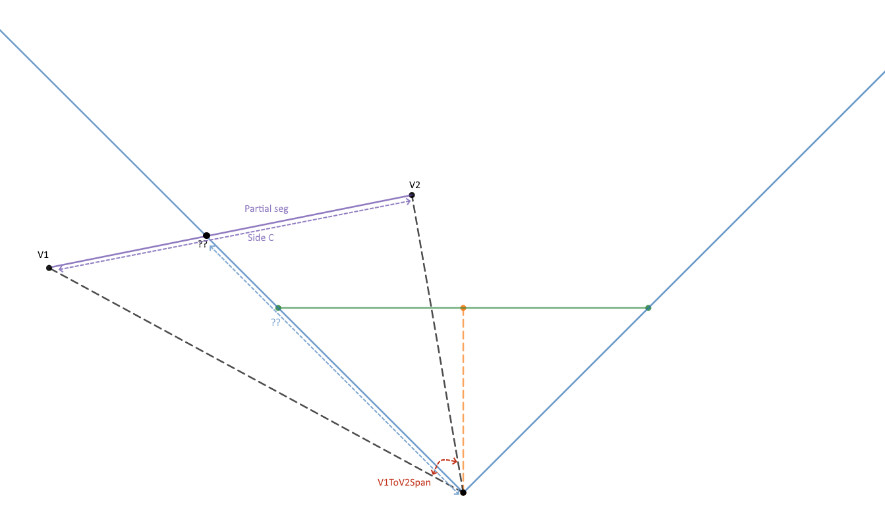   

The rendering will not be correct for partially viewable segments.  
So, we need to decouple V1 and V2 from the calculation; instead of calculating the distance to V1, we would calculate the intersection of the FOV with the segment. To implement this, we need a way to calculate points on the line without V1 or V2 being involved. This is where the normal to the wall would help.   
The normal is simply a line that is perpendicular to the line slope. The Seg slope is already available in the Seg data which is loaded from the WAD.   

The normal will help us create a right-angle triangle no matter what the angle of the wall is.  

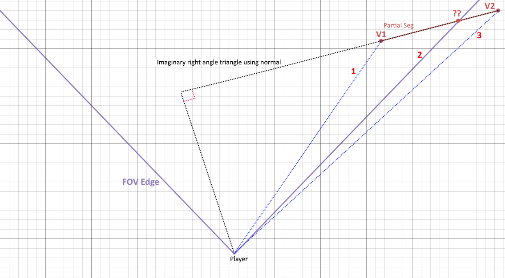  

Notice that if we have the right-angle triangle (using the normal), then you can calculate the distance of side 1, 2 or 3 (given the angle).  
And instead of calculating the distance using X and Y coordinates for V1 or V2 we can use the V1 and V2 screen X coordinates' angle to calculate the distance.  

```
Note: 
Remember the X coordinate was clipped so if V1 is outside the screen it was clipped to be drawn at X = 0 with angle 45, and if V2 was outside the screen it was clipped to be drawn at 319 with angle -45.
We can use this to our advantage.  
```

Let's continue using our example by adding a normal to the Seg  

``` cpp
Angle SegToNormalAngle = seg.SlopeAngle + Angle90;
```

The slope of this Seg (line) is 90! Just add 90 to that to get the normal to that line (Normal angle = 90 + 90 = 180)   

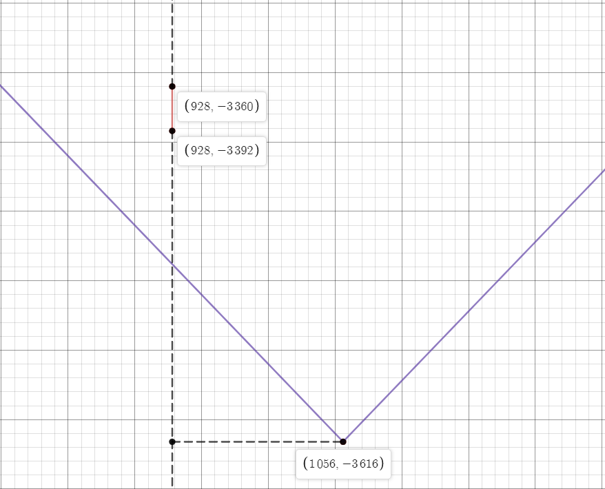   

The normal can be drawn anywhere on the line, but we care that it goes though the player. After all, we are trying to project relative to the player's location.    
Note: The normal that is calculated will be true for any segment on the line, and not only V1 or V2 (do you see that we started decoupling?). But, if we want to be completely decoupled from V1 or V2 (and form a right-angle triangle) then we need to find the length from the normal to the player.    

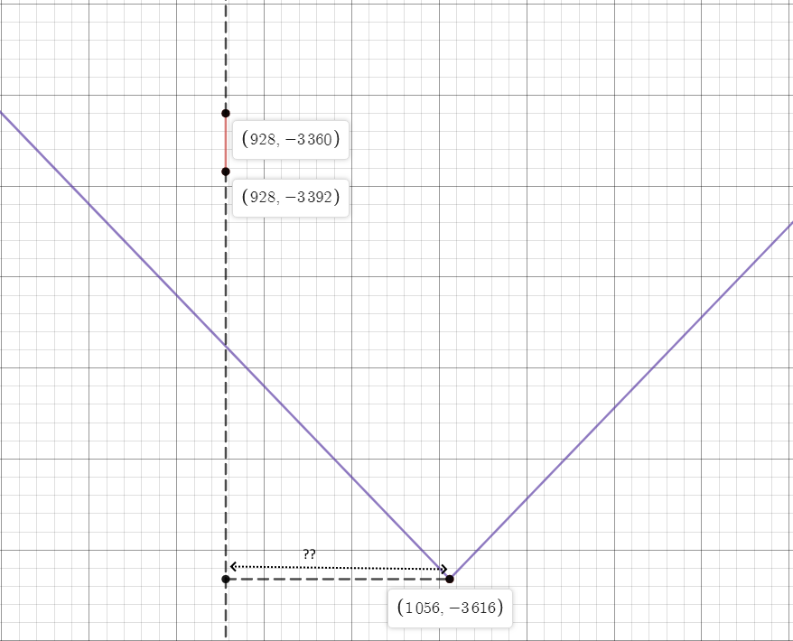   

We have some givens we could make use of to find that out.  
Let's create a right-angle triangle and find out the length of that segment. Add a segment from V1 to the player (I promise we will decouple V1 by using V1 just be patient).  

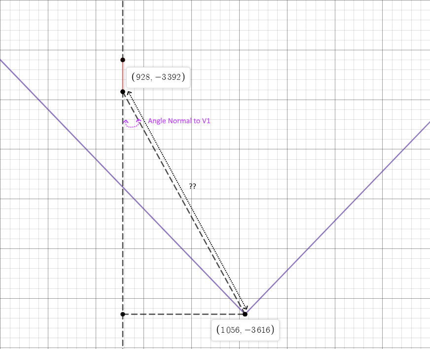  

We can find the angle at the top of the triangle easily since we have all the givens  

``` cpp
    Angle NomalToV1Angle = SegToNormalAngle.GetValue() - V1Angle.GetValue();
```

Now it is even more easy to find the angle at the lower right corner of the triangle  

``` cpp
    // Total sum of angles in a triangle is 180
    // We already know that one of them is 90
    // and we just calculated another one
    // so 180 - 90 - NomalToV1Angle
    Angle SegToPlayerAngle = Angle90 - NomalToV1Angle;
```

Now that we have all three angles, we can easily calculate the length of one side (V1) to the player, by simply using the distance formula.  

``` cpp
    // using the location of V1 and player we can 
    float DistanceToV1 = m_pPlayer->DistanceToPoint(*seg.pStartVertex);
```

Now, it should be simple trigonometry to find out the length of the normal  

``` cpp
    float DistanceToNormal = SegToPlayerAngle.GetSinValue() * DistanceToV1;
``` 

Let's move on to calculating the scaling factor and see how we can put this to use!  

So, we want to find the scale of the wall at the point V1 (without using V1 coordinates).  
Let's start by finding the distance to the projection screen; it should be easy, and we have done that back in week014 (when calculating for fish eye correction). We know the distance to the screen is 160 and we know the angle from the lookup table.  

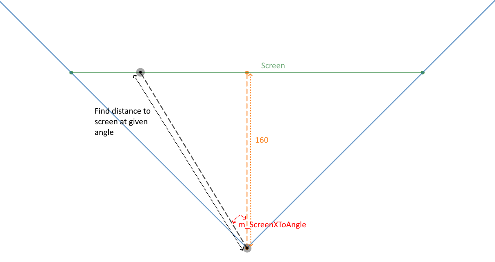  

So that makes our first equation   

```
// m_iDistancePlayerToScreen = 160
// ScreenXAngleCos: The angle from the center of the screen, forming a right-angle triangle
m_iDistancePlayerToScreen / ScreenXAngleCos
```

Now, we care about finding the full length at the same exact angle of the screen, but by utilizing the normal we calculated; in other words, find the distance from the player to V1, yes, V1. Does that sound bizarre? We are trying to re-calculate the distance to V1, but using angles this time (polar coordinates). Again, the reason for this is to clip it in case it is outside the FOV.  
Now that we have the base of the right-angle triangle, we need to calculate the angle between the normal and the new projected line to V1 (to form a right-angle triangle), which I will call SkewAngle.  

``` cpp
Angle SkewAngle = m_ScreenXToAngle[VXScreen] + m_pPlayer->GetAngle() - SegToNormalAngle;  
```

Using cosine, we can find the full length to what is/was "V1"   

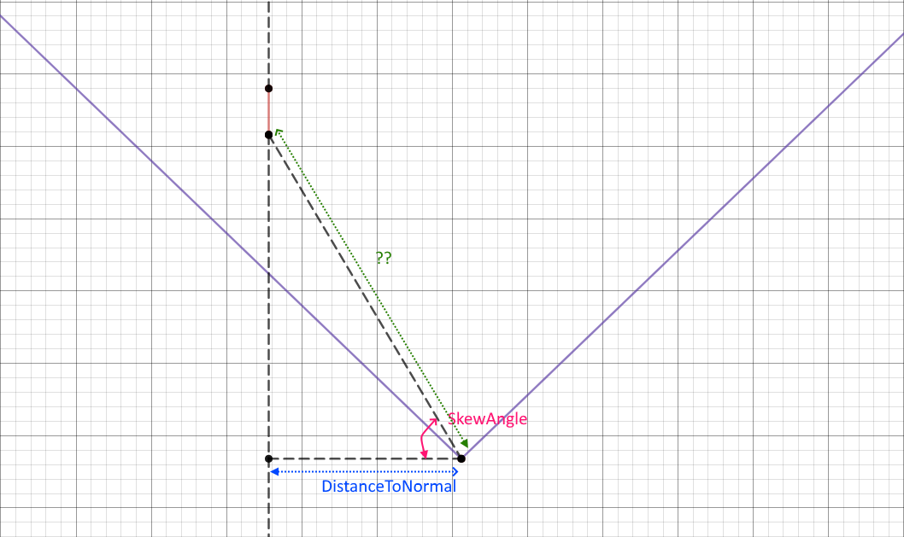  

This makes the second equation  

``` 
DistanceToNormal / SkewAngleCos
```

Notice V1 didn't come to play anymore and we just used the angles and distances to points.  
Dividing those two equations would give us the factor for scaling V1  

```
(m_iDistancePlayerToScreen / ScreenXAngleCos)  divided by (DistanceToNormal / SkewAngleCos)
```

Simplifying the above equation (fraction division to multiplication, flip right side)   

```
float ScaleFactor = (m_iDistancePlayerToScreen * SkewAngleCos) / (DistanceToNormal * ScreenXAngleCos);
```

That gives us the scaling factor.  

All of the scaling code in one piece!  

``` cpp
float ViewRenderer::GetScaleFactor(int VXScreen, Angle SegToNormalAngle, float DistanceToNormal)
{
    static float MAX_SCALEFACTOR = 64.0f;
    static float MIN_SCALEFACTOR = 0.00390625f;

    Angle Angle90(90);

    Angle ScreenXAngle = m_ScreenXToAngle[VXScreen];
    Angle SkewAngle = m_ScreenXToAngle[VXScreen] + m_pPlayer->GetAngle() - SegToNormalAngle;

    float ScreenXAngleCos = ScreenXAngle.GetCosValue();
    float SkewAngleCos = SkewAngle.GetCosValue();
    float ScaleFactor = (m_iDistancePlayerToScreen * SkewAngleCos) / (DistanceToNormal * ScreenXAngleCos);

    if (ScaleFactor > MAX_SCALEFACTOR)
    {
        ScaleFactor = MAX_SCALEFACTOR;
    }
    else if (MIN_SCALEFACTOR > ScaleFactor)
    {
        ScaleFactor = MIN_SCALEFACTOR;
    }

    return ScaleFactor;
}
```
Notice: The scaling is clamped between 64 and 0.00390625, this is a texture thing (Which will come in an upcoming week).

This example looks simple, and the base of the triangle is nicely at 180 degrees, but that is not the case for most Segs.   

This algorithm boils down to: calculate the distance to the screen at a specific angle, calculate the distance to the Seg at the same specific angle using the normal, and divide those values to get the ratio.  

## Coding
After all the math and scaling is done, it is time to draw.  
Once we have the scale for V1 and for V2 we can easily interpolate the values in between.   

``` cpp
float Steps = (V2ScaleFactor - V1ScaleFactor) / (V2XScreen - V1XScreen);
```

``` cpp
    float Steps = (V2ScaleFactor - V1ScaleFactor) / (V2XScreen - V1XScreen);
    float Ceiling = seg.pFrontSector->CeilingHeight - m_pPlayer->GetZPosition();
    float Floor = seg.pFrontSector->FloorHeight - m_pPlayer->GetZPosition();

    float CeilingStep = -(Ceiling * Steps);
    float CeilingEnd = m_HalfScreenHeight - (Ceiling * V1ScaleFactor);

    float FloorStep = -(Floor * Steps);
    float FloorStart = m_HalfScreenHeight - (Floor * V1ScaleFactor);

    SDL_Color color = GetWallColor(seg.pLinedef->pFrontSidedef->MiddleTexture);
    SetDrawColor(color.r, color.g, color.b);

    int iXCurrent = V1XScreen;
    while (iXCurrent <= V2XScreen)
    {
        SDL_RenderDrawLine(m_pRenderer, iXCurrent, CeilingEnd, iXCurrent, FloorStart);
        ++iXCurrent;

        CeilingEnd += CeilingStep;
        FloorStart += FloorStep;
    }
```

After interpolating the height of the wall between V1XScreen and V2XScreen, we can draw a line for every screen X value between V1XScreen and V2XScreen.  

Now run  

   

Comparing to original DOOM

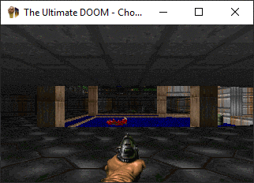   

Moving around the map  

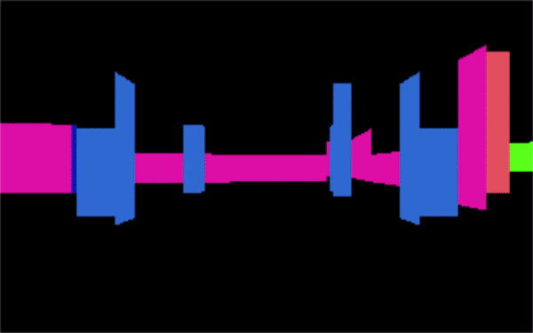  

We can enable the previous week's height calculation (as a white boarder) to compare it to Doom's technique.
It is now easy to notice and compare both ways.  

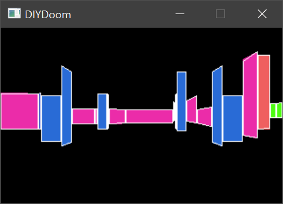  

Looking at this makes me feel very guilty for my poor partial Seg handling, but overall you can see that in most of the cases it works well.  

## Other Notes
In the previous week, I mentioned that DOOM's way was more accurate in calculating wall heights (that was before me understanding this new approach). Actually, I take that back, it is not exactly true, there is an error rate caused by the low precision due to the X to screen angle lookup table. But, does it really matter? No, it doesn't, the error rate is really small and won't be noticeable.  

Notice: this error will only differ in a few pixels (in our current 200-pixel height resolution).

Using DIY Doom code, here is an idea about the error rate for some vertices: 
Player standing (1056, -3616)
Now compare the distance from player to V1 using distance formula and using the polar lookup table.

| V1 (X,Y)    | Distance | Polar   |
|-------------|----------|---------|
| 928, -3392  | 257.992  | 258.908 |
| 1184, -3360 | 286.217  | 286.217 |
| 896, -3392  | 275.274  | 275.042 |
| 1184, -3392 | 257.992  | 258.39  |
| 1184, -3104 | 527.758  | 527.758 |
| 1344, -3200 | 505.964  | 493.458 |
| 896, -3104  | 536.418  | 536.418 |
| 928, -3104  | 527.758  | 540.503 |
| 1184, -3072 | 558.856  | 553.938 |
| 1344, -2880 | 790.342  | 786.087 |
| 832, -2944  | 708.35   | 708.509 |
| 832, -2944  | 708.35   | 719.612 |
| 968, -2880  | 741.242  | 740.643 |
| 704, -2944  | 758.609  | 749.45  |
| 1248, -2528 | 1104.81  | 1140.87 |
| 512, -3136  | 725.49   | 693.303 |
| 680, -3104  | 635.232  | 634.286 |
| 1344, -3264 | 454.805  | 456.329 |
| 1384, -2592 | 1075.25  | 1084.1  |
| 2208, -2304 | 1745.98  | 1776.13 |
| 2304, -2304 | 1810.76  | 1805.76 |

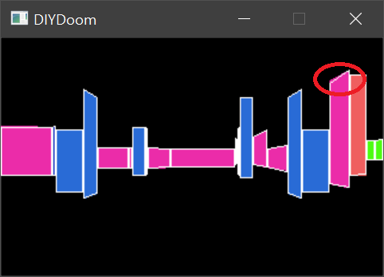  

I have extracted the original lookup table from DOOM code and stored it in array ```classicDoomScreenXtoView``` just to see the difference between the lookup table and the one I created. There is a boolean you can set to switch between lookup tables.

Let's have a look at ```R_ScaleFromGlobalAngle```.  
It is called as the following ```rw_scale = R_ScaleFromGlobalAngle(viewangle + xtoviewangle[start]);```, notice ```visangle = viewangle + xtoviewangle[start]```  

``` cpp
//
// R_ScaleFromGlobalAngle
// Returns the texture mapping scale
//  for the current line (horizontal span)
//  at the given angle.
// rw_distance must be calculated first.
//
fixed_t R_ScaleFromGlobalAngle (angle_t visangle)
{
    fixed_t		scale;
    angle_t		anglea;
    angle_t		angleb;
    int			sinea;
    int			sineb;
    fixed_t		num;
    int			den;

    anglea = ANG90 + (visangle-viewangle);
    angleb = ANG90 + (visangle-rw_normalangle);

    // both sines are allways positive
    sinea = finesine[anglea>>ANGLETOFINESHIFT];	
    sineb = finesine[angleb>>ANGLETOFINESHIFT];
    num = FixedMul(projection,sineb)<<detailshift;
    den = FixedMul(rw_distance,sinea);

    if (den > num>>FRACBITS)
    {
	scale = FixedDiv (num, den);

	if (scale > 64*FRACUNIT)
	    scale = 64*FRACUNIT;
	else if (scale < 256)
	    scale = 256;
    }
    else
	scale = 64*FRACUNIT;
	
    return scale;
}
```

Let's have a look at ```anglea```, and simplify it  

```
anglea = ANG90 + (visangle-viewangle);
anglea = ANG90 + (viewangle + xtoviewangle[start] - viewangle);
anglea = ANG90 + xtoviewangle[start];
```

```anglea``` is simply ```xtoviewangle[start]```, the addition of 90 degree is to use a sine instead of cosine.  

Now looking at ```angleb````  

```
angleb = ANG90 + (viewangle + xtoviewangle[start] - rw_normalangle);
```

```angleb``` the angle be will represent the xtoviewangle to the Normal side of the triangle. It is important to have the angle start from ```xtoviewangle[start]```, both calculations should share the same side of the triangle.  

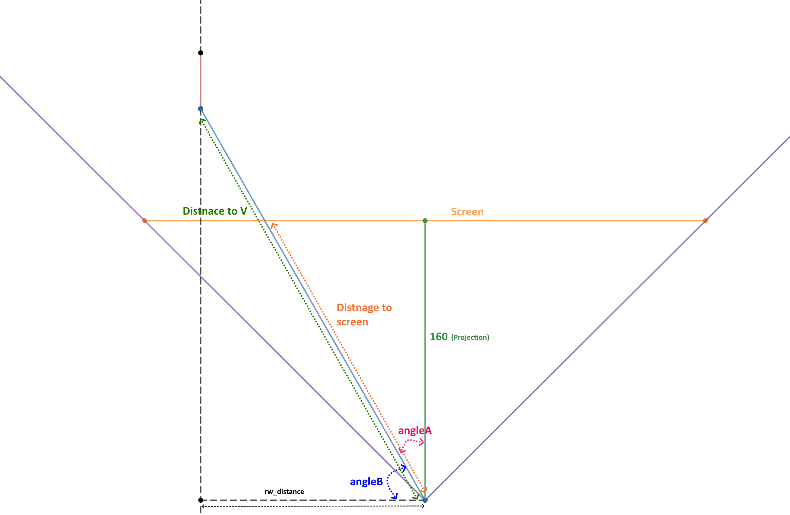   

The above code is implemented in the original Chocolate DOOM in r_segs.c, R_StoreWallRange and r_main.c, R_ScaleFromGlobalAngle.  
Understanding this part of the code in DOOM original/Chocolate code was difficult and here are the factors that I believe contributed to the difficulty  
* I have not seen someone used such an approach to projection and clipping.  
* The function that has this implemented does a lot of stuff (texture mapping, handling solid walls, handling portals, etc.).  
* Looking at a simplified mathematical equation, it is very hard to guess the original meaning before simplification.   
* Using sine instead of cosine sin(Q)= cos(90 - Q); in our case +90 would also work due to the symmetry around 0.  
The original code mostly used Sine instead of Cosine, due to the fact that rendering was one of the first things implemented in the game and at that time only the Sine lookup table existed, not the Cosine (again, this is just a wild guess).   

After understanding what is going on, it is a simple and easy algorithm to implement.  
What I like about this DOOM technique is its efficiency; it uses square root only once per Seg, and only a few divisions.  

Now, we need to focus on portals (windowed walls).

## Source code
[Source code](../src)  

## Reference
[SOHCAHTOA](https://www.mathsisfun.com/algebra/sohcahtoa.html)  
