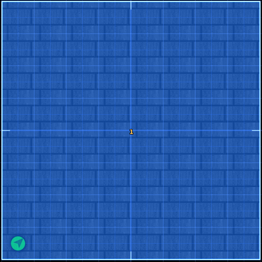
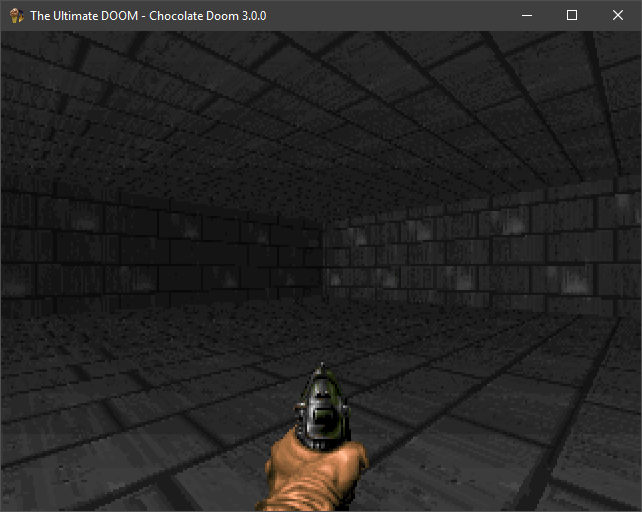
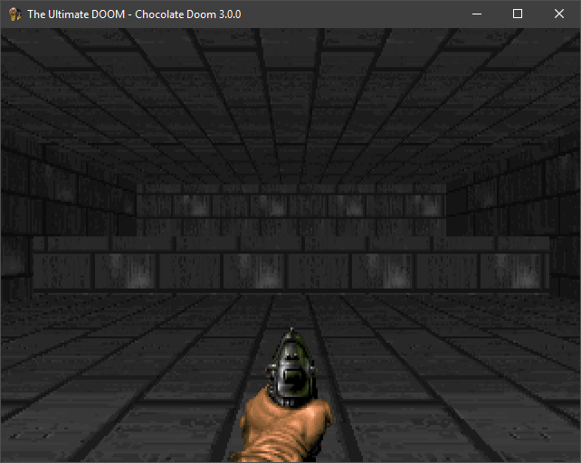
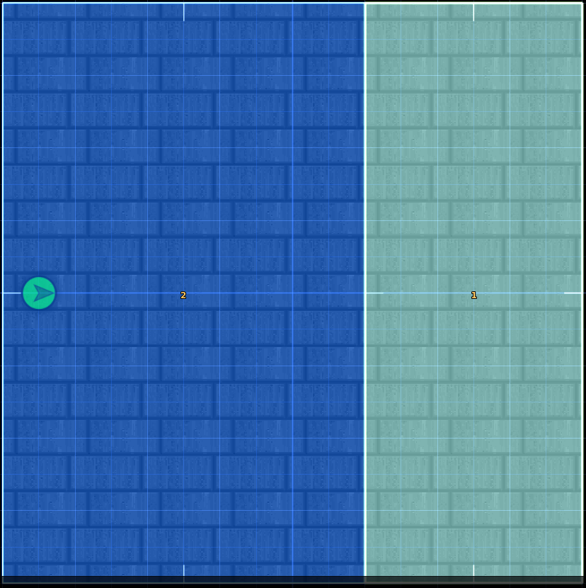
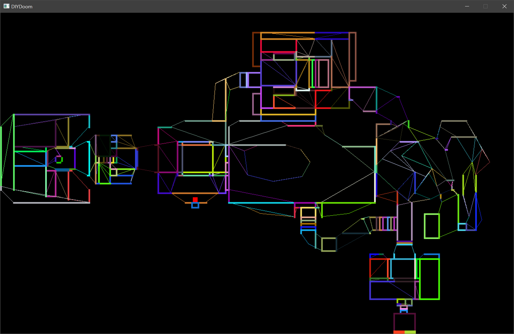
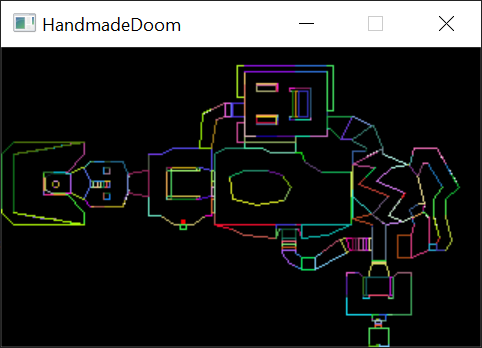
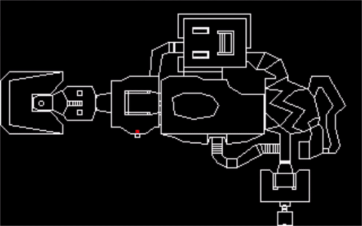
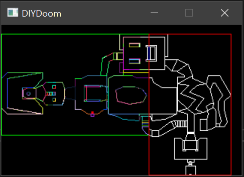

__Editor:__ DOOMReboot ([twitter](https://twitter.com/DOOMReboot))  
# Week 009 - Sector and Subsector  
At this point there is no escape from understanding sectors, sub-sectors, and segs! So, let's start.  
We know that vertexes and linedefs form walls (Week002).  
Using vertexes and lindefs, lets create a very simple room (top 2D view).   
  

which in DOOM view would look like this    

  

A sector is (usually) a closed area. It is formed by linedefs and sidedefs (Sidedefs hold information about the wall's texture. For now, we will keep texture aside, so you don’t have to worry about sidedefs).  
See the above simple room, it has same floor and ceiling height, texture, light level. It is all the same sector.    
A sector has the following properties:   
* Floor height  
* Ceiling height  
* Floor texture  
* Ceiling texture  
* Light level  
* Type  

So, if I want to make areas with different properties, let's say height, we would split that area into two sectors, sector for each height.  

So, adding a single step to this simple room would need to update the map and split the sector into something like this (top 2D view).  

  

which would render to  

  

Now, Imagine the power of this! You can keep adding sectors to make stairs, or bring the floor a little higher and ceiling a little lower, creating what would look like a window.  

Now, let’s move to sub-sector, a sector is broken down into small pieces when building the BSP Tree. Those sub-sectors are "convex", which means no overlaping walls. This convex area is defined by segments of linedefs known as "segs".    

  
[Image credit Doom Wiki](https://doom.fandom.com/wiki/Subsectori)

It is very common that sub-sectors are represented as a polygon (a closed convex polygon), but the closed polygon part is not very accurate. Usually, an extra side is added and adding that extra line would help visualize which subsector the player is in. If you color the segs you would end up with something like this  

   

So in short, sub-sector is a group of Segs. Segs are just a complete or a segment of a linedef.   

### Sub-sector Data Format  
| Field Size | Data Type        | Content                                           |  
|------------|------------------|---------------------------------------------------|  
| 0x00-0x01  | Seg count        | The number of segs that compose this sub-segment  |  
| 0x02-0x03  | First seg index  | The index of the first seg in the seg list        |  

### Segs Data Format
| Field Size | Data Type                                                  | Content                                 |  
|------------|------------------------------------------------------------|-----------------------------------------|  
| 0x00-0x01  | Starting vertex index                                      |                                         |  
| 0x02-0x03  | Ending vertex index                                        |                                         |  
| 0x04-0x05  | Angle                                                      |                                         |  
| 0x06-0x07  | Linedef index                                              |                                         |  
| 0x08-0x09  | Direction: 0 (same as linedef) or 1 (opposite of linedef)  |                                         |  
| 0x0A-0x0B  | Offset: distance along linedef to start of seg             |                                         |  

## Goals  
1. Code refactoring.  
2. Load map sub-sectors.  
3. Load map segs.  
4. Color Sub-sectors on automap.  

## Coding
I have noticed I was not consistent in my variable/function naming, so I renamed:  
* m_Linedef to m_Linedefs  
* ReadMapVertex to ReadMapVertexes  
* ReadMapLinedef to ReadMapLinedefs  
* ReadMapVertex to ReadMapVertexes  
* ReadNodesData to ReadNodeData  
* Linedef StartVertex, StartVertexID  
* Linedef EndVertex, EndVertexID  

We will not go into detail on how to read those from the WAD file since we have done this many times by now, I will just list structs so it is easier to follow the code.  

``` cpp
struct Subsector
{
    uint16_t SegCount;
    uint16_t FirstSegID;
};

struct Seg
{
    uint16_t StartVertexID;
    uint16_t EndVertexID;
    uint16_t Angle;
    uint16_t LinedefID;
    uint16_t Direction; // 0 same as linedef, 1 opposite of linedef
    uint16_t Offset; // distance along linedef to start of seg
};
```

So let's just jump in and color those beautiful sub-sectors, random colors will do  

```cpp
void Map::RenderSubsector(int iSubsectorID)
{
    Subsector subsector = m_Subsector[iSubsectorID];
    SDL_SetRenderDrawColor(m_pRenderer, rand() % 255, rand() % 255, rand() % 255, SDL_ALPHA_OPAQUE);

    for (int i = 0; i < subsector.SegCount; i++)
    {
        Seg seg = m_Segs[subsector.FirstSegID + i];
        SDL_RenderDrawLine(m_pRenderer,
            RemapXToScreen(m_Vertexes[seg.StartVertexID].XPosition),
            RemapYToScreen(m_Vertexes[seg.StartVertexID].YPosition),
            RemapXToScreen(m_Vertexes[seg.EndVertexID].XPosition),
            RemapYToScreen(m_Vertexes[seg.EndVertexID].YPosition));
    }
}
```

Let's run and see the magic!  


That is nice! But I'm not thrilled, I'm the kind of guy who likes to see everything with my own eyes (still, I don't believe everything I see!), this flickering map is cool, but I really want to see the rendering orders of the segs in slow motion.  

add this to the end of ``` void Map::RenderSubsector(int iSubsectorID)```  

``` cpp
    // This is a hacky code, so remember to comment it out!
    SDL_RenderPresent(m_pRenderer); 
    SDL_Delay(100);
```

Now let’s run and see what happens. 

  

You can see that the front side of the root node gets completed first before moving to the backside.  

   
  
You can also see at any angle to the player the “walls” in front of the player if done before the further way!  

Traversing the BSP tree gives us all the sub-sectors, from nearest to and farthest from the player. So, we will need to filter those to the ones that are just within the player's field of view.  

## Other Notes
If you are tracing or comparing your code to original/chocolate DOOM, there are few things you need to keep in mind to make comparing your code easier. In the function ``` void R_RenderBSPNode (int bspnum) ``` you can comment out ``` if (R_CheckBBox (bsp->bbox[side^1])) ``` so it would look like  

``` cpp
    // Decide which side the viewpoint is on.
    // Cross product happens here, but there is some
    // optimization that makes it even avoid the multiplication
    side = R_PointOnSide (viewx, viewy, bsp);  

    R_RenderBSPNode (bsp->children[side]); 
    R_RenderBSPNode (bsp->children[side^1]);
```

This will remove the optimization and will force the traversal though the BSP tree. This should not impact rendering output, it just makes comparing the output from chocolate DOOM and your code easier.  

It is amazing how much impact on performance that optimization is, I did some testing with E1M1 and playing being in spawn area.  
 * Without ``` if (R_CheckBBox (bsp->bbox[side^1])) ``` all the sub-sectors gets traversed 477 sub-sectors.  
 * With the change, only 32 sub-sector traversed! You only traversed 6% of the BSP tree!  

## Source code
[Source code](../src)  

## Reference
[Doom Wiki Sector](https://doomwiki.org/wiki/Sector)  
[Doom Wiki Seg](https://doomwiki.org/wiki/Seg)  
[Doom Wiki Subsector](https://doomwiki.org/wiki/Subsector)  
[Fandom Rendering](https://doom.fandom.com/wiki/Doom_rendering_engine)  
