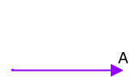
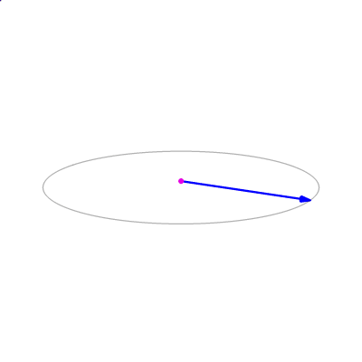
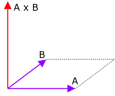

__Author:__ Amro Ibrahim  
__Editor:__ DOOMReboot ([twitter](https://twitter.com/DOOMReboot))  

# Week 008 - Finding Walls and BSP Traversal  
This week things will start getting serious, our main goal is to render a 3D view of what the player is viewing. To accomplish this, we need to know few things  
*  Where is the player on the map? We know this (Week005)  
*  Which walls are around the player? We will be implementing this  
*  Which of these walls are in the player's field of view? Later week  
*  Render what the player is seeing. Later week  

So with us knowing where the player is, the first step of the 3D rendering journey is to figure out which walls are closest to the player. If you have been a ID Software fan you mostly know by now how Wolfenstein 3D rendering works, and the big shift between Wolf3D and DOOM was the utilization of a BSP Tree (BSP was used in Wolf3D SNES version). 
How things worked in Wolf 3D was using [ray casting](https://en.wikipedia.org/wiki/Ray_casting) technology. But using such a technology has a lot of limitations. This is where BSP trees comes in. BSP trees are used to help us know which walls are closest to the player. So let's get started.  

With all the info we have from the binary tree traversal it should be easy to understand this. The BSP traversal is based on the modified algorithm we discussed in Week007, with the only difference being that the map space is being split instead of numbers.  

Here is how the root node can be visualized.  

 

Notice the small blue line that splits the map to front/back (or left and right)?  
The front and back of a line are based on the direction of drawing the line. So that specific line is drawn from top to bottom, this makes the left side the front (green box), and the right box the back (the red box). Recursively, the front and the back of those boxes are split into smaller boxes, for example here is the front box in the above picture being split into smaller ones.  

  

The map breaking down all the way to what is known as "sub-sector", for now, let's just think about a sub-sector as a small piece of map walls (we will look into details about sector and sub-sectors later).  

Here is an image to visualize how sub-sectors would look. All the pieces with the same color are part of the same sub-sector.

  

I see BSP traversal as two stage actions
1. Find which sub-sector the player is in
2. What are the sub-sectors close to the sub-sector the playing is in?

But before we start there is one missing key part that we have not discussed yet! How in the world will I know if a player is in front or behind a splitter line? The answer is "cross product".   

First, let's quickly go over a what a vector is.
A vector is an object that has both a magnitude and a direction. We can visualize a vector as a line in a specific direction, where we know its length and magnitude. 
  
  
  
In other words, a line that has a starting point and an end point. Given two points a and b, moving from a to b (where we know both magnitude and direction). If you remember, the splitter walls in the BSP nodes are actually vectors, they have a starting point and direction.  
  
Cross product is a mathematical operation on two vectors and the output is another vector. The output vector will also have magnitude and a direction. We can tell its direction if it is up or down based on the sign value of the cross product (we don't care much about the magnitude).    



Notice in the above example that if vector b is on the left of a output vector points up, and when b the right of a output vector points down. We can use this to our advantage.  

So lets create our two vectors
1. Splitter V1 to the position of the player.  
2. Splitter V1 to its V2.  
  
Finding cross products is easy once you have the two vectors.    
For two 2D vector A=(Ax, Ay), B=(Bx, By) the cross product is  
__A x B = Ax * By - Ay * Bx__  
  
  

Keep in mind A X B = -B X A  

## Goals
1. Traverse the BSP tree!  
   
## Coding
The other week we loaded all the nodes, which are stored in an array form with the root being the last node in the list. Now we need to find the player in this BSP tree. So, we start at the root and figure out whether to go left or right based on player location.  
To figure out which node of those is a leaf node (a sub-sector node) the original DOOM code had a nice optimization, they used the last bit of the node ID as a flag.   
  
``` cpp
// 0x8000 in binary 1000000000000000
#define SUBSECTORIDENTIFIER 0x8000
```  

We will use bit masking to figure out if we are holding a sub-sector node, or just "guide" node,  
and at each node we can simply use the cross product to decide whether to go left or right.  
We just care about the direction (positive or negative to decide where to go).  

``` cpp
bool Map::IsPointOnBackSide(int XPosition, int YPosition, int iNodeID)
{
    int dx = XPosition - m_Nodes[iNodeID].XPartition; // Find X the point relative to the player 
    int dy = YPosition - m_Nodes[iNodeID].YPartition; // Find y the point relative to the player 

    return (((dx * m_Nodes[iNodeID].ChangeYPartition) - (dy * m_Nodes[iNodeID].ChangeXPartition)) <= 0);
}
```

Now let apply the tree search code we discussed in previous week, and call it passing in the root node!  

``` cpp
void Map::RenderBSPNodes(int iNodeID)
{
    // Masking all the bits except the last one
    // to check if this is a subsector
    if (iNodeID & SUBSECTORIDENTIFIER)
    {
        RenderSubsector(iNodeID & (~SUBSECTORIDENTIFIER));
        return;
    }

    bool isOnBack = IsPointOnBackSide(m_pPlayer->GetXPosition(), m_pPlayer->GetYPosition(), iNodeID);

    if (isOnBack)
    {
        RenderBSPNodes(m_Nodes[iNodeID].BackChildID);
    }
    else
    {
        RenderBSPNodes(m_Nodes[iNodeID].FrontChildID);
    }
}

void Map::RenderBSPNodes()
{
    RenderBSPNodes(m_Nodes.size() - 1);
}

void Map::RenderSubsector(int iSubsectorID)
{
    // for now just let's keep this empty
}
```

Animating the searching for the player  
  
  

Sweeeet!  
Now let's finish this off, by going through the rest of the tree to give us the custom sort we want (Week006)!

```cpp
void Map::RenderBSPNodes(int iNodeID)
{
    // Masking all the bits except the last one
    // to check if this is a subsector
    if (iNodeID & SUBSECTORIDENTIFIER)
    {
        RenderSubsector(iNodeID & (~SUBSECTORIDENTIFIER));
        return;
    }

    bool isOnBack = IsPointOnBackSide(m_pPlayer->GetXPosition(), m_pPlayer->GetYPosition(), iNodeID);

    if (isOnBack)
    {
        RenderBSPNodes(m_Nodes[iNodeID].BackChildID);
        RenderBSPNodes(m_Nodes[iNodeID].FrontChildID);
    }
    else
    {
        RenderBSPNodes(m_Nodes[iNodeID].FrontChildID);
        RenderBSPNodes(m_Nodes[iNodeID].BackChildID);
    }
}
```

Now, ```RenderSubsector``` will be called processing sub-sectors from near to far!  

## Other Notes
Let's take a look at the original/Chocolate doom code that did the BSP traversal. You will find the implementation in ``` r_bsp.c ```, function ``` R_RenderBSPNode ```.  
Let's peek at the struct that held the node data. 
``` cpp
//
// BSP node.
//
typedef struct
{
    // Partition line.
    fixed_t	x;
    fixed_t	y;
    fixed_t	dx;
    fixed_t	dy;

    // Bounding box for each child.
    fixed_t	bbox[2][4];

    // If NF_SUBSECTOR its a subsector.
    unsigned short children[2];
    
} node_t;
```
  
We could have defined our box boundaries as bbox was defined, but I found it was easier to be explicit about the naming and not to hide them under array indexes.   
What was interesting was that children nodes were an array. As soon as I saw the code, I was wondering why it wasn't defined as two separate variables, back/front or left/right but it didn't take much time to know it was an optimization.   
  
``` cpp
//
// RenderBSPNode
// Renders all subsectors below a given node,
// traversing subtree recursively.
// Just call with BSP root.
void R_RenderBSPNode (int bspnum)
{
    node_t*	bsp;
    int		side;

    // Found a subsector?
    if (bspnum & NF_SUBSECTOR)
    {
        // This condition was never hit, maybe it was 
        // there to handle unexpected cases in custom maps
        if (bspnum == -1)			
            R_Subsector (0);
        else
            R_Subsector (bspnum&(~NF_SUBSECTOR));
        return;
    }
        
    bsp = &nodes[bspnum];
    
    // Decide which side the viewpoint is on.
    // Cross product happens here, but there is some
    // optimization that makes it even avoid the multiplication
    side = R_PointOnSide (viewx, viewy, bsp);  

    // Recursively divide front space.
    R_RenderBSPNode (bsp->children[side]); 

    // Possibly divide back space.
    if (R_CheckBBox (bsp->bbox[side^1]))	
        R_RenderBSPNode (bsp->children[side^1]);
}
```

What is happening here? Where is the condition to check which side the player is on and traverse based on that? hmmm...  
Nice trick! I got it! So the function ```R_PointOnSide (viewx, viewy, bsp);``` returns 0 or 1 (true or false) which is used to select either the child at index 0 or index 1 ```R_RenderBSPNode (bsp->children[side]);```. Now to go to the other branch we just call ```R_RenderBSPNode (bsp->children[side^1]);```.
What happened here is a good utilization of X-OR operation.  

| A | B | A XOR B |  
|---|---|---------|  
| 0 | 0 | 0       |  
| 0 | 1 | 1       |  
| 1 | 0 | 1       |  
| 1 | 1 | 0       |  

So you always get to invert the case when calling ```R_RenderBSPNode (bsp->children[side^1]);```. So, no "if" statement is needed to determine the code path, which will make the code perform faster (better branch predictor for the CPU).  
The function ```R_CheckBBox (bsp->bbox[side^1])``` is another optimization that saves going though nodes that are not in the player FOV (maybe something we could look at and implement later).  

## Source code
[Source code](../src)  

## Reference
[3D Math Primer for Graphics and Game Development](https://www.amazon.com/Math-Primer-Graphics-Game-Development-ebook/dp/B008KZU548/ref=sr_1_1?keywords=3d+Math+primer&qid=1564421411&s=gateway&sr=8-1)  
[Cross product Wikipedia](https://en.wikipedia.org/wiki/Cross_product)  
[Cross product Math is fun](https://www.mathsisfun.com/algebra/vectors-cross-product.html)  

