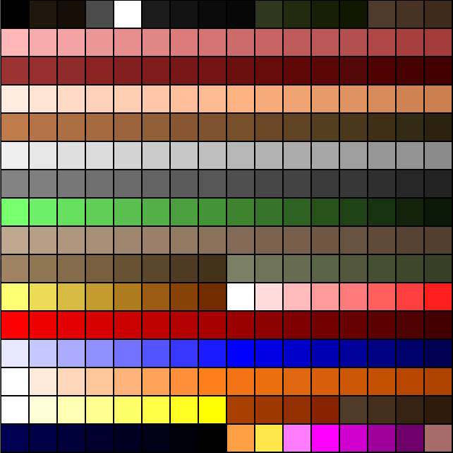
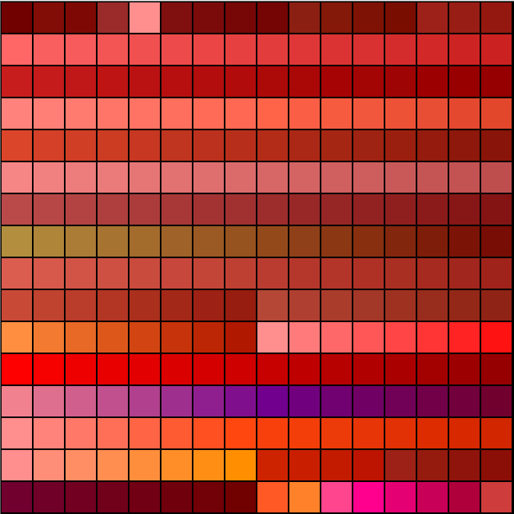

# Week 018 - Color Palette
So with the world being rendered in 3D at this point, it would be nice to draw some texture instead of just having a solid color segs. You would expect that the texture is some image that is stored in the WAD and all you have to do is just read that texture and draw it on the screen, your close but that is not exactly it, there is much more into it than that.

Now a days (with a lot of memory) it is very common to store a pixel in an image in a 4 byte (Red, Green, Blue and Alpha), back then it wasn't the case. Due to many limitations colors was limited to a predefined palette, each color in the palette has an index which is used to represent a single pixel. 
DOOM utilize palettes to represent colors. DOOM has a total of 14 different palettes with each palette indexing 256 colors.
It only requires a single byte to represent any index in the palette (0-255).  

Palette 0 (Normal)



With that being said, each pixel on the screen will be represented with a single byte, and we know that we have a total of 320\*200 pixel in any frame. Our current method to draw to screen was using the SDL_Renderer to draw directly to the windows using full RGB colors, we need to replace this with an memory buffer that represents each pixel as 8 bits, then we can pass this around components to draw on. If that is too much to grasp all at once let’s go step by step.  

## Goals
* Read palette from WAD
* Create DisplayManager class
* Remove AutoMap
* Draw vertical lines 
* Update GetSectionColor to return a palette color
* Refactoring / cleanup

## Code
First let's have a look at how the palette is formatted in the WAD file. For each palette it is a total of 256 represented in Red, Green and Blue with each being a single byte (So RGB is 3 bytes)

```
                        <------ 32 bits ------->
                       /----------------------\
            --->  0x00 |  R  |  G  |  B  |  R | 0X03
            |          |----------------------|
            |     0x04 |  G  |  B  |  R  |  G | 0x07
            |          |----------------------|          
            |     0x08 |  B  |  ......        |      
            .          |----------------------|
            .          |        ......        |
            .          |----------------------|
            |--->      |        ......        |
                       \----------------------/
```

The struct that we will use to store a single palette will be 256 array of SDL_Color. 

``` cpp
struct WADPalette
{
    SDL_Color Colors[256];
};
```

The lump name that contains all the palettes is called ```PLAYPAL```. We need to find it and from there we would read all 14 palettes. 

``` cpp
bool WADLoader::LoadPalette(DisplayManager *pDisplayManager)
{
    std::cout << "Info: Loading PLAYPAL (Color Palettes)" << endl;
    int iPlaypalIndex = FindLumpByName("PLAYPAL");

    if (strcmp(m_WADDirectories[iPlaypalIndex].LumpName, "PLAYPAL") != 0)
    {
        return false;
    }

    WADPalette palette;
    // Read 14 different palettes and store them
    for (int i = 0; i < 14; ++i)
    {
        m_Reader.ReadPalette(m_pWADData, m_WADDirectories[iPlaypalIndex].LumpOffset + (i * 3 * 256 ), palette);
        pDisplayManager->AddColorPalette(palette);
    }
    
    return true;
}
```

There are different palettes to have different effects, for example if the player gets hurt, we will see more reddish (bloody) color, overall. Though we will read all 14 we will only focus on palette 0 which is normal.  



As we mentioned each palette has 256 colors; we need to read them all. SDL_Color has an extra byte (A or Alpha) for transparency which we will set to 255 (fully opaque/ no transparency).

``` cpp
void WADReader::ReadPalette(const uint8_t * pWADData, int offset, WADPalette &palette)
{
    for (int i = 0; i < 256; ++i)
    {
        palette.Colors[i].r = pWADData[offset++];
        palette.Colors[i].g = pWADData[offset++];
        palette.Colors[i].b = pWADData[offset++];
        palette.Colors[i].a = 255;
    }
}
```

Now that we can read the palettes, we need to implement DisplayManager class to store those palettes and create an 8-bit memory that we could use as screen buffer. We will also move all windows creation from DOOMEngine class into the DisplayManager class.  

``` cpp
SDL_Renderer* DisplayManager::Init(const std::string &sWindowTitle)
{
    int bpp;
    uint32_t Rmask;
    uint32_t Gmask;
    uint32_t Bmask;
    uint32_t Amask;

    //Initialize SDL
    if (SDL_Init(SDL_INIT_EVERYTHING) != 0)
    {
        std::cout << "SDL failed to initialize! SDL_Error: " << SDL_GetError() << std::endl;
        return false;
    }

    m_pWindow = SDL_CreateWindow(sWindowTitle.c_str(), SDL_WINDOWPOS_UNDEFINED, SDL_WINDOWPOS_UNDEFINED, m_iScreenWidth, m_iScreenHeight, SDL_WINDOW_SHOWN);
    if (m_pWindow == nullptr)
    {
        std::cout << "SDL failed to create window! SDL_Error: " << SDL_GetError() << std::endl;
        return false;
    }

    m_pRenderer = SDL_CreateRenderer(m_pWindow, -1, 0);
    if (m_pRenderer == nullptr)
    {
        std::cout << "SDL failed to create renderer! SDL_Error: " << SDL_GetError() << std::endl;
        return false;
    }
    ...
    ...
```

Up to this point it is just moving code from DOOMEngine class that we previously wrote to create the window.  
What we should do next is create an SDL_Surface. SDL_Serface is a buffer that is created in main memory (not on the GPU). SDL_Surface can be created by calling SDL_CreateRGBSurface and specifying the depth which in this case 8-bit and we are calling it m_pScreenBuffer. We will also create another surface that is a full RGB which we will call m_pRGBBuffer. The goal of this surface is after we draw everything to the 8-bit surface we will have to convert it to RGB using the palette to a temporary buffer. When we have the surface in full RGB color, there is a final stage of copying this to the GPU memory and SDL_Texture, and get it rendered.

``` cpp
    
    uint32_t PixelFormat = SDL_GetWindowPixelFormat(m_pWindow);

    // Create 8-bit screen buffer
    m_pScreenBuffer = SDL_CreateRGBSurface(0, m_iScreenWidth, m_iScreenHeight, 8, 0, 0, 0, 0);
    if (m_pScreenBuffer == nullptr)
    {
        std::cout << "SDL failed to create 8-bit surface! SDL_Error: " << SDL_GetError() << std::endl;
        return false;
    }

    SDL_FillRect(m_pScreenBuffer, NULL, 0);

    SDL_PixelFormatEnumToMasks(PixelFormat, &bpp, &Rmask, &Gmask, &Bmask, &Amask);

    // Create a full 32 bit screen buffer for conversion
    m_pRGBBuffer = SDL_CreateRGBSurface(0, m_iScreenWidth, m_iScreenHeight, 32, Rmask, Gmask, Bmask, Amask);
    if (m_pScreenBuffer == nullptr)
    {
        std::cout << "SDL failed to create RGB surface! SDL_Error: " << SDL_GetError() << std::endl;
        return false;
    }

    SDL_FillRect(m_pRGBBuffer, NULL, 0);
    
    // Finally move this to GPU memory
    m_pTexture = SDL_CreateTexture(m_pRenderer, SDL_PIXELFORMAT_ARGB8888, SDL_TEXTUREACCESS_STREAMING, m_iScreenWidth, m_iScreenHeight);
    if (m_pTexture == nullptr)
    {
        std::cout << "SDL failed to create texture! SDL_Error: " << SDL_GetError() << std::endl;
        return false;
    }

    return m_pRenderer;
}
```

Now getting the screen puffer from the 8-bit screen buffer should be very simple  

``` cpp
uint8_t *DisplayManager::GetScreenBuffer()
{
    return (uint8_t *)m_pScreenBuffer->pixels;
}
```

So to clean up thing, lets wrap any SDL rendering in a class and if any component needs to draw anything it should get a pointer to a 8-bit surface to draw on
I had to go thought the code and remove any call to the renderer, all we should pass now is just the 8-bit screen buffer for components to draw on. 
Switching from a SDL_Renderer to SDL_Surface you would notice that SDL_RenderDrawLine will not work anymore, so we will need to implement our own drawing routine.  

``` cpp
void ViewRenderer::DrawSection(uint8_t *pScreenBuffer, int iBufferPitch, std::list<ViewRenderer::SingleDrawLine> &Section, uint8_t color)
{
    for (std::list<SingleDrawLine>::iterator line = Section.begin(); line != Section.end(); ++line)
    {
        int iStartY = line->y1;
        while (iStartY < line->y2)
        {
            pScreenBuffer[iBufferPitch * iStartY + line->x1] = color;
            ++iStartY;
        }
    }
}
```

In drawing segs we are in luck! We only draw vertical lines all the time, so that should be easy to implement with a loop. But this is not the case with the AutoMap we currently have implemented, it is time to remove it and have a DOOM like implemented at some point. So, we need to clean all those AutoMap related implementation.   

Now setting wall color would change a little, instead of having a full RGB color randomly generated, we will just randomly select a color within the palette color range which would be between 0 to 255.

``` cpp
uint8_t ViewRenderer::GetSectionColor(const std::string &TextureName)
{
    uint8_t color;
    if (m_WallColor.count(TextureName))
    {
        color = m_WallColor[TextureName];
    }
    else
    {
        color = rand() % 256;
        m_WallColor[TextureName] = color;
    };

    return color;
}
```

Finally, after all those clean up and changes just update the render calls, which should much cleaner now, get the screen buffer and pass it to be drawn on.

``` cpp
void DoomEngine::Render()
{
    uint8_t *pScreenBuffer = m_pDisplayManager->GetScreenBuffer();

    m_pDisplayManager->InitFrame();
    m_pViewRenderer->Render(pScreenBuffer, m_iRenderWidth);

    m_pDisplayManager->Render();
}
```

The display manager simply takes the screen buffer and the palette and generates a RGB surface, then converting a surface to texture (just copy it to GPU memory), and present it.

``` cpp
void DisplayManager::Render()
{
    SDL_SetPaletteColors(m_pScreenBuffer->format->palette, m_ColorPallettes[0].Colors, 0, 256);
    
    // Copy and convert
    SDL_BlitSurface(m_pScreenBuffer, nullptr, m_pRGBBuffer, nullptr);

    SDL_UpdateTexture(m_pTexture, nullptr, m_pRGBBuffer->pixels, m_pRGBBuffer->pitch);
    SDL_RenderCopy(m_pRenderer, m_pTexture, nullptr, nullptr);
    SDL_RenderPresent(m_pRenderer);
}
```

Now there is retro feeling to those colors, after all it looks cooler. 

  

a quick run though the level

  

Since we go the colors sorted out, it is time to read some of the pictures in the WAD and draw them to screen! 

## Other Notes
Yes, in chocolate DOOM this is all there, it is all implemented in ```i_video.c```, I have learned allot looking at that code I was not aware that SDL had palette implementation (I guess no tutorials cover it and rarely such a feature is used). As a practice with palettes I have updated my [DOOMFire](https://github.com/amroibrahim/DOOMFire), and played around even more will palettes [Palette Cycling Demos](https://github.com/amroibrahim/PaletteCycling).

The Chocolate DOOM implementation has an extra SDL_Surface to stretch the final rendering.

## Source code
[Source code](../src)  

## Reference
[DOOM WIKI PLAYPAL](https://doomwiki.org/wiki/PLAYPAL)  
