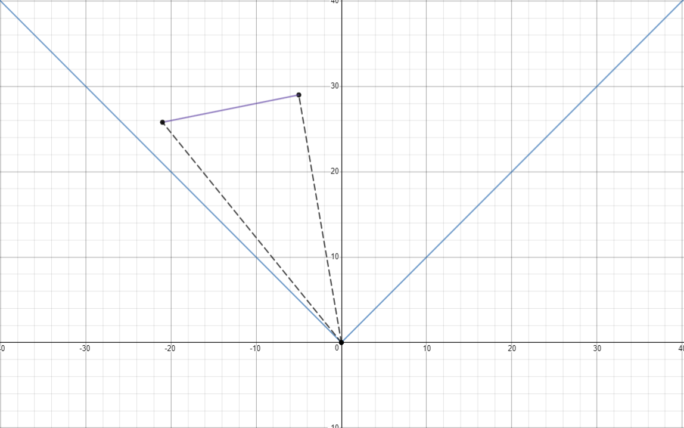
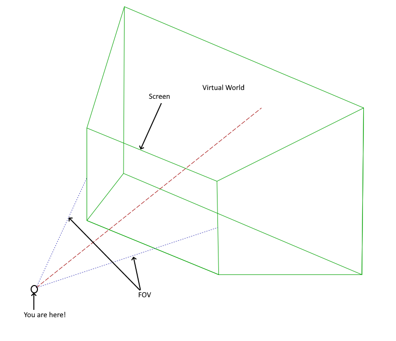
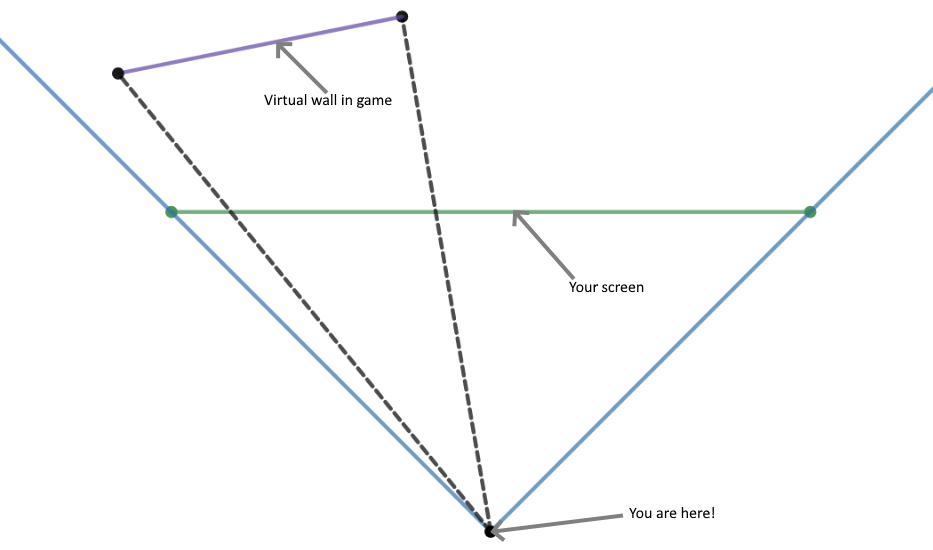
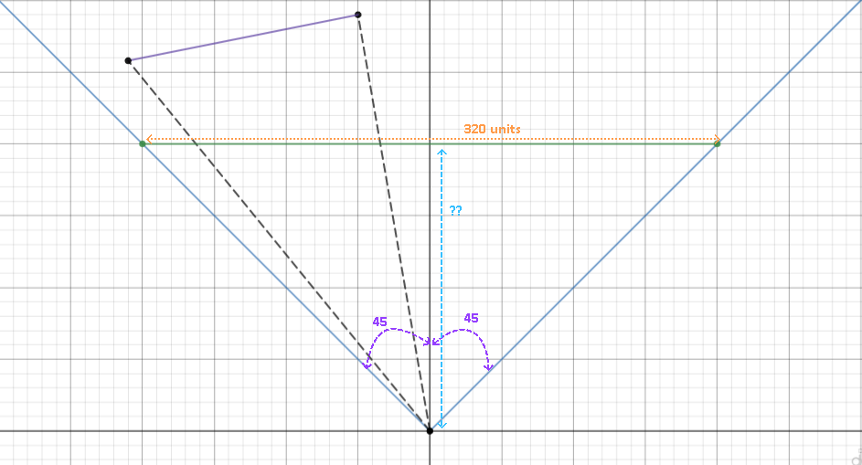
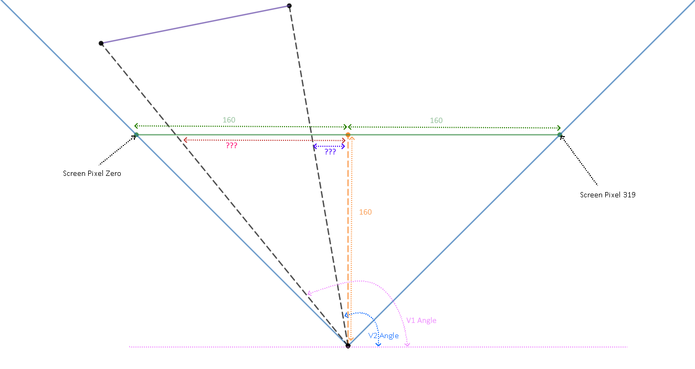
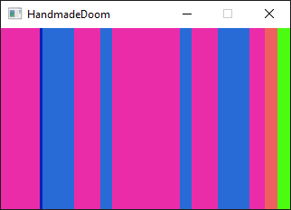
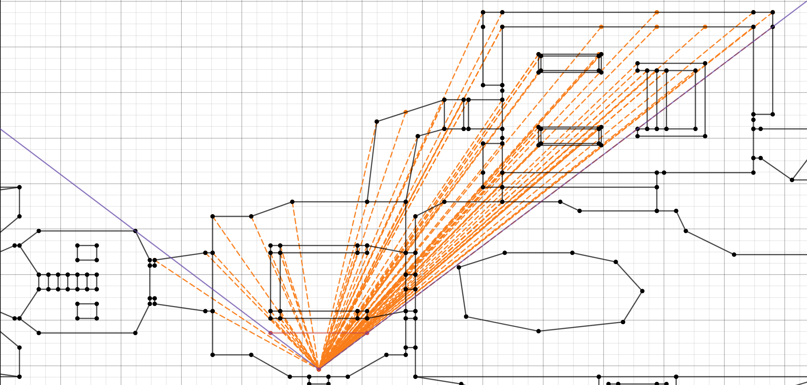

__Editor:__ DOOMReboot ([twitter](https://twitter.com/DOOMReboot))  

# Week 011 - Horizontal Projection  
So, at this point we know all the walls which are within the player's FOV and we know the angle to those walls, but where should we draw them on the screen?  

  

Where should we draw them on the screen is not the only question, there is still more we need to know: its height, is it a window/portal (see-though and passable), or is it a solid wall (opaque and impassable)? This is too much to do at once, so let's break things down a little.  
All we know at this point is the angle of the wall segments' "edges"! But which angle corresponds with which X coordinate on the screen? Before we jump into the math, let's try to visualize what is going on!  
Imagine that you are the player and are looking through your monitor, what you see is a "window into the virtual world"; whatever is behind the screen is the virtual world.  



From a top view  



So, with this visualization there are a few facts we need to remind ourselves about  
*  FOV is 90.
*  Screen Width is 320 pixels.



So, the first thing to figure out is exactly how far the screen is from the player.  
This is a simple high school Trigonometry problem.  
All we need to do is split the 90-degree view into two 45-degree triangles, and also split the 320 pixels into two 160 units
using TAN. This should be easy to solve!  

Tan = Opposite / Adjacent  
Tan(45) = 160 / Adjacent  
Adjacent = 160  

Let's find out how far the player is from the screen.  
Now, with that Adjacent side length being known, we can use it to do the math for the X coordinates on the screen.  

Original DOOM used a lookup table to map an angle into its corresponding X coordinate on the screen; the lookup table was built on game start up and calculates the Tan values. The lookup table is possible if you limit the precession of the angles to a predetermined range. ("Lookup tables" were frequently used back then as a performance optimization; it was quicker to perform a memory lookup than to calculate a trigonometric function.  However, this is not as applicable today as most processors' trigonometric functions are run so quickly and efficiently that they are frequently faster than a memory lookup.)

So, I will do the second part where we calculate the Tan but will not cache the value.  

What we will have at this point is the edges of the walls and their corresponding X coordinates on the screen.  

## Goals
*  ViewRenderer Class  
*  Refactor  
*  Convert an angle to its X coordinate on screen  
   
## Coding
So, the map class it is becoming complicated; I will move the rendering logic out. This is where the ViewRenderer class comes into play!  

``` cpp
class ViewRenderer
{
public:
    ViewRenderer(SDL_Renderer *pRenderer);
    ~ViewRenderer();

    void Init(Map *pMap, Player *pPlayer);
    void Render(bool IsAutomap);
    void AddWallInFOV(Seg seg, Angle V1Angle, Angle V2Angle);
    void InitFrame();
    void SetDrawColor(int R, int G, int B);
    void DrawRect(int X, int Y, int X2, int Y2);
    void DrawLine(int X1, int Y1, int X2, int Y2);

protected:
    void RenderAutoMap();
    void Render3DView();

    int AngleToScreen(Angle angle);
    int RemapXToScreen(int XMapPosition);
    int RemapYToScreen(int YMapPosition);

    int m_iRenderXSize;
    int m_iRenderYSize;
    int m_iAutoMapScaleFactor;

    Map *m_pMap;
    Player *m_pPlayer;

    SDL_Renderer *m_pRenderer;
};
```

Remember, we forced the player to look at 90 degrees and we rotated the world around that.  



You will notice there are two triangles, a left triangle and a right triangle. We need to handle them separately.

``` cpp
// Please remember to replace the numeric literals (numbers) with predefined, "const" variables; it
// is a very bad idea to use "magic numbers" as they are the source of many bugs.  
// I have broken this rule for the sake of clarity.
int ViewRenderer::AngleToScreen(Angle angle)
{
    int iX = 0;

    // Left side
    if (angle > 90)
    {
        angle -= 90;
        iX = 160 - round(tanf(angle.GetValue() * PI / 180.0f) * 160);
    }
    else
    {
        // Right side
        angle = 90 - angle.GetValue();
        iX = round(tanf(angle.GetValue() * PI / 180.0f) * 160);
        iX += 160;
    }

    return iX;
}
```

Finally, let's draw those lines. We don't know the height yet so we will just draw a line on its corresponding X column, from the top of the screen (0) down to the bottom (200).

``` cpp
void ViewRenderer::AddWallInFOV(Seg seg, Angle V1Angle, Angle V2Angle)
{
    int V1XScreen = AngleToScreen(V1Angle);
    int V2XScreen = AngleToScreen(V2Angle);

    SDL_RenderDrawLine(m_pRenderer, V1XScreen, 0, V1XScreen, m_iRenderYSize);
    SDL_RenderDrawLine(m_pRenderer, V2XScreen, 0, V2XScreen, m_iRenderYSize);
}
```

I have added a few other changes to show the Automap only when I press the Tab key on the keyboard.

``` cpp
void DoomEngine::KeyPressed(SDL_Event &event)
{
...
    case SDLK_TAB:
        m_bRenderAutoMap = true;
        break;
...
}
```

and before we render, we can check whether we should render the Map or the 3D View

``` cpp
void ViewRenderer::Render(bool IsRenderAutoMap)
{
    if (IsRenderAutoMap)
    {
        RenderAutoMap();
    }
    else
    {
        Render3DView();
    }

    SDL_RenderPresent(m_pRenderer);
}
```

Side Note: The above would be better implemented as a state machine [state design pattern](https://sourcemaking.com/design_patterns/state). As the code grows bigger, we'll definitely look into implementing it.  
Now, when running the program we will see something like this  



So, what are we looking at here? We are looking at the edges of each wall within the player's FOV!  
They can be represented graphicly as



The point that is all the way on the left is only partially in view, so we have clipped it to the left edge of the screen (coordinate 0).
Now, we need to identify wall types and perform clipping on walls which are not visible to the player. Partial clipping must be performed when one edge of the wall extends past either the left or right edge of the screen and the other edge of the wall is within the screen's horizontal range (0-319). If neither of the edges of the wall fall within the screen's horizontal range, then we clip the entire wall as it cannot possibly be seen.

## Other Notes
Please feel free to open an issue if you have a question, if you think there is a better way to implement things, or even if you notice spelling mistakes (I will credit you for it). I'm very open to constructive criticism. The main goal of this is to learn more about DOOM engine internals, so please help me by sharing your ideas and thoughts.  

The code we covered today is part of ``` R_AddLine ``` function
``` cpp
//
// R_AddLine
// Clips the given segment
// and adds any visible pieces to the line list.
//
void R_AddLine (seg_t* line)
{
...
...
...

    // The seg is in the view range,
    // but not necessarily visible.
    angle1 = (angle1+ANG90)>>ANGLETOFINESHIFT;
    angle2 = (angle2+ANG90)>>ANGLETOFINESHIFT; // <- We stopped here last week
    
    x1 = viewangletox[angle1]; // <- Yes, these 2 lines of code is all what we did today!
    x2 = viewangletox[angle2]; 
```

and the lookup table ``` viewangletox ``` gets populated as part of ```void R_InitTextureMapping (void)```.

To make it possible to store the lookup table in memory there is a value truncation that happens ``` angle1 = (angle1+ANG90)>>ANGLETOFINESHIFT``` the shift truncates the value, making it possible to create a lookup table with what was a reasonable amount of memory back in the i486 days.


## Source code
[Source code](../src)  

## Reference
[Math is Fun (SOHCAHTOA)](https://www.mathsisfun.com/sine-cosine-tangent.html)  
