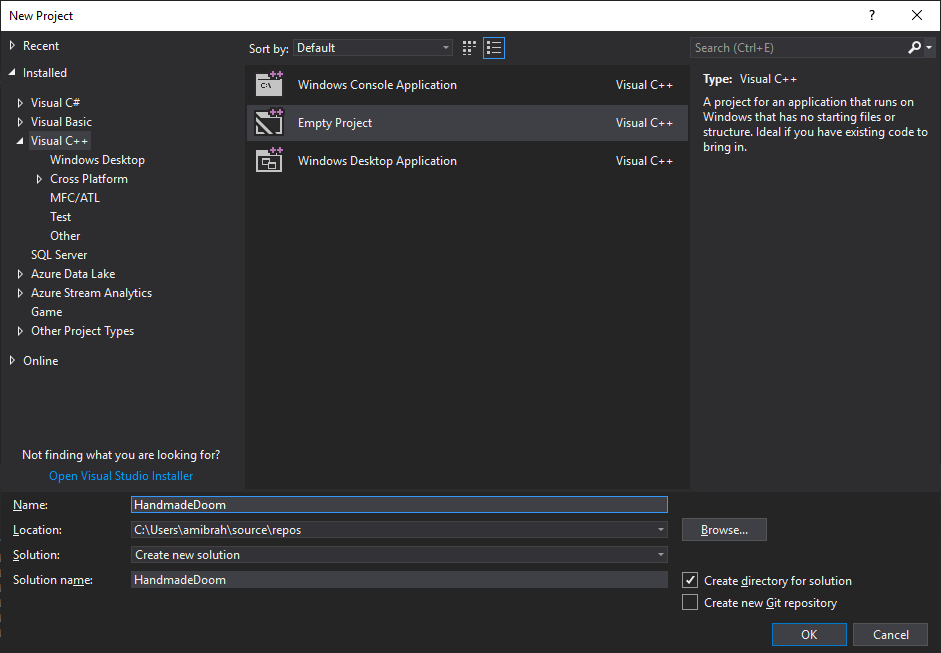
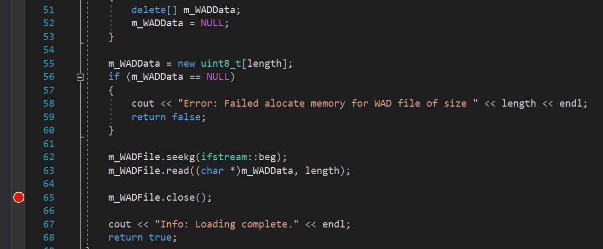
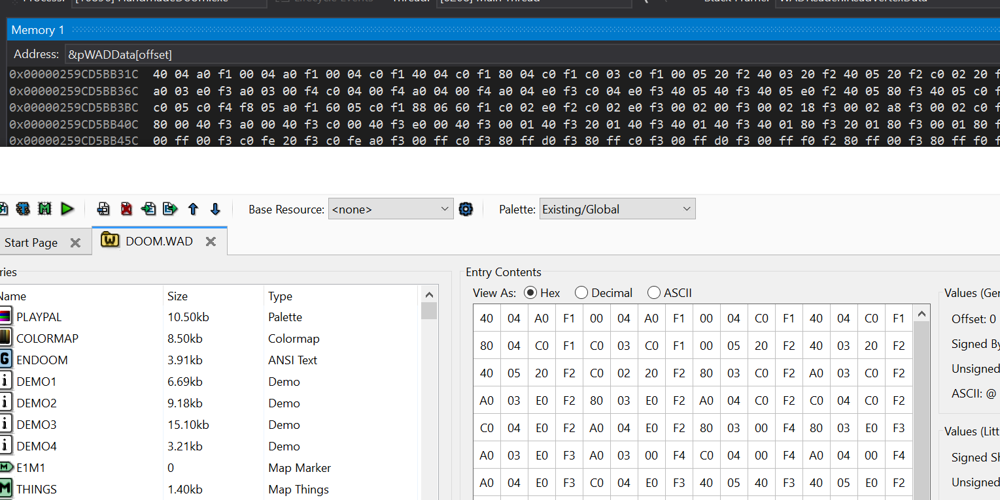
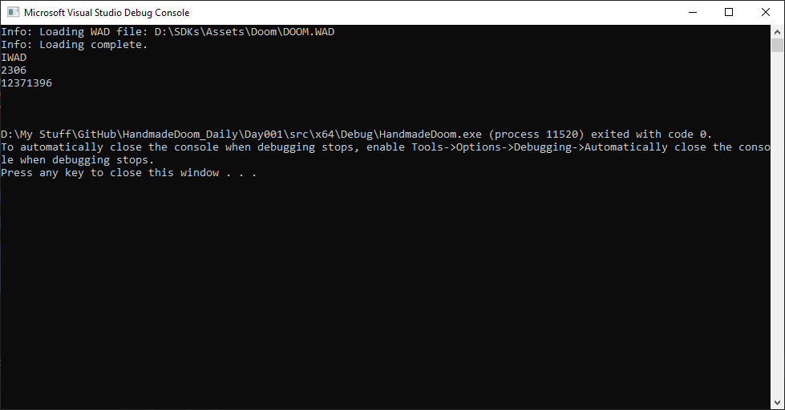
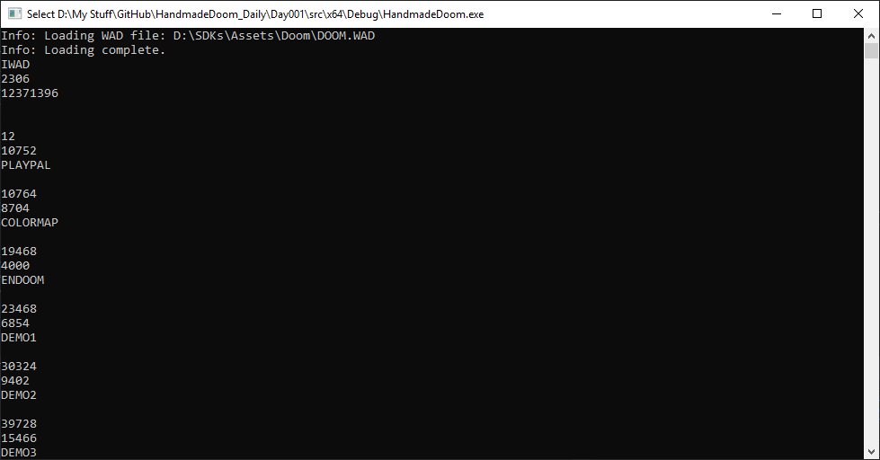
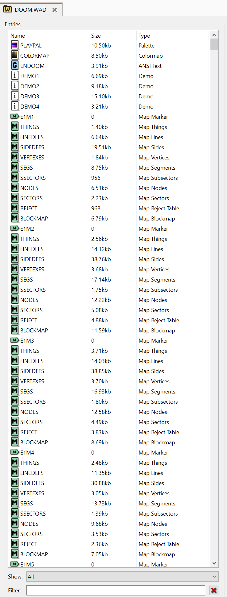

# Week 001 - WAD Files  
Before we do any coding, let's spend some time setting some goals and think through what we want to achieve.  
As a start let's see if we can read DOOM assets file. All DOOM assets and resources are in the WAD file.  

## What is a WAD file?  
"Where is All my Data"? It is in the WAD! WAD is an archive of all the assets in DOOM (and DOOM based games) in one file.  
Doom creators came up with this format to make it easy to modify the game.  

## WAD File Anatomy  
The WAD file has 3 main parts, header, lumps, and directories.  
1. Header  
   This contains basic information about the WAD file and where are the directories offset.  
2. Lumps  
   This is where the game assets gets stored, map data, sprites, music, etc.  
3. Directories  
   This is an organizational structure to find data in the lump section.  
```
                       <---- 32 bits  ---->          
                       /------------------\          
            --->  0x00 |  ASCII WAD Type  | 0X03     
            |          |------------------|          
    Header -|     0x04 | # of directories | 0x07     
            |          |------------------|          
            --->  0x08 | directory offset | 0x0B --  
            --->       |------------------| <--    | 
            |     0x0C |     Lump Data    |    |   | 
            |          |------------------|    |   | 
    Lumps - |          |        .         |    |   | 
            |          |        .         |    |   | 
            |          |        .         |    |   | 
            --->       |        .         |    |   | 
            --->       |------------------| <--|---  
            |          |    Lump offset   |    |     
            |          |------------------|    |     
 Directory -|          | directory offset | ---      
    List    |          |------------------|          
            |          |    Lump Name     |   
            |          |------------------| 
            |          |        .         |        
            |          |        .         | 
            |          |        .         | 
            --->       \------------------/          
```

### Header Format  
| Field Size | Data Type    | Content                                                        |  
|------------|--------------|----------------------------------------------------------------|  
| 0x00-0x03  | 4 ASCII char | ASCII string (with values "IWAD" or "PWAD").                   |  
| 0x04-0x07  | unsigned int | The number of directories entry.                               |  
| 0x08-0x0b  | unsigned int | Offset value to the directory in the WAD file.                 |  

### Directories Format  
| Field Size | Data Type    | Content                                                        |  
|------------|--------------|----------------------------------------------------------------|  
| 0x00-0x03  | unsigned int | Offset value to the start of the lump data in the WAD file.    |  
| 0x04-0x07  | unsigned int | The size of the lump in bytes.                                 |  
| 0x08-0x0f  | 8 ASCII char | ASCII holding the name of the lump.                            |  

## Goals  
1. Create a project.  
2. Open the WAD file.  
3. Read the header.  
4. Read all the directories and print them.  

## Design  
let's keep things simple for now.  
let's have a class to just open and load the WAD and call it WADLoader.  
Then let's have a class responsible for reading the Data based on their formats and call it WADReader.  
We will also need a simple main function that calls those classes.   

Note: this design might not be optimal but let's tune it as we need to.  

## Coding  
So, let's start by creating an empty C++ Project, In a visual studio just click File-> New -> Project. let's name it "DIYDoom".  

  

let's add two new classes WADLoader, and WADReader.  
let's start by implementing WADLoader.  

``` cpp
class WADLoader
{
public:
    WADLoader(std::string sWADFilePath); // We always want to make sure a WAD file is passed
    bool LoadWAD(); // Will call other helper functions to open and load the WAD file

    ~WADLoader();   // Clean up!

protected:
    bool OpenAndLoad();     // Open the file and load it to memory
    bool ReadDirectories(); // A function what will iterate though the directory section 

    std::string m_sWADFilePath; // Sore the file name passed to the constructor 
    std::ifstream m_WADFile;    // The file stream that will pint to the WAD file.
    uint8_t *m_WADData;         // let's load the file and keep it in memory! It is just a few MBs!
    std::vector<Directory> m_WADDirectories; //let's store all the directories in this vector.
};
```
Implementing the constructor should be straight forward, just initialize the data pointer and keep a copy of the WAD file path that is passed.  

``` cpp
WADLoader::WADLoader(string sWADFilePath) : m_WADData(NULL), m_sWADFilePath(sWADFilePath)
{
}
```
Now let's start implementing the helper load function OpenAndLoad, just let's try to open the file as binary, and print an error if we fail.  

``` cpp
m_WADFile.open(m_sWADFilePath, ifstream::binary);
if (!m_WADFile.is_open())
{
    cout << "Error: Failed to open WAD file" << m_sWADFilePath << endl;
    return false;
}
```

if all is going fine and we were able to find and open the file, we need to know the file size so we could allocate memory to copy the file to.  

``` cpp
m_WADFile.seekg(0, m_WADFile.end);
size_t length = m_WADFile.tellg();
```

Now we know how many bytes the full WAD is let's allocate memory.  

``` cpp
m_WADData = new uint8_t[length]; 
```

and copy the file content to that memory location.  

``` cpp
// remember to know the file size we had to move the file pointer all the way to the end! We need to move it back to the beginning.
m_WADFile.seekg(ifstream::beg);
m_WADFile.read((char *)m_WADData, length); // read the file and place it in m_WADData

m_WADFile.close();
```

Maybe you have noticed that I have used unint8_t as a data type for the m_WADData. This means I want an exact array of 1 byte (1 byte * length). Using unint8_t garauntees the size of a byte (8 bits which are hinted by the name).  
If we want to allocate 2 bytes (16 bits) we would use unint16_t, which we will come across later! Using such types makes it platform independent.  
Just to clarify, if we use "int" the actual size of the int in memory will depend on your system. Compiling an "int" under a 32-bit configuration will provide a memory size of 4 bytes (32 bits), and if you compile same code under 64-bit it will provide you with a memory size of 8 bytes (64 bits)! To make things worse if you compile this under a 16-bit platform (maybe you are a DOS fan) it will give you 2 bytes (16 bits)!  

Let's give this a quick test and see if things are working! but before we do that, we will need to implement LoadWAD.  
For now, LoadWAD will call "OpenAndLoad"  

``` cpp
bool WADLoader::LoadWAD()
{
    if (!OpenAndLoad())
    {
        return false;
    }

    return true;
}
```

And let's add somebody in our main function that creates an instance of our class and try and load the WAD  

``` cpp
int main()
{
    WADLoader wadloader("D:\\SDKs\\Assets\\Doom\\DOOM.WAD");
    wadloader.LoadWAD();
    return 0;
}
```  

__You might need to type in the correct path of your WAD file.__  
Let's run it!  

Oh! A console window that just opens for a few seconds! Nothing much to see... hmm did it work?  
I have an idea! Let's look at the memory and see how it looks like! Maybe we can see something special there!  
First, let's place a breakpoint by double-clicking on the left of the line number, you should see something like this.  



I placed my breakpoint just after reading all the bytes from the file, so I can look at that array in memory and see what is loaded in it.  
Now let's click run again!  
In the auto window, I can see the first few bytes! It is reading "IWAD" in the first 4 bytes! WOW! It is working! I never thought this day would come!  
Come on! Pull yourself together there is still more to do!  



## Reading the header
The header has a total of 12 bytes (0x00 to 0x0b), this 12-bytes is divided to 3 groups, first 4 bytes is the WAD type and usually it is either "IWAD" or "PWAD", IWAD Should be official WAD released officially by ID Software, "PWAD" should be used by Mods. In other words, it is just a way to identify if this WAD file is an official release or is it made by modders. Note the string is not NULL terminated so be careful!  
Next 4 bytes is an unsigned int that will hold the total count of directories at the end of the file.
Next 4 bytes will represent the offset of the first directory.  

let's add a struct that would hold this information for us. I'm adding a new header file and call it "DataTypes.h" there we will define any structs we need.  

``` cpp
struct Header
{
    char WADType[5]; // I added an extra character to add the NULL
    uint32_t DirectoryCount; //uint32_t is 4 bytes (32 bits)
    uint32_t DirectoryOffset; // The offset where the first directory is located.
};
```

Now we need to implement the WADReader class, this class will read data from the loaded WAD bytes array.  
Oh! there is a catch, WAD files are a big-endian format, that means we need to shift the bytes to make them little-endian (most systems nowadays are little endian).  
Let's add 2 functions to accomplish this, one to handle 2 bytes (16 bits), and one to handle 4 bytes (32 bits), there is nothing to do if we only need to read 1 byte.  

``` cpp
uint16_t WADReader::bytesToShort(const uint8_t *pWADData, int offset)
{
    return (pWADData[offset + 1] << 8) | pWADData[offset];
}

uint32_t WADReader::bytesToInteger(const uint8_t *pWADData, int offset)
{
    return (pWADData[offset + 3] << 24) | (pWADData[offset + 2] << 16) | (pWADData[offset + 1] << 8) | pWADData[offset];
}
```

Now we are ready to read the header, read the first four bytes as a char, then let's add the NULL to it so it would be easier for us to handle. For the directory count and directory offset we could just use our helper functions to convert them to the correct format.  

``` cpp
void WADReader::ReadHeaderData(const uint8_t *pWADData, int offset, Header &header)
{
    //0x00 to 0x03
    header.WADType[0] = pWADData[offset];
    header.WADType[1] = pWADData[offset + 1];
    header.WADType[2] = pWADData[offset + 2];
    header.WADType[3] = pWADData[offset + 3];
    header.WADType[4] = '\0';

    //0x04 to 0x07
    header.DirectoryCount = bytesToInteger(pWADData, offset + 4);

    //0x08 to 0x0b
    header.DirectoryOffset = bytesToInteger(pWADData, offset + 8);
}
```

let's stitch everything together and call those functions and print out the results  

``` cpp
bool WADLoader::ReadDirectories()
{
    WADReader reader;

    Header header;
    reader.ReadHeaderData(m_WADData, 0, header);

    std::cout << header.WADType << std::endl;
    std::cout << header.DirectoryCount << std::endl;
    std::cout << header.DirectoryOffset << std::endl;
    std::cout << std::endl << std::endl;
    return true;
}
```
let's run and see if this is working!


Cool! It is easy to validate the IWAD string, but do the other 2 numbers look correct, let's try to read the directories using that offset and see if it works!  

We will have to add a new struct to handle the directory matching the specs listed above  .

``` cpp
struct Directory
{
    uint32_t LumpOffset;
    uint32_t LumpSize;
    char LumpName[9];
};
```

Now let's update the ReadDirectories function to read the offset and print them!  
In each iteration, we multiply i * 16 to move to the next directory offset increment.  

``` cpp
Directory directory;

for (unsigned int i = 0; i < header.DirectoryCount; ++i)
{
    reader.ReadDirectoryData(m_WADData, header.DirectoryOffset + i * 16, directory);

    m_WADDirectories.push_back(directory);

    std::cout << directory.LumpOffset << std::endl;
    std::cout << directory.LumpSize << std::endl;
    std::cout << directory.LumpName << std::endl;
    std::cout << std::endl;
}
```

Let's run this now and see what happens.  
Wow! A big list of directories.  

  

From the lump name, we can assume that we were able to read the data correctly, but maybe there is a better way to validate this.  
We can have a look at the WAD Directory entries using Slade3.  

  

It seems the name, and the lump size matches the output of our code.  
I think we are good for today!  

## Other Notes
* At some point I thought using a vector to store the directories might not be smart! Why not use a Map? It will be faster to retrieve data than linearly searching the vector. That is a bad idea. Using a map will not keep track of the directory’s entry order, and we need that information later to retrieve the correct data.  
Also, one final miss conception, Map in C++ is internally implemented as Red-Black trees with O(log N) lookup, and iterating through the map will always give you ascending order of the keys. If you want a data structure that gives an average of O(1) and the worst case of O(N) you will have to use unordered map.  
* Loading all the WAD files to memory is not the optimal way to do this. It would make more sense to just read the header and directories to memory, then based on the code flow needs we would go back to the WAD file and load the recourses from the disk. Hopefully at some point we learn more about caching.  
__DOOMReboot__ *Completely disagree. 15MB of RAM is absolutely nothing these days and reading from it will be significantly faster than the voluminous fseeks you're going to find yourself using by the time you're through loading everything required for a level. It has shaved off at least a second or two of load time (for me, I've got entire load time now down to under 20ms). fseeks hit the OS. Which likely has the file in RAM cache, but may not. Even if it is, that's a lot of overhead and will mess up a lot of WAD reads in terms of CPU cache. The best part is that you can hybrid the load methods and have all contiguous WAD data for a level fitting into modern processors' L3 cache where savings are incredible.*  
I still think it is worth learning how to create a caching system, and how DOOM implemented it. 

## Source code  
[Source code](../src)  

## Reference  
[Doom Wiki](https://doomwiki.org/wiki/WAD)  
[ZDoom Wiki](https://zdoom.org/wiki/WAD)  
