__Editor:__ DOOMReboot ([twitter](https://twitter.com/DOOMReboot))  

# Week 014 - Solid Wall Heights (Part 1)
Before jumping into DOOM code to see how the vertical projection was done, I thought to myself: "The hard part is done". After all, online fans frequently claim that the most complex part of the DOOM engine is dealing with the BSP tree. But I didn't find it too hard, it is just a simple tree traversal (in my opinion, constructing the tree is the hard part, which is not part of DOOM code). 

I was expecting math like that which was used in Wolfenstein 3D for vertical projection, specifically that which was used for "Ray Casting". After all, online fans also keep referring to DOOM's rendering technology as being a "Ray Caster", implying similarity between both, but let me state this important fact: the DOOM engine has nothing to do with the Wolf3D engine. Not on any level. Both engines use completely different technologies. So, the next time you see someone saying "Wolf3D/Doom style engine" or "DOOM used Ray Casting", you can be certain that it is not true! 

That being said, it is actually possible to project walls using similar math as to that which was used in Wolf3D and this is what we will cover in Part 1. In Part 2 we will cover how the Original/Chocolate doom engine implemented the projection. As a heads up, I was not able to back up my conclusions in Part 2 with references. I have a basic understanding of what is going on based on observation, experimentation, and by stepping through the code with a debugger. Please don't blame me if it's not perfect. Here is what John Carmack himself thinks about his own projection code

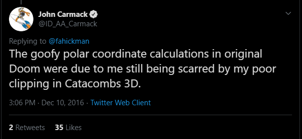  

[Twitter](https://twitter.com/ID_AA_Carmack/status/807723200431783936?ref_src=twsrc%5Etfw)  

Note: If you understand the math in ```R_ScaleFromGlobalAngle``` function used in DOOM, and you can back your statements with a reliable reference, ping [AngryCPPCoder](https://twitter.com/AngryCPPCoder) or [DOOMReboot](https://twitter.com/DOOMReboot) and you will be rewarded for sharing the knowledge!   

So, for this week I will be projecting the walls using a similar technique to that which is used in Wolf3D. Please note that this technique didn't give me output that was identical to that of the original DOOM.  

With that out of the way let's get started!   
As usual, I like to start with the givens, what we know up to this point.  
1. We know the player location X, and Y.  
2. We know how far the player is from the screen 160 units (Week 011).  
3. We know the height of the screen 200 units (Width 320 x Height 200).  
4. For a given Seg (part of the wall/Linedef) we know its start and end points, V1 and V2 respectively, on the screen.  

## Goals  
* Calculate the wall height  
* Draw the wall  

## Similar triangles approach and fisheye effect  
The technique used to calculate the vertical wall projection is covered in details in [GAME ENGINE BLACK BOOK: WOLFENSTEIN 3D by Fabien Sanglard](http://fabiensanglard.net/gebbwolf3d/). It is a good read, don't miss it. This technique is covered in lots of tutorials online (look at references) so I will just summarize the logic.  
The technique is based on the properties of similar triangles. Similar triangles are triangles that are the same shape, but not the same size.   

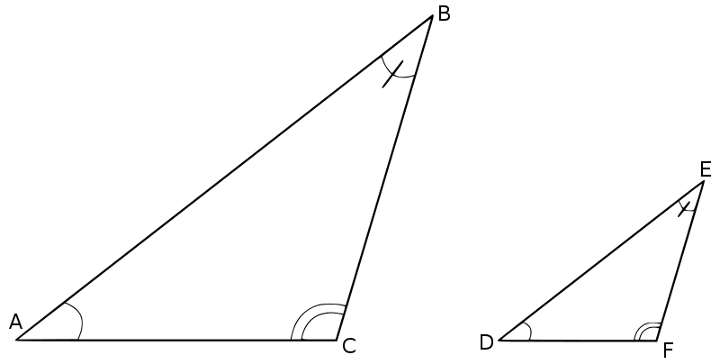   

How do we know that two triangles are similar? One way that could let us know is if they have equally sized angles.  
The property that we care about for similar triangles is where corresponding sides are in the same proportions. Based on the example above, 

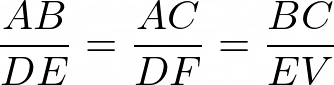  

While browsing I found this nice example on Wikipedia (link in reference).  

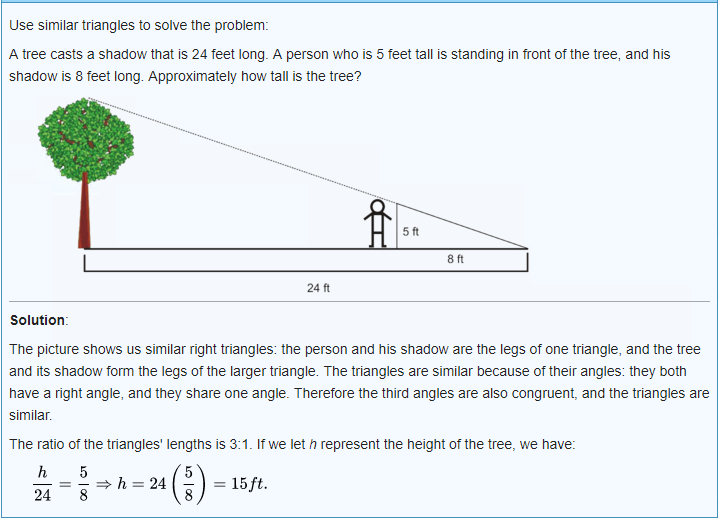   

If you're familiar with those from high school math, then this should be very simple for you.  
Now, how can we apply this to our problem?    

So, the first thing we need to figure out is the wall height of the virtual wall. The data provided within the WAD files are the Ceiling and Floor Z values (after all, the solid wall is between them). Using this data, we will be able to know the vertical start and end points of the wall's height in the virtual wall.  

Let's start with a very simple example, let's assume there is a single wall in front of the player, it is segmented to four parts, and it looks like the following   
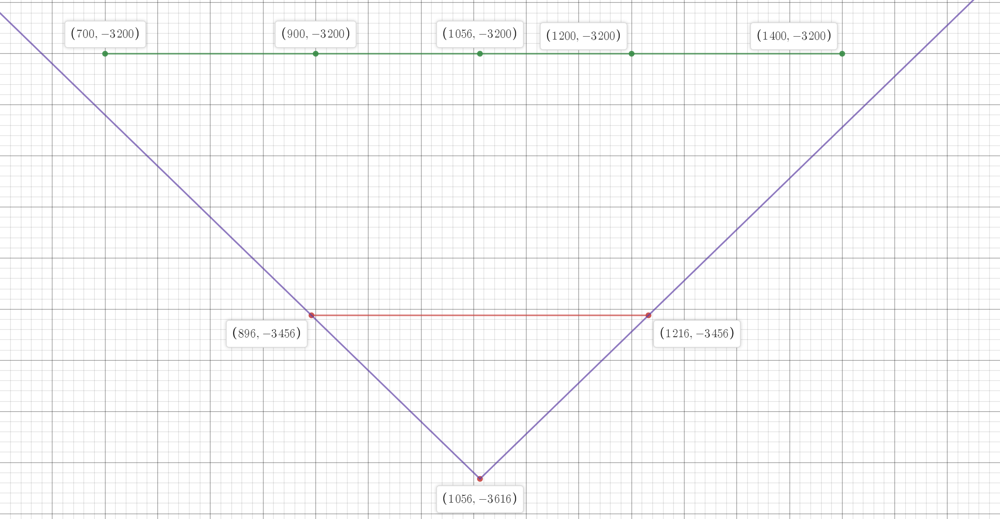  

the expected output is should be a straight horizontal wall which looks something like this  

   

Here are some assumptions for the above example:    
* Wall rests at Z = 0 and has a height of 200 units (ceiling height  - floor height).   
* Player's eye level is at Z = 41 (This is the eye Z level for Doomguy)  
* Screen height is 200 units  
* Center of the player FOV will split the screen into two halves, 100 to the top (0) and 100 to the bottom (199).  
* Center of the player FOV will split the wall, but the wall is resting on Z = 0, so it will split it into 0 to 41 and 41 to 159.  
* Projection screen is 160 units away from player.  

drawing those givens:  

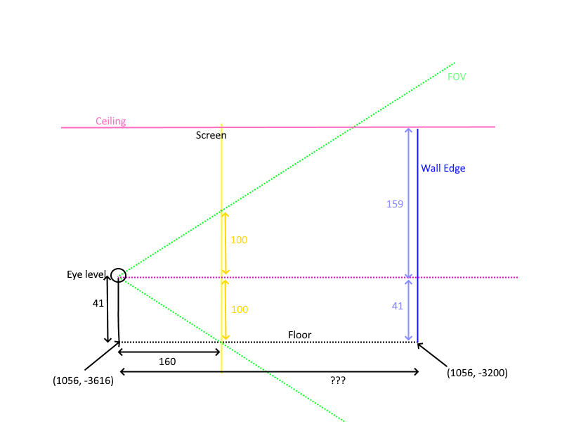  

Notice how part of the wall is above the player's eye level and the rest is below? In order to create a right angle triangle, we need to split this wall into two.  
Can you see the 2 triangles now?  

Both triangles are highlighted in red  

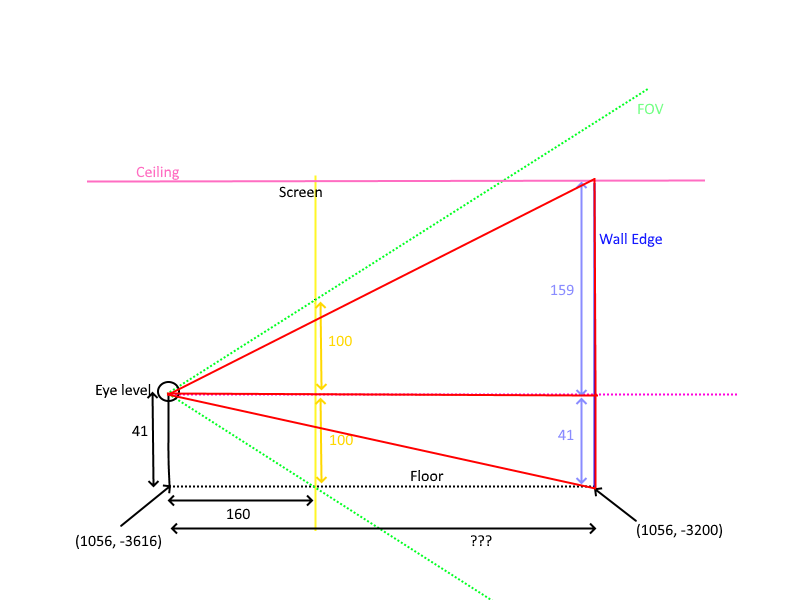   

First thing we need to do is calculate how far the player is from the wall  
We have two points, the segment's start and end
Let's start with point (1056, -3200)  
Player is at (1056,-3616)  
We can use the distance formula to calculate the distance between the player and the first edge of the segment

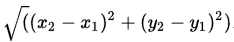   

 Sqrt((1056 - 1056)^2 - (-3200 -3616)^2) = 440.2    

Now, doing the math for the upper triangle: (160 * 159) / 440.2 = 57.7 (~58 pixels from center of the screen)    
The math for the lower triangle: (160 * 41) / 440.2 = 14.9 (~15 pixels from center of the screen)   

Let's do the same thing on another edge at point (1200, -3200)  
Sqrt((1200 - 1056)^2 - (-3200 -3616)^2) = 416    

Upper triangle: (160 * 159) / 416 = 61.15 (~61 pixels from center of the screen)   
Lower triangle: (160 * 41) / 416 = 15.76 (~16 pixels from center of the screen)     
 
Okay something is off here! The wall should have the same height, why is it getting shorter? If you do the math for all those points you will notice a fisheye effect. Where is the error in the calculation?  

The screen is 160 units away from player. It is only 160 units in the center of the screen.  
The circle shows a 160 radius around the player. Note how there is extra space between the player's radius and the projection screen! We must take that into account.   

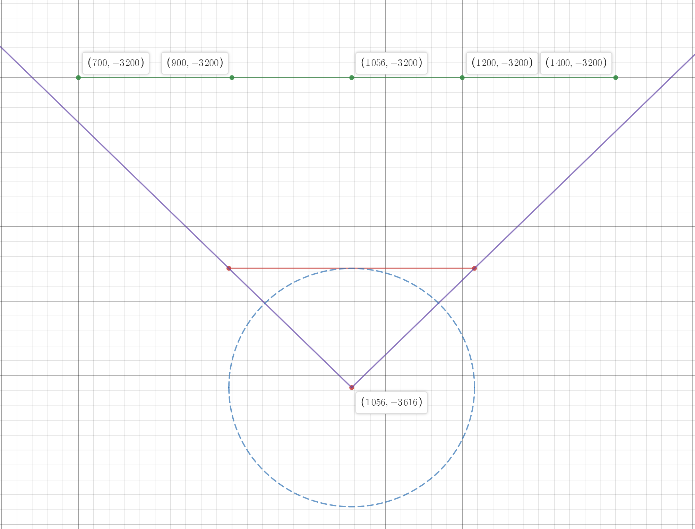   

We need to correct for this fisheye effect.  

To find the correct distance to the screen we use trigonometry. Take the distance to the screen (160) divided by the COSINE of the angle between the wall edge and the center of the screen. If that is not clear, then please head to the reference section for more to read.   

So, using this technique we can calculate the height for both edges of a wall and just draw it in wireframe.   

## Coding  
To organize things, I have added helper functions in Angle class to do all the trigonometry that will be needed  

```
    float GetCosValue();
    float GetSinValue();
    float GetTanValue();
    float GetSignedValue();
```

And a simple function to calculate how far a point is to the player

``` cpp
float Player::DistanceToPoint(Vertex &V)
{
    // We have two points, where the player is and the vertex passed.
    // To calculate the distance just use "The Distance Formula"
    // distance = square root ((X2 - X1)^2 + (y2 - y1)^2)
    return sqrt(pow(m_XPosition - V.XPosition, 2) + pow(m_YPosition - V.YPosition, 2));
}
```

Now, write a function that will do the required math for a single edge.  
But, before we start, we need to figure out the angle of the wall relative to the center of the screen, this is where the lookup table ```m_ScreenXToAngle``` comes into play.  
Building this table is very simple. The FOV for the player is 90 and splits the screen into two sections, each of which is 45 degrees.  So, just divide this evenly over the X coordinates.  
Just create the table once during initialization.   

``` cpp
void  ViewRenderer::Init(Map *pMap, Player *pPlayer)
{
    m_pMap = pMap;
    m_pPlayer = pPlayer;

    SDL_RenderGetLogicalSize(m_pRenderer, &m_iRenderXSize, &m_iRenderYSize);

    Angle ScreenAngle = m_pPlayer->GetFOV() / 2.0f;
    float fStep = (float)m_pPlayer->GetFOV() / (float)(m_iRenderXSize + 1);
    for (int i = 0; i <= m_iRenderXSize; ++i)
    {
            m_ScreenXToAngle[i] = ScreenAngle;
            ScreenAngle -= fStep;
    }

    m_HalfScreenWidth = m_iRenderXSize / 2;
    m_HalfScreenHeight = m_iRenderYSize / 2;
    Angle HalfFOV = m_pPlayer->GetFOV() / 2;
    m_iDistancePlayerToScreen = m_HalfScreenWidth / HalfFOV.GetTanValue();
}
```

Now putting all the above math into code!   
```CalculateCeilingFloorHeight``` calculates the top and bottom edges of a single wall  

``` cpp
void ViewRenderer::CalculateCeilingFloorHeight(Seg &seg, int &VXScreen, float &DistanceToV, float &CeilingVOnScreen, float &FloorVOnScreen)
{
    float Ceiling = seg.pFrontSector->CeilingHeight - m_pPlayer->GetZPosition();
    float Floor = seg.pFrontSector->FloorHeight - m_pPlayer->GetZPosition();

    Angle VScreenAngle = m_ScreenXToAngle[VXScreen];

    float DistanceToVScreen = m_iDistancePlayerToScreen / VScreenAngle.GetCosValue();
    CeilingVOnScreen = (abs(Ceiling) * DistanceToVScreen) / DistanceToV;
    FloorVOnScreen = (abs(Floor) * DistanceToVScreen) / DistanceToV;

    if (Ceiling > 0)
    {
        CeilingVOnScreen = m_HalfScreenHeight - CeilingVOnScreen;
    }
    else
    {
        CeilingVOnScreen += m_HalfScreenHeight;
    }

    if (Floor > 0)
    {
        FloorVOnScreen = m_HalfScreenHeight - FloorVOnScreen;
    }
    else
    {
        FloorVOnScreen += m_HalfScreenHeight;
    }
}
```

Now, call all those helper functions and draw it in wireframe  

``` cpp
void ViewRenderer::CalculateWallHeightSimple(Seg &seg, int V1XScreen, int V2XScreen, Angle V1Angle, Angle V2Angle)
{
    //We have V1 and V2, do calculations for V1 and V2 separately then interpolate values in between
    float DistanceToV1 = m_pPlayer->DistanceToPoint(*seg.pStartVertex);
    float DistanceToV2 = m_pPlayer->DistanceToPoint(*seg.pEndVertex);

    float CeilingV1OnScreen;
    float FloorV1OnScreen;
    float CeilingV2OnScreen;
    float FloorV2OnScreen;

    CalculateCeilingFloorHeight(seg, V1XScreen, DistanceToV1, CeilingV1OnScreen, FloorV1OnScreen);
    CalculateCeilingFloorHeight(seg, V2XScreen, DistanceToV2, CeilingV2OnScreen, FloorV2OnScreen);

    //SDL_Color color = { 255,255,255 };
    SDL_Color color = GetWallColor(seg.pLinedef->pFrontSidedef->MiddleTexture);
    SetDrawColor(color.r, color.g, color.b);

    SDL_RenderDrawLine(m_pRenderer, V1XScreen, CeilingV1OnScreen, V1XScreen, FloorV1OnScreen);
    SDL_RenderDrawLine(m_pRenderer, V2XScreen, CeilingV2OnScreen, V2XScreen, FloorV2OnScreen);
    SDL_RenderDrawLine(m_pRenderer, V1XScreen, CeilingV1OnScreen, V2XScreen, CeilingV2OnScreen);
    SDL_RenderDrawLine(m_pRenderer, V1XScreen, FloorV1OnScreen, V2XScreen, FloorV2OnScreen);
}
```

If you run the code now you should see  

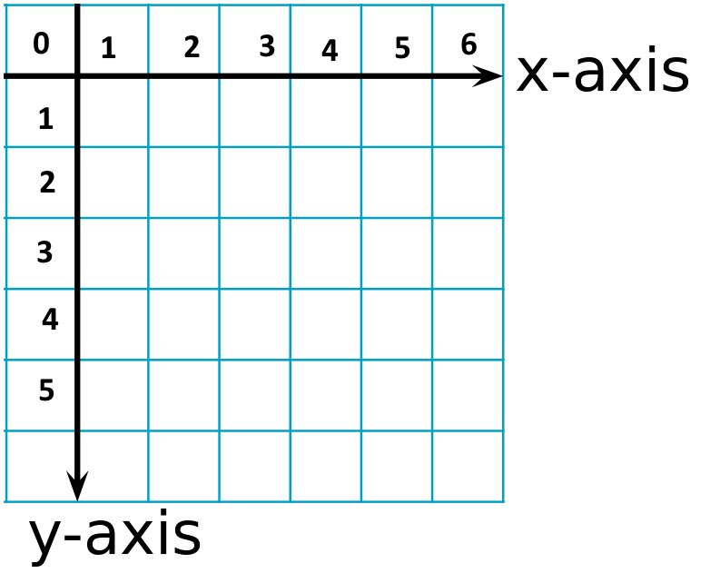  

Comparing this to the original rendering  

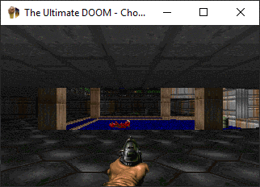  

Let's give the player the ability to move within the map. I updated ```void Game::ProcessInput()``` adding 
``` cpp
    // read the states of the keyboard every frame
    m_pDoomEngine->UpdateKeyStatus(SDL_GetKeyboardState(NULL));
```

And let the Player class handle those events

Now, if you re-run you will notice that something is not quite right. The Segs that are only partially visible (clipped) are not rendered correctly!
Can you guess why?

The edge that is outside the view is being calculated with angle 45 or -45 (lookup table) despite its actual value being greater than 45. One option is to calculate precisely where the FOV intersects with the Seg.  
There are multiple ways to evaluate this. I decided to use Law of Sines to solve the problem (I will not cover this piece of code in detail as there is a better way to solve this problem. Please see Other Notes at the end of this tutorial.)  

``` cpp
void ViewRenderer::PartialSeg(Seg &seg, Angle &V1Angle, Angle &V2Angle, float &DistanceToV, bool IsLeftSide)
{
    float SideC = sqrt(pow(seg.pStartVertex->XPosition - seg.pEndVertex->XPosition, 2) + pow(seg.pStartVertex->YPosition - seg.pEndVertex->YPosition, 2));
    Angle V1toV2Span = V1Angle - V2Angle;
    float SINEAngleB = DistanceToV * V1toV2Span.GetSinValue() / SideC;
    Angle AngleB(asinf(SINEAngleB) * 180.0 / PI);
    Angle AngleA(180 - V1toV2Span.GetValue() - AngleB.GetValue());

    Angle AngleVToFOV;
    if (IsLeftSide)
    {
        AngleVToFOV = V1Angle - (m_pPlayer->GetAngle() + 45);
    }
    else
    {
        AngleVToFOV = (m_pPlayer->GetAngle() - 45) - V2Angle;
    }

    Angle NewAngleB(180 - AngleVToFOV.GetValue() - AngleA.GetValue());
    DistanceToV = DistanceToV * AngleA.GetSinValue() / NewAngleB.GetSinValue();
}
```

A visualization of what I had in mind to help you understand the above code  


Finding the intersection this way doesn't always give the correct value, but it works for most of the cases. So, you will still find some partial Segs that don't look correct.  
Running the above code, and moving around the map, you'll see that things looks much better (but not perfect).
Note: There are still rendering issues at some angles, but I will not invest any more time fixing this. After all, my goal was just to see if it was possible to use Wolf3D rendering in DOOM!  
After all remember the goal was to just find out if it was possible to apply Wolf3D logic in DOOM.  

  

Visualize what happened in the last two weeks   

  

## Other Notes  
It was very interesting to apply Wolf3D techniques in DOOM and it now makes me wonder how easy it would be to project walls using a more modern, matrix-based approach. 
My poor choice of using Law of Sines to handle partial Segs ruined the game experience. Also, there is a good chance I have bugs in my implementation. A better way to handle partial Segs is to use cross products, this [link](https://stackoverflow.com/questions/563198/how-do-you-detect-where-two-line-segments-intersect) explains in detail how the cross product can be used to clip the Segs correctly. Any robust line-line or segment-segment algorithm will work, too.

## Source code
[Source code](../src)  

## Reference
[Similar Triangles](https://en.wikibooks.org/wiki/High_School_Trigonometry/Angles_in_Triangles)   
[Raycasting Tutorial](https://permadi.com/1996/05/ray-casting-tutorial-table-of-contents/)  
[Lode's Raycasting Tutorial](https://lodev.org/cgtutor/raycasting.html)  
[Find Intersection Point](https://stackoverflow.com/questions/563198/how-do-you-detect-where-two-line-segments-intersect)  
