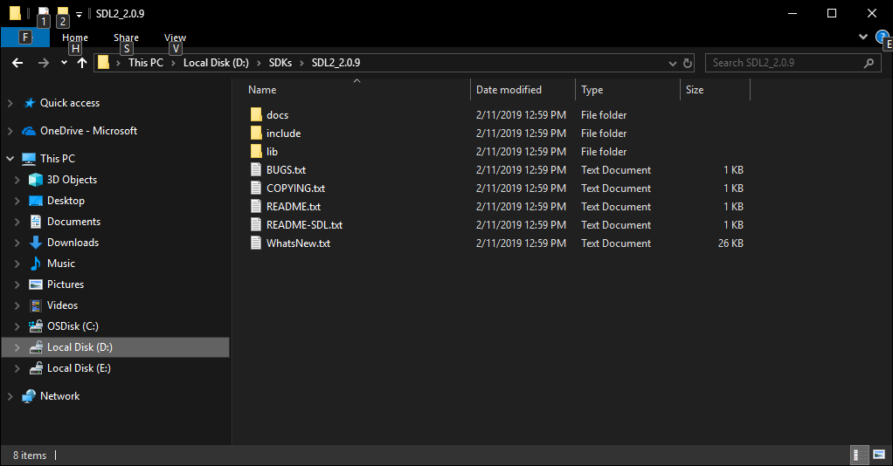
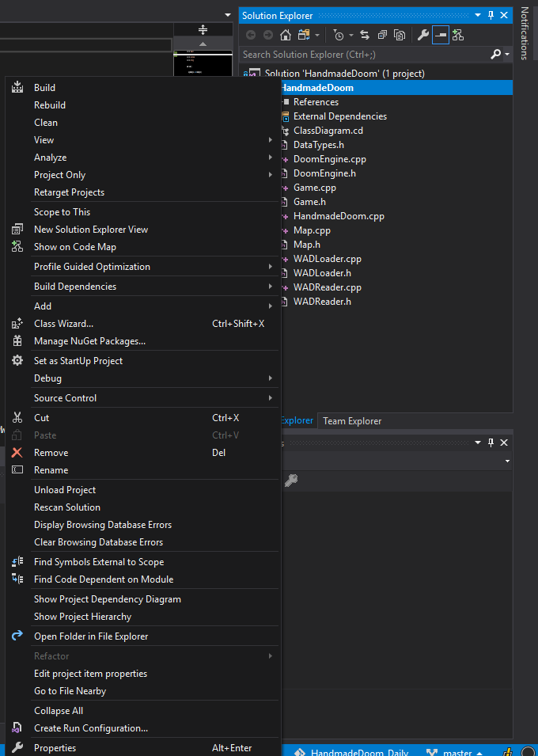
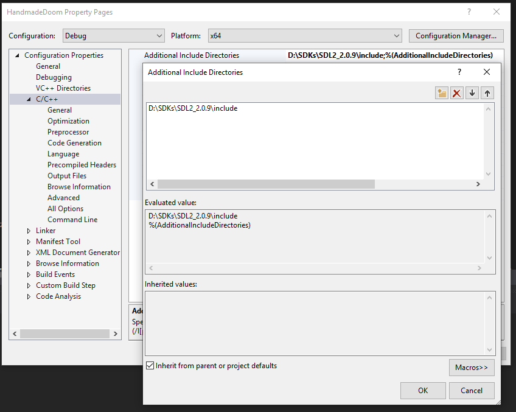
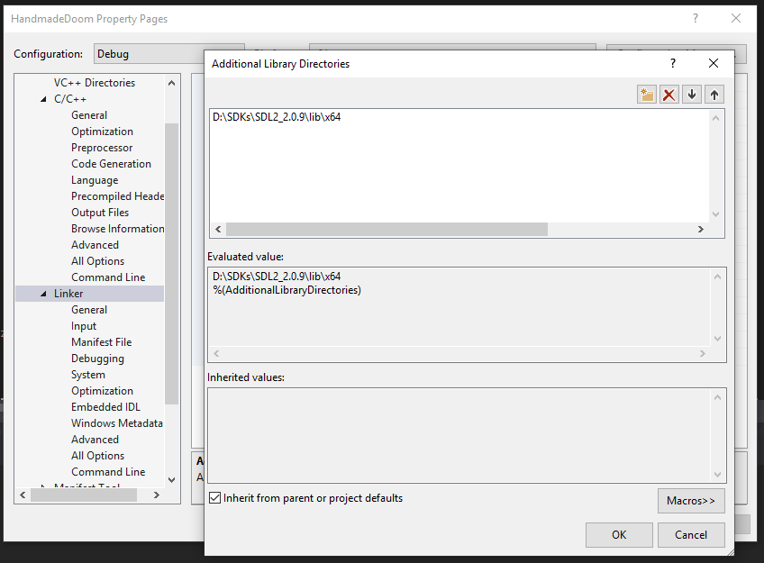
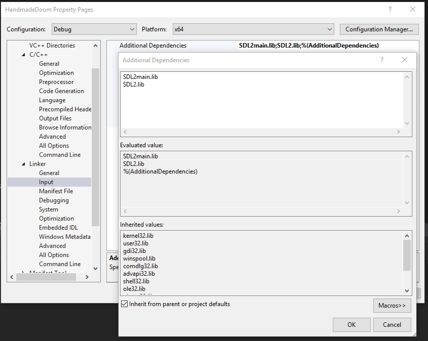
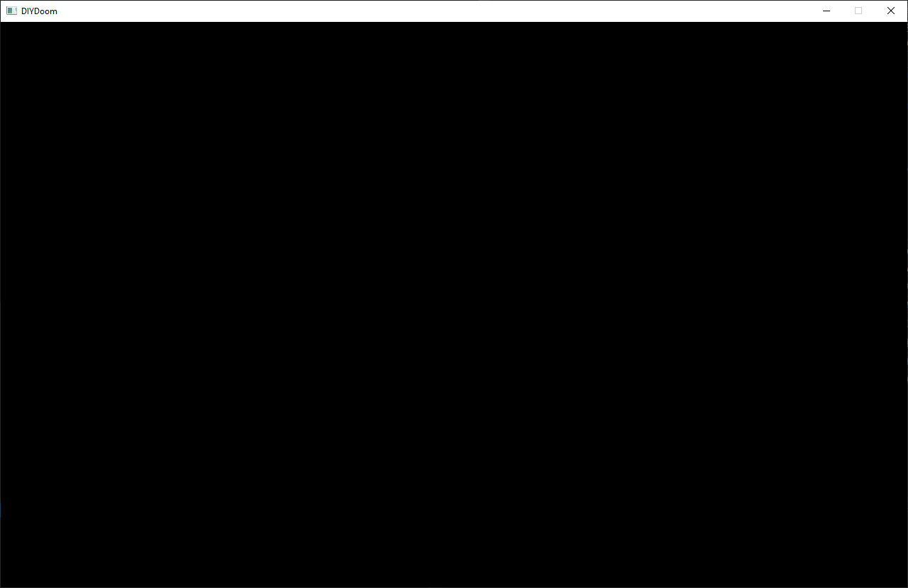

__Author:__ Amro Ibrahim  
__Reviewer:__ DOOMReboot [twitter](https://twitter.com/DOOMreboot), [web](http://www.movax13h.com)  

# Week 003 - Adding SDL
Now that we have read some data from the WAD, we need to draw something on the screen, after all we are trying to make a game.  
The console windows are nice but it is text based (it can be hacked to draw graphics), but we need a window were we can draw some graphics. We can use windows APIs but that will add windows as a dependency for us, which I don’t want. This is where SDL comes in play.  

## SDL  
SDL is a cross platform library to provide a hardware, and OS abstraction for multimedia components. In the previous Weeks, we would could have used SDL in opening and reading the WAD file, and endian conversion.  
For now, we will use SDL to create a window and draw some graphics.  

## Goals  
*  Create a new Game class  
*  Create DoomEngine class to cleanup and organize functionality  
*  Create a window  
*  Cleanup code to pass around some objects using pointers  

## Design    
First let’s start by adding Game class that would wrap the game's major steps in simple functions.  
Adding DoomEngine that would hold game objects and aware of the game internals.  
Update DIYDoom.cpp to create and call the Game class, to create a game loop.  

## Coding
First you will need to download SDL libraries which can be found [here](https://www.libsdl.org/)  
at the time of writing SDL2 v2.0.9 is the latest stable version, remember to download the Development Libraries version in my case "SDL2-devel-2.0.9-VC.zip". Unzip this anywhere you like but keep things organized. I have a SDKs directory on D drive where I keep all my SDKs.  
  

You will need to note where include and lib directories are.  
Now let’s go to our project and update the settings to see and use the SDL library right click on DIYDoom project and select Properties.    
  

Under C/C++, edit the Additional include directories and add where the SDL "include" folder located.  

  

Now under Linker, edit Additional Library Directories and add where the SDL "lib". If you look in those folders the libraries are under x64 and x86 folders, so make sure you have the correct path.  

  

Finally, under Linker > Input, edit Additional Dependencies and add SDL2main.lib, SDL2.lib.  

  

### DoomEngine Class  
DoomEngine class will be a class that knows the internals of our Doom clone. It will keep track of the player, the game status, what map is loaded etc. The list will grow as we implement more of the game.  
  
``` cpp
class DoomEngine
{
public:
    DoomEngine();
    ~DoomEngine();

    virtual void Render(SDL_Renderer *pRenderer); // Draw something to show on screen
    virtual void KeyPressed(SDL_Event &event); // Which keys are pressed?
    virtual void KeyReleased(SDL_Event &event); // Which keys are released?
    virtual void Quit(); // Close and shutdown the game
    virtual void Update();

    virtual bool IsOver(); // Did the game end?
    virtual bool Init(); // Initialize game object

    virtual int GetRenderWidth();
    virtual int GetRenderHeight();
    virtual int GetTimePerFrame();

    virtual std::string GetName(); 
    virtual std::string GetWADFileName();

protected:
    int m_iRenderWidth;
    int m_iRenderHeight;

    bool m_bIsOver;

    WADLoader m_WADLoader; // Now the game engine will own the loader
    Map *m_pMap; // Also the map will be owned by the engine.
};
```
  
We will not go through every function implementation, you can have a look at the source code to have an idea what was added, but let’s have look at some of them.  
DoomEngine constructor  
  
``` cpp
// For now, lets match doom default resolution
// and then stretch this to the final window 
// And let’s create an instance of the map
DoomEngine::DoomEngine() : m_bIsOver(false), m_iRenderWidth(320), m_iRenderHeight(200)
{
    m_pMap = new Map("E1M1");
}
```
  
Init function is very simple, call the WADLoader to load the WAD file.  
  
``` cpp
std::string DoomEngine::GetWADFileName()
{
    return "D:\\SDKs\\Assets\\Doom\\DOOM.WAD";
}

bool DoomEngine::Init()
{
    m_WADLoader.SetWADFilePath(GetWADFileName());
    m_WADLoader.LoadWAD();    
    m_WADLoader.LoadMapData(m_pMap);
    return true;
}
```
  
And also, just lets clear the Window we want to draw with black for now  
  
``` cpp
void DoomEngine::Render(SDL_Renderer *pRenderer)
{
    SDL_SetRenderDrawColor(pRenderer, 0x00, 0x00, 0x00, 0x00);
    SDL_RenderClear(pRenderer);
}
```
  
### Game Class and Game Loop
So, we need to add a basic game loop that would do some basic functionally for our game. Let’s start with a basic one for now (we tune that at later point when we need to).  
So, our simple game loop will follow this simple logic.  
  
1. Read input  
2. Update our world  
3. Display the new updated world  
4. Lock the refresh rate to max 60 per sec (by waiting)  
  
Let’s create some functions that represent this high level functionality to our Game class
  
``` cpp
class Game
{
public:
    Game();
    virtual ~Game();

    void ProcessInput(); // Read user input
    void Render(); // Draw on the screen
    void Update(); // Update the world
    void Delay(); // A function that would just wait for an amount of time

    bool IsOver(); // Check if game is over
    bool Init(); // Initialize our objects

protected:
    int m_iWindowWidth;
    int m_iWindowHeight;

    SDL_Window *m_pWindow; // The windows we will create
    SDL_Renderer *m_pRenderer; // Were we will render our frames
    DoomEngine *m_pDoomEngine; // This is an object that knows more details about game internal
};
```
  
Let’s implement those functions to achieve what their name claim.  
Let’s start with the init function. This function should initialize the SDL library, create a Window, and a renderer!  
If you've noticed, the window size differs from the renderer resolution.  
This keeps display resolution independent from internal game resolution. I have set the logical (whatever we render) to be on a 320*200 resolution, to match the original game design.  
  
``` cpp
bool Game::Init()
{
    //Initialize SDL
    if (SDL_Init(SDL_INIT_EVERYTHING) != 0)
    {
        std::cout << "SDL failed to initialize! SDL_Error: " << SDL_GetError() << std::endl;
        return false;
    }

    // Create a window with a specific size, here you can set whatever resolution you prefer.
    m_pWindow = SDL_CreateWindow(m_pDoomEngine->GetName().c_str(), SDL_WINDOWPOS_UNDEFINED, SDL_WINDOWPOS_UNDEFINED, m_iWindowWidth, m_iWindowHeight, SDL_WINDOW_SHOWN);
    if (m_pWindow == nullptr)
    {
        std::cout << "SDL failed to create window! SDL_Error: " << SDL_GetError() << std::endl;
        return false;
    }

    m_pRenderer = SDL_CreateRenderer(m_pWindow, -1, SDL_RENDERER_SOFTWARE);
    if (m_pRenderer == nullptr)
    {
        std::cout << "SDL failed to create renderer! SDL_Error: " << SDL_GetError() << std::endl;
        return false;
    }

    SDL_SetRenderDrawColor(m_pRenderer, 0xFF, 0xFF, 0xFF, 0xFF);

    if (!m_pDoomEngine->Init())
    {
        std::cout << m_pDoomEngine->GetName() << " failed to initialize!" << std::endl;
        return false;
    }

    // Sets the logical size of the screen, that means we can draw on a specific render size then, SDL will 
    // automatically stretch it to the window size. This will make the development independent from window resolution
    if (SDL_RenderSetLogicalSize(m_pRenderer, m_pDoomEngine->GetRenderWidth(), m_pDoomEngine->GetRenderHeight()) != 0)
    {
        std::cout << "SDL failed to set logical size! SDL_Error: " << SDL_GetError() << std::endl;
        return false;
    }

    return true;
}
```
  
one more function I would like to go over in Game class is ProcessInput  
  
``` cpp
// All what process input need to do is just forward the events to the 
// DoomEngine to take appropriate action
void Game::ProcessInput()
{
    SDL_Event event;
    while (SDL_PollEvent(&event)) {
        {
            switch (event.type)
            {
            case SDL_KEYDOWN:
                m_pDoomEngine->KeyPressed(event);
                break;

            case SDL_KEYUP:
                m_pDoomEngine->KeyReleased(event);
                break;

            case SDL_QUIT:
                m_pDoomEngine->Quit();
                break;
            }
        }
    }
}
```

With Game class being created our main function needs to call those function.  

``` cpp
Game game;
game.Init();

while (!game.IsOver()) // Did the user quite?
{
    game.ProcessInput(); // Read the user input
    game.Update();  // Update all our objects in memory (characters, map, etc.)
    game.Render();  // Create and display a new image to screen
    game.Delay();   // let’s try to lock the refresh rate to 60 frames for now
}
```

When you run this all you will get is an empty window. Now we are ready to draw something!  

  

## Source code
[Source code](../src)  

## Reference
[SDL Wiki](https://wiki.libsdl.org/FrontPage)  
[Lazy Foo SDL tutorials](http://lazyfoo.net/SDL_tutorials/)  
