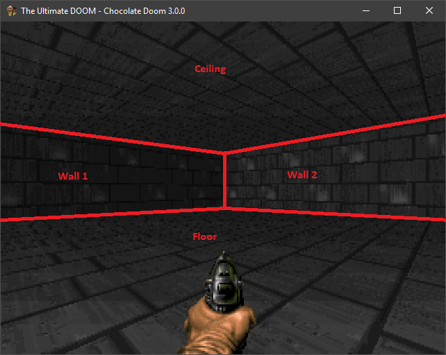
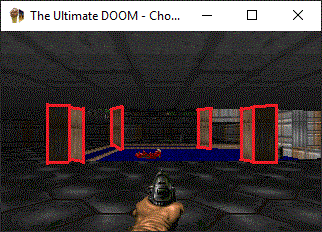
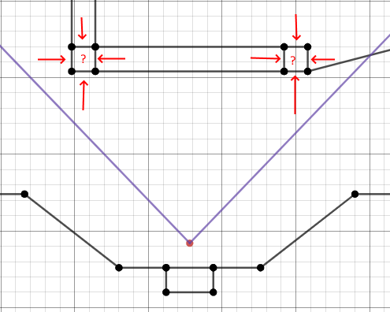
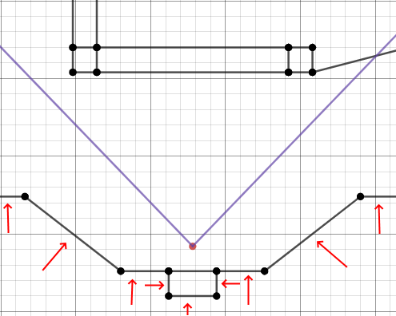
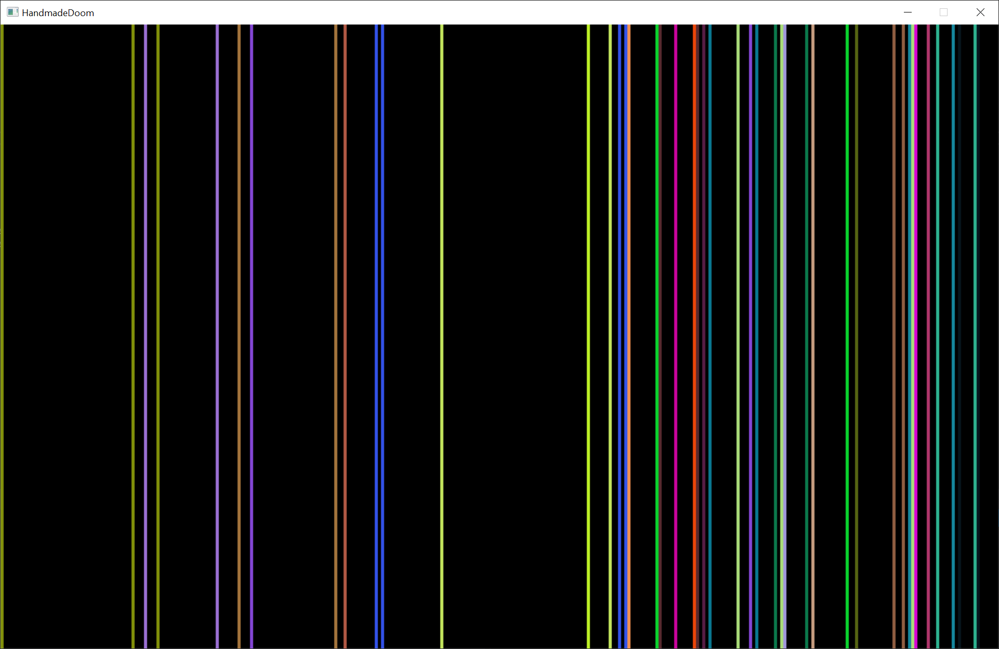
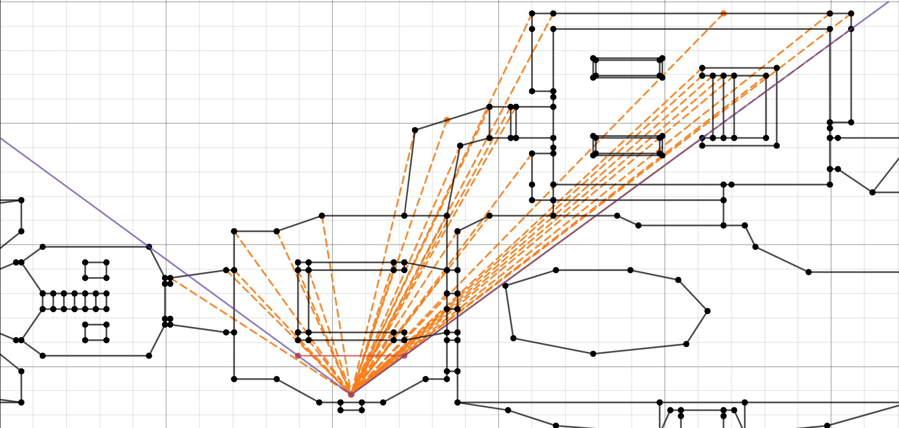

__Editor:__ DOOMReboot ([twitter](https://twitter.com/DOOMReboot))  

# Week 012 - Solid Wall
Now that we have the angles of all the walls in the player FOV, we need to figure out the type of each wall.  

There are two types of walls, a solid wall and a wall with a window (AKA portal). For now, let's focus only on solid walls, which is simply when you can't see what is behind it.  

  

The screenshot above shows a single Sector (all of the area has the same ceiling height and floor height), and we see two walls (Linedefs) at different angles.  

  

It is obvious that you will not be able to see what is behind this wall, no matter what. So, once you draw a solid wall on the screen you really can't draw anything behind it.  

So, how do we know if a wall is a solid wall? Solid walls have a property that makes it easy to figure out, which is that it only has one side! What does that mean? It only can be viewed from one side, the front side. Again, what does that mean? Let me explain with an example.  

Here you can see that there are four pillars in front of Doomguy as soon as he spawns in E1M1.

  

Those pillars are solid walls, and there are four sides for each pillar (front side only) 

  

and there is no way for the player to get inside the pillar (where the question mark is on the back side each of the pillar's Linedefs).  

Another good example of solid walls are the walls just behind the player.  

  

These walls are solid and have no back side; the player will never get outside the map! (actually, they can with cheats, but let's keep that aside).  

So, to summarize, the solid wall can only be viewed from one side, which means it will have a front Sidedef but not a back Sidedef (a front Sector, but no back Sector). So, figuring out if a wall is solid is simple (we will handle doors on a later day); we only need to check if it has a back Sidedef! If it doesn't, then you can't see through it.
But, how can we do that check? This is the story behind all the refactoring we will do today!  

## Goals
*  Refactor! 
*  Refactor!
*  Refactor!
*  Determine if the wall is solid!

## Coding
The best thing to do is to diff the code with a previous version to see all the changes. But I will try to give a quick summary of what I had in mind.  
Originally, we had structs that would hold an ID of another struct. For example, a Linedef was holding the ID of StartVertexID and EndVertexID! We could access the Vertex vector and do something like this  

``` cpp
int StartVertexXValue = m_Vertexes[line.StartVertexID].XPosition;
```

But what would be even better is to convert those IDs into pointers so it will be easier to access the data.  
Maybe something like this  

``` cpp
int StartVertexXValue  = line.pStartVertex->XPosition;
```

It will make passing Linedefs or Segs much easier, without need of having access to the vector (and it sure looks cleaner). But, how can we do this?  
I would load all the data from the WAD file then build those pointers. So, we will still need the old structs to read the data off the WAD file and create new, neater ones to use in code.  
I suffixed the old ones with "WAD" so they became  

``` cpp
struct WADSector
{
    int16_t FloorHeight;
    int16_t CeilingHeight;
    char FloorTexture[8];
    char CeilingTexture[8];
    uint16_t Lightlevel;
    uint16_t Type;
    uint16_t Tag;
};

struct WADSidedef
{
    int16_t XOffset;
    int16_t YOffset;
    char UpperTexture[8];
    char LowerTexture[8];
    char MiddleTexture[8];
    uint16_t SectorID;
};

struct WADLinedef
{
    uint16_t StartVertexID;
    uint16_t EndVertexID;
    uint16_t Flags;
    uint16_t LineType;
    uint16_t SectorTag;
    uint16_t FrontSidedef; //0xFFFF means there is no sidedef
    uint16_t BackSidedef;  //0xFFFF means there is no sidedef
};

struct WADSeg
{
    uint16_t StartVertexID;
    uint16_t EndVertexID;
    uint16_t Angle;
    uint16_t LinedefID;
    uint16_t Direction; // 0 same as Linedef, 1 opposite of Linedef
    uint16_t Offset; // distance along Linedef to start of Seg
};

```
And added the following, but notice they now point to the objects.

``` cpp
struct Sidedef
{
    int16_t XOffset;
    int16_t YOffset;
    char UpperTexture[9];
    char LowerTexture[9];
    char MiddleTexture[9];
    Sector *pSector;
};

struct Linedef
{
    Vertex *pStartVertex;
    Vertex *pEndVertex;
    uint16_t Flags;
    uint16_t LineType;
    uint16_t SectorTag;
    Sidedef *pFrontSidedef;
    Sidedef *pBackSidedef;
};

struct Seg
{
    Vertex *pStartVertex;
    Vertex *pEndVertex;
    Angle SlopeAngle;
    Linedef *pLinedef;
    uint16_t Direction; // 0 same as Linedef, 1 opposite of Linedef  
    uint16_t Offset; // distance along Linedef to start of Seg  
    Sector *pFrontSector;
    Sector *pBackSector;
};
```

In the Map class I created new variable pointers (so that I can free the memory as soon as I don't need it anymore)  

``` cpp
    std::vector<WADSector> *m_pSectors;
    std::vector<WADSidedef> *m_pSidedefs;
    std::vector<WADLinedef> *m_pLinedefs;
    std::vector<WADSeg> *m_pSegs;
```

and updated the init function!
``` cpp
void Map::Init()
{
    BuildSectors();
    BuildSidedefs();
    BuildLinedef();
    BuildSeg();
}
```

Those helper functions just populate the pointers! I will just list BuildLinedef here  

``` cpp
void Map::BuildLinedef()
{
    WADLinedef wadlinedef;
    Linedef linedef;

    for (int i = 0; i < m_pLinedefs->size(); ++i)
    {
        wadlinedef = m_pLinedefs->at(i);

        linedef.pStartVertex = &m_Vertexes[wadlinedef.StartVertexID];
        linedef.pEndVertex = &m_Vertexes[wadlinedef.EndVertexID];
        linedef.Flags = wadlinedef.Flags;
        linedef.LineType = wadlinedef.LineType;
        linedef.SectorTag = wadlinedef.SectorTag;
        
        // 0xFFFF means not defined, sidedef doens't exist
        if (wadlinedef.FrontSidedef == 0xFFFF)
        {
            linedef.pFrontSidedef = nullptr;
        }
        else
        {
            linedef.pFrontSidedef = &m_Sidedefs[wadlinedef.FrontSidedef];
        }

        if (wadlinedef.BackSidedef == 0xFFFF)
        {
            linedef.pBackSidedef = nullptr;
        }
        else
        {
            linedef.pBackSidedef = &m_Sidedefs[wadlinedef.BackSidedef];
        }

        m_Linedefs.push_back(linedef);
    }

    delete m_pLinedefs;
    m_pLinedefs = nullptr;
}
```

I have also added other helper functions just to correctly point to each other.  

Now, with this new structure populated, all we need to do is a simple check: does the Seg have a back Sector defined?  

``` cpp
void ViewRenderer::AddWallInFOV(Seg &seg, Angle V1Angle, Angle V2Angle)
{
    // Solid walls don't have a Back side.
    if (seg.pBackSector == nullptr) 
    {
        AddSolidWall(seg, V1Angle, V2Angle);
    }
}
```

If not, just draw it!  

  

Sorry to blind you with those flickering colored edges! I promise to fix that next week.  

Graphical representation!  

  

Now, we have filtered down all the solid walls that are in the FOV! But not all those walls should be drawn; the ones in the front block the ones behind them, and that is what we will do next.  
The fun part is about to start!  

## Other Notes  
The structs pointing to each other is not my idea, this is how the Chocolate/ Classic Doom was implemented, and building all those structs from day one would just be confusing and it would be easy to get lost, so I was just progressing based on what was needed.  
Loading and setup of those structs are done in ``` p_setup.c ``` I didn't copy the same exact structs that DOOM had, I implemented what makes sense to me, (if you didn't notice I like to keep things simple and refactor as needed).  
The Chocolate / Original Doom does all those loading and setup when in the ``` void P_SetupLevel ( int episode, int map, int playermask, skill_t skill) ```  

Here is a some of the function in Chocolate Doom that does the load and setup structures  

``` cpp
    P_LoadBlockMap (lumpnum+ML_BLOCKMAP);
    P_LoadVertexes (lumpnum+ML_VERTEXES);
    P_LoadSectors (lumpnum+ML_SECTORS);
    P_LoadSideDefs (lumpnum+ML_SIDEDEFS);

    P_LoadLineDefs (lumpnum+ML_LINEDEFS);
    P_LoadSubsectors (lumpnum+ML_SSECTORS);
    P_LoadNodes (lumpnum+ML_NODES);
    P_LoadSegs (lumpnum+ML_SEGS);

    P_GroupLines ();
```

## Source code  
[Source code](../src)  

## Reference  
[Chocolate Doom](https://www.chocolate-doom.org/wiki/index.php/Chocolate_Doom)  
