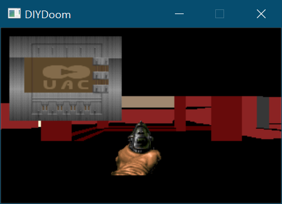
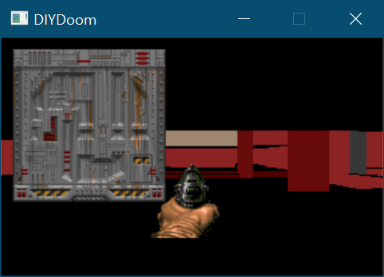
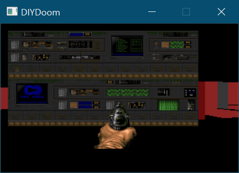

# Week 019 - Patch Format

We were able to read the palette that has all the colors we will need to draw an image on the screen, but we are not there yet to draw textures on walls. A texture is composed of multiple patches combined aka "multipatch texture". For now, let’s focus on a patch and their format as a first step.  

A patch is just a picture/image. The patch format in DOOM is interesting, its focus is a mix between transparency, compression, and performance.
It is common to see transparency implemented as designating a color that is checked for while drawing. For example, in Wolfenstein 3D the color (RGB 152, 0, 136) was used to tell if a pixel is transparent.  


One down side of using such an approach, is going over every pixel and checking if you need to draw it, (even with optimized solutions, and an X-OR is used instead of a check, you will still have to loop though every pixel in the sprite).   

DOOM patch/picture format solved the problem in a different way. So, let’s jump on.  
The picture format consists of two parts, a header and the actual pixels that make the pictures. Let’s start with the header.  

### Patch Header Format  
| Field Size | Data Type      | Content                         |  
|------------|----------------|---------------------------------|  
| 0x00-0x01  | Unsigned short | Patch (image) Width             |  
| 0x02-0x03  | Unsigned short | Patch (image) Height            |  
| 0x04-0x05  | signed short   | Left Offset (X Offset)          |  
| 0x06-0x07  | signed short   | Top Offset (Y Offset)           | 
| 0x08-0x0C* | 4 * Width      | Column/Post Data pointer offset |

let’s have a look at a very basic example.  
The following is "WALL01_7" which can be found in the WAD (use Slade3)  
Note: The images I'm using are resized for clarity  

  

The header content of the above patch/picture contains the following  
* Width of 16 pixels, and a height of 72 pixels.
* X offset from the origin is 7 and the y offset from the origin is 67.
* Finally, a total of 16 offsets pointing to the patch columns data.

Visualizing the header would look something like this  

  

Reading the header will require a loop equal to the width of the image to read the offset for each column.  
If you noticed the last field is just a pointer to a pixels column/post, an image with the same repeating column of pixels, can be stored only once and it can be refereed to multiple times, this can achieve some kind of compression.  

Now let’s look at the more complicated part of the picture format.  

### Patch Column Data
| Field Size | Data Type | Content                                        |  
|------------|-----------|------------------------------------------------|  
| 0x00-0x01  |    byte   | Offset (Y Offset) terminated with 0xFF         |  
| 0x02-0x03  |    byte   | Length of data                                 |  
| 0x04-0x05  |    byte   | Padding byte (not used)                        |  
| 0x06-0x??  |   Length  | Pixel Data, each byte is an index into palette |  
| 0x00-0x01  |    byte   | Padding byte (not used)                        |  

The column data might look simple at the first glance, but let’s have a deeper look. First let’s look at the first field, the Y offset. A single column of pixels can be stored into multiple patch data, we must keep reading consecutive Patch column Data until we read an offset with the value 0xFF. So, this field serves two purposes, 
* Tell us the Y offset of the pixels we are about to read.  
* Tell us if this is the end of the pixel columns.   
The second field will give us the length of the data in the current Patch column data to read, and the data is an index to the colors in the palette.  
The simple example we chose has two Patch column data for each column which look something like this for the first column/post  


But what is the point of such an implementation? This is how transparency is implemented. If a pixel is transparent just don't have a Patch column data for it, and the Y offset will indicate a gap.  
Visualizing this with an image with transparency.  
Note: For clarity cayenne color is just added to visualize transparency.  


Neat trick isn't it?  
Now with all this information it should be easy write some code to read a patch and draw it on the screen.  
I found the nicest thing to draw on the screen for now would be the player weapon, we will not make it function, we will just want some code to make sure we are reading the patch file correctly.  

## Goals
* Create a class to manage the game assets (pictures/sprites).  
* Read a patch
* Weapon class (that just draws the weapon)
* Cleanup and reorganize code

## Code
First things first, Reading and loading the Patch header and data, add the structs that will read the data from the WAD 

``` cpp
struct WADPatchHeader
{
    uint16_t Width;
    uint16_t Height;
    int16_t LeftOffset;
    int16_t TopOffset;
    uint32_t *ColumnOffset;
};

struct WADPatchColumn
{
    uint8_t TopDelta;
    uint8_t Length;
    uint8_t	PaddingPre;
    uint8_t *pColumnData;
    uint8_t PaddingPost;
};

```

Loading the patch would be different than what we have done before, we don't know the size of the data that we will be reading so we need a more dynamic way to read and append that data.  
The patch class will wrap few functions that will help us accomplish that, to load a patch you have to know its name in the WAD, also we need to read the patch header so we have an idea what we will be reading. As we are reading the patch data column, we need a function to append it to the patch class object.  

``` cpp
class Patch
{
public:
    Patch(std::string sName); // Patch must have a name
    ~Patch();

    void Initialize(WADPatchHeader &PatchHeader); // We need to know that patch header information 
    void AppendPatchColumn(WADPatchColumn &PatchColumn); // call for every time you have a patch data

    // A render function that knows all about the patch, its transparency implementation and the internal details
    void Render(uint8_t *pScreenBuffer, int iBufferPitch, int iXScreenLocation, int iYScreenLocation); 

    int GetHeight();
    int GetWidth();
    int GetXOffset();
    int GetYOffset();

protected:
    int m_iHeight;
    int m_iWidth;
    int m_iXOffset;
    int m_iYOffset;

    std::string m_sName;
    std::vector<WADPatchColumn> m_PatchData;
};
```

So, once we read the header lets store its contents to make use of this information to render the patch when needed.

``` cpp
void Patch::Initialize(WADPatchHeader &PatchHeader)
{
    m_iWidth = PatchHeader.Width;
    m_iHeight = PatchHeader.Height;
    m_iXOffset = PatchHeader.LeftOffset;
    m_iYOffset = PatchHeader.TopOffset;
}
```

Simply append all the patch data into a vector.

``` cpp
void Patch::AppendPatchColumn(WADPatchColumn &PatchColumn)
{
    m_PatchData.push_back(PatchColumn);
}
```

When it is time to render, we need to utilize the values we stored to draw the image correctly.  
we know that 0xFF is the end of a column/post, this will be our key to increment to draw the next column

``` cpp
void Patch::Render(uint8_t *pScreenBuffer, int iBufferPitch, int iXScreenLocation, int iYScreenLocation)
{
    int iXIndex = 0;
    for (size_t iPatchColumnIndex = 0; iPatchColumnIndex < m_PatchData.size(); iPatchColumnIndex++)
    {
        // Increment if we are done with current post
        if (m_PatchData[iPatchColumnIndex].TopDelta == 0xFF)
        {
            ++iXIndex;
            continue;
        }

        // Draw the data in the correct Y position, remember to add the Y offset (TopDelta)
        for (int iYIndex = 0; iYIndex < m_PatchData[iPatchColumnIndex].Length; ++iYIndex)
        {
            pScreenBuffer[320 * (iYScreenLocation + m_PatchData[iPatchColumnIndex].TopDelta + iYIndex) + (iXScreenLocation + iXIndex)] = m_PatchData[iPatchColumnIndex].pColumnData[iYIndex];
        }
    }
}

```
Now we have added the functionality to store and draw a patch!

All the other classes are cosmetic, in the past few weeks the code has turned ugly, and the minimum we can do is just and a more organized code.

class AssetsManager will take responsibility to load and cache patches, once we have a patch loaded, it is cached.   
AssetsManager is a simple singleton class that will load and keep track of the patchs in a map data structure, nothing special about it.
Note: Each patch has a unique name, so that should be our key  

``` cpp
class AssetsManager
{
public:
    static AssetsManager* GetInstance();
    void Init(WADLoader* pWADLoader);

    ~AssetsManager();

    Patch* AddPatch(const std::string &sPatchName, WADPatchHeader &PatchHeader);
    Patch* GetPatch(const std::string &sPatchName);

protected:
    static bool m_bInitialized;
    static std::unique_ptr <AssetsManager> m_pInstance;

    AssetsManager();

    void LoadPatch(const std::string &sPatchName);

    std::map<std::string, std::unique_ptr<Patch>> m_PatchesCache;

    WADLoader* m_pWADLoader;
};
```

Weapon is another cosmetic class, it literary doesn't do anything, it is just a place holder for the patch.
``` cpp
class Weapon
{
public:
    Weapon(const std::string &sWeaponPatch);
    virtual ~Weapon();

    void Render(uint8_t *pScreenBuffer, int iBufferPitch);

protected:
    Patch *m_pPatch;
};


void Weapon::Render(uint8_t *pScreenBuffer, int iBufferPitch)
{
    m_pPatch->Render(pScreenBuffer, iBufferPitch, -m_pPatch->GetXOffset(), -m_pPatch->GetYOffset());
}
```

Now all we need to do is add a Weapon to the player, I just passed the patch name for the handgun ```PISGA0```

``` cpp
m_pWeapon = std::unique_ptr<Weapon>(new Weapon("PISGA0"));
```

Now running and moving around makes things look cooler :)


We can play around with the patch and with very little modification we can load the DOOM main screen. If you have some time create a splash screen class and use "TITLEPIC" for the patch name, or just modify "PISGA0" to "TITLEPIC" in weapon and remember to change the rendering offset to 0 (just make sure when you draw the patch with an offset within the screen boundaries).

```
m_pPatch->Render(pScreenBuffer, iBufferPitch, 0, 0);
```


It is good to try out few patches to validate that the code works correctly.
Here are some screens with different patches. 







Transparency seems to be working well!

## Other Notes
The patch format is really intreating format, with such format it is really easy and fast to draw a patch on the screen buffer, just go to the correct offset and place the column data content. 
That patch drawing function in doom chocolate code is called ```void V_DrawPatch(int x, int y, patch_t *patch)```. It works very similarly to our implementation

``` cpp
void V_DrawPatch(int x, int y, patch_t *patch)
{
    .....
    
    for ( ; col<w ; x++, col++, desttop++)
    {
        column = (column_t *)((byte *)patch + LONG(patch->columnofs[col]));

        // step through the posts in a column
        while (column->topdelta != 0xff)
        {
            source = (byte *)column + 3;
            dest = desttop + column->topdelta*SCREENWIDTH;
            count = column->length;

            while (count--)
            {
                *dest = *source++;
                dest += SCREENWIDTH;
            }
            column = (column_t *)((byte *)column + column->length + 4);
        }
    }
}
```

If you feel that the frame rate has dropped and the player is moving slower, there are few work arounds you could try, the easiest it try a release build, it will run faster. Second (which I hope to implement for next week) fix the game loop, the poorly implemented game loop just forces a delay that would cap the frame rate to a MAX of 60 FPS (it reality it will usually be less than 60). We should calculate the time each frame and factor that into player move speed, to have a more consistent behavior.
DOOM caps the frame rate at 35 FPS, this is covered in Fabians DOOM book v1.1 section 5.4 "Fixed Time Steps".

## Source code
[Source code](../src)  

## Reference
https://doom.fandom.com/wiki/TEXTURE1_and_TEXTURE2
https://doom.fandom.com/wiki/Picture_format
https://doomwiki.org/wiki/Picture_format
